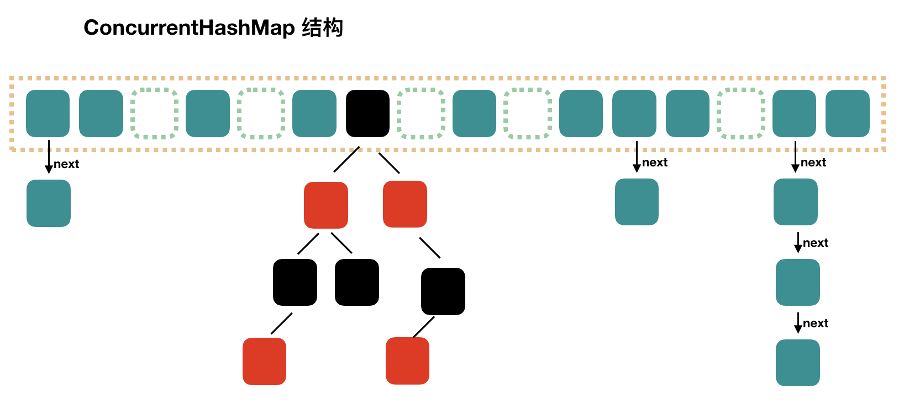

### 构造方法

```java
public class ConcurrentHashMap<K,V> extends AbstractMap<K,V> implements ConcurrentMap<K,V>, Serializable {
    private transient volatile int sizeCtl;

    private static final int MAXIMUM_CAPACITY = 1 << 30;

    /**
     * 构造方法，其他构造函数最终都会调用该方法，但实际上在构造方法中并没有完成初始化
     * 
     * @param initialCapacity  指定初始化大小
     * @param loadFactor       负载因子，注意该值并没有被任何字段记录下来，而是只参与了 size 的计算
     * @param concurrencyLevel 指定并发线程数，用于校正大小
     */
    public ConcurrentHashMap(int initialCapacity, float loadFactor, int concurrencyLevel) {
        if (!(loadFactor > 0.0f) || initialCapacity < 0 || concurrencyLevel <= 0)
            throw new IllegalArgumentException();
        // 如果指定的并发线程数大于初始化容量，那么以并发线程数为准
        if (initialCapacity < concurrencyLevel)
            initialCapacity = concurrencyLevel;
        long size = (long) (1.0 + (long) initialCapacity / loadFactor);
        int cap = (size >= (long) MAXIMUM_CAPACITY) ? MAXIMUM_CAPACITY : tableSizeFor((int) size);
        this.sizeCtl = cap;
    }

    // 向上取整 2的n次幂
    private static final int tableSizeFor(int c) {
        // Integer.numberOfLeadingZeros(c - 1) 用于计算 c-1 的二进制表示中最高位 1 之前有多少个 0
        // -1 的二级制表示为 11111111111111111111111111111111（32个1），无符号右移则会得到某 2的n次幂-1 的结果
        int n = -1 >>> Integer.numberOfLeadingZeros(c - 1);
        // 限制最大值的同时，结果永远为 2的n次幂
        return (n < 0) ? 1 : (n >= MAXIMUM_CAPACITY) ? MAXIMUM_CAPACITY : n + 1;
    }
    
}
```

`loadFactor` 负载因子通常被指定为 **0.75F**，并且在源码中也提供了该默认值，如此的原因在源码的 JavaDoc 中有详细的介绍：

> 理想情况下，容器中的节点遵循泊松分布，一个桶中有 k 个元素的概率分布如下：
>
> 0：0.60653066
> 
> 1：0.30326533
>
> 2：0.07581633
>
> 3：0.01263606
>
> 4：0.00157952
>
> 5：0.00015795
>
> 6：0.00001316
>
> 7：0.00000094
>
> 8：0.00000006
>
> 更多：不到千万分之一
>
> 在随机散列下，两个线程访问不同元素的锁争用概率约为 1 / (8 * 元素数量)。

该阈值能够较好的防止多个元素发生碰撞，在随机散列的情况下，多线程发生锁争抢的概率较低。负载因子 `loadFactor` 作为局部变量计算完 size 后，并没有被记录下来，后续有关该值的逻辑，如扩容阈值的计算均使用了默认值 0.75F。 

### put 方法

```java
public class ConcurrentHashMap<K,V> extends AbstractMap<K,V> implements ConcurrentMap<K,V>, Serializable {

    static final int TREEIFY_THRESHOLD = 8;

    // 最高位为 0，其余位为 1
    static final int HASH_BITS = 0x7fffffff;

    private static final int DEFAULT_CAPACITY = 16;
    
    transient volatile Node<K,V>[] table;

    private transient volatile int sizeCtl;
    
    public V put(K key, V value) {
        return putVal(key, value, false);
    }
    
    final V putVal(K key, V value, boolean onlyIfAbsent) {
        // key 和 value 均不能为 null
        if (key == null || value == null) throw new NullPointerException();
        // hash 扰动，用于使 hash 结果均匀分布
        int hash = spread(key.hashCode());
        int binCount = 0;
        for (Node<K,V>[] tab = table;;) {
            Node<K,V> f; int n, i, fh; K fk; V fv;
            // 懒加载实现初始化
            if (tab == null || (n = tab.length) == 0)
                tab = initTable();
            // 如果元素 hash （数组大小 - 1 & hash）到桶的位置没有元素（为 null）
            else if ((f = tabAt(tab, i = (n - 1) & hash)) == null) {
                // 通过 CAS 操作直接将元素放到该位置
                if (casTabAt(tab, i, null, new Node<K,V>(hash, key, value)))
                    break;
            }
            // 扩容相关逻辑，后续再讲解
            else if ((fh = f.hash) == MOVED)
                tab = helpTransfer(tab, f);
            // onlyIfAbsent 是入参，默认为 false，表示键不存在时才插入新值，否则相同键值不能覆盖
            // 该逻辑满足在此特定条件下，避免获取锁，从而提高性能
            else if (onlyIfAbsent && fh == hash && ((fk = f.key) == key || (fk != null && key.equals(fk))) && (fv = f.val) != null)
                return fv;
            else { // 执行到此处意味着该元素 hash 到的桶位置存在元素，需要追加到此处的链表或红黑树上，f 为该桶位置的第一个元素
                V oldVal = null;
                // 锁住第一个元素
                synchronized (f) {
                    // 校验此处元素并没有发生变更（类似单例模式的双重检测锁机制）
                    if (tabAt(tab, i) == f) {
                        // 头节点的 hash 值大于 0，说明是链表
                        if (fh >= 0) {
                            binCount = 1;
                            // 注意这里会对链表中元素数量进行累加
                            for (Node<K,V> e = f;; ++binCount) {
                                K ek;
                                // 如果发现了 key 值相同的元素，根据 onlyIfAbsent 字段判断是否需要覆盖
                                if (e.hash == hash && ((ek = e.key) == key || (ek != null && key.equals(ek)))) {
                                    oldVal = e.val;
                                    if (!onlyIfAbsent)
                                        e.val = value;
                                    break;
                                }
                                // 直到找到链表的尾巴节点，进行添加（尾插法）
                                Node<K,V> pred = e;
                                if ((e = e.next) == null) {
                                    pred.next = new Node<K,V>(hash, key, value);
                                    break;
                                }
                            }
                        }
                        else if (f instanceof TreeBin) { // 如果该元素是红黑树
                            Node<K,V> p;
                            binCount = 2;
                            // 调用红黑树添加元素的方法
                            if ((p = ((TreeBin<K,V>)f).putTreeVal(hash, key, value)) != null) {
                                oldVal = p.val;
                                if (!onlyIfAbsent)
                                    p.val = value;
                            }
                        }
                        // ReservationNode 为 computeIfAbsent 和 compute 方法中使用的占位节点，同样也是为了保证并发环境下的正确性和一致性
                        else if (f instanceof ReservationNode)
                            throw new IllegalStateException("Recursive update");
                    }
                }
                if (binCount != 0) {
                    // 如果链表中元素数量超过了树化阈值，则将链表转换为红黑树
                    if (binCount >= TREEIFY_THRESHOLD)
                        treeifyBin(tab, i);
                    if (oldVal != null)
                        return oldVal;
                    break;
                }
            }
        }
        // 更新元素计数
        addCount(1L, binCount);
        return null;
    }

    // 扰动函数，用于计算哈希值以减少碰撞的可能性
    static final int spread(int h) {
        // 右移 16 位后，使该 hash 值的高 16 位和低 16 位“混合”，使 hash 值均匀分布，位与操作则是限制哈希值的范围，并保证它为非负数
        return (h ^ (h >>> 16)) & HASH_BITS;
    }

    private final Node<K,V>[] initTable() {
        Node<K,V>[] tab; int sc;
        while ((tab = table) == null || tab.length == 0) {
            // 通过 CAS 操作将 sizeCtl 赋值为 -1，成功后 sizeCtl 为 -1 表示正在有线程在对它进行初始化
            // 如果此时再有其他线程来操作，CAS 操作会失败，会在 while 循环中自旋等待直到完成初始化
            if ((sc = sizeCtl) < 0)
                Thread.yield();
            else if (U.compareAndSetInt(this, SIZECTL, sc, -1)) {
                try {
                    if ((tab = table) == null || tab.length == 0) {
                        int n = (sc > 0) ? sc : DEFAULT_CAPACITY;
                        @SuppressWarnings("unchecked")
                        Node<K,V>[] nt = (Node<K,V>[])new Node<?,?>[n];
                        table = tab = nt;
                        // 计算扩容阈值，相当于原值的 0.75F，构造函数中指定的负载因子不会生效，均采用默认 0.75F 来计算
                        sc = n - (n >>> 2);
                    }
                } finally {
                    sizeCtl = sc;
                }
                break;
            }
        }
        return tab;
    }
}
```

在这段源码逻辑中，我能能发现一些具有“隐藏”性的赋值操作，比如在如下逻辑中，变量 `n` 的赋值：

```java
public class ConcurrentHashMap<K,V> extends AbstractMap<K,V> implements ConcurrentMap<K,V>, Serializable {
    // ...
    
    final V putVal(K key, V value, boolean onlyIfAbsent) {
        // ...
        
        for (Node<K,V>[] tab = table;;) {
            Node<K,V> f; int n, i, fh; K fk; V fv;
            if (tab == null || (n = tab.length) == 0)
                tab = initTable();
            // ...
        }
    }
    
}
```

它是在 **if 条件** 判断中完成赋值的，这样写代码确实相对精简一些，但是也仅限于此（或非业务技术组件中），我觉得如果在业务代码中这样写，可读性就比较差了。

`put` 方法向数组中每个桶添加第一个元素时，都会使用 CAS 操作。为了节省空间，并没有为每个桶都创建一个锁，而是将每个桶中第一个元素作为锁，当发生哈希碰撞时，依赖 `synchronized` 完成锁定。这里值得关注的是：在获取到该元素的锁后，又重复判断了链表头节点是否仍然为该元素（双重检测），因为该元素可能被其他线程操作删除。当某个桶中第一个元素被锁定时，其他线程的操作会被阻塞，如果 `equals` 方法耗时较长，可能会影响性能，但实际上，这种情况并不常见。

key 和 value 不能为 null 的妙用

#### addCount 更新元素计数方法


```java
public class ConcurrentHashMap<K,V> extends AbstractMap<K,V> implements ConcurrentMap<K,V>, Serializable {

   private static final int RESIZE_STAMP_BITS = 16;

   private static final int RESIZE_STAMP_SHIFT = 32 - RESIZE_STAMP_BITS;

   private static final int MAXIMUM_CAPACITY = 1 << 30;

   // 65535 允许最大操作扩容的线程数（好大...）
   private static final int MAX_RESIZERS = (1 << (32 - RESIZE_STAMP_BITS)) - 1;
   
   transient volatile Node<K,V>[] table;

   // 扩容操作后要使用的数组
   private transient volatile Node<K,V>[] nextTable;
    
   private transient volatile CounterCell[] counterCells;

   private static final long BASECOUNT;

   private transient volatile long baseCount;

   // counterCells 在创建元素或者在扩容的标志，使用 CAS 操作更新 
   transient volatile int cellsBusy;

   // CPU 核数
   static final int NCPU = Runtime.getRuntime().availableProcessors();
   
    final V putVal(K key, V value, boolean onlyIfAbsent) {
        // ...
       
        // 增加计数
        addCount(1L, binCount);
        return null;
    }
    
    private final void addCount(long x, int check) {
        CounterCell[] cs; long b, s;
        // 更新元素计数，注意这里有 cas 操作更新 baseCount 的值，如果 CAS 更新失败或 counterCells 已经被初始化，会进入 if 条件的执行逻辑
        if ((cs = counterCells) != null || !U.compareAndSetLong(this, BASECOUNT, b = baseCount, s = b + x)) {
            CounterCell c; long v; int m;
            boolean uncontended = true;
            if (cs == null || (m = cs.length - 1) < 0 || (c = cs[ThreadLocalRandom.getProbe() & m]) == null 
                    || !(uncontended = U.compareAndSetLong(c, CELLVALUE, v = c.value, v + x))) {
                // 负责 counterCells 的初始化和扩展
                fullAddCount(x, uncontended);
                return;
            }
            if (check <= 1)
                return;
            // 计算元素总和
            s = sumCount();
        }
        if (check >= 0) {
            Node<K,V>[] tab, nt; int n, sc;
            // 增加元素后元素数量大于当前 sizeCtl 大小 且 table 已被初始化 且未超过最大容量
            while (s >= (long)(sc = sizeCtl) && (tab = table) != null && (n = tab.length) < MAXIMUM_CAPACITY) {
                // n 为 table 的长度（length），以 n 为参数计算 resizeStamp（扩容戳），唯一标识，用来协调多个线程同时操作 transfer
                // 而再将其左移 16 位，会得到一个较大的负数，eg: -2145779712，这样其他线程只能调用到 sc < 0 的条件分支了
                int rs = resizeStamp(n) << RESIZE_STAMP_SHIFT;
                // sc < 0 表示正在进行扩容
                if (sc < 0) {
                    // 超过最大线程数量 或 最后一个扩容线程 或 扩容后数组为空 或 transferIndex小于等于0 则 退出循环
                    if (sc == rs + MAX_RESIZERS || sc == rs + 1 || (nt = nextTable) == null || transferIndex <= 0)
                        break;
                    // 将 sc 增加 1，表示增加一个扩容线程
                    if (U.compareAndSetInt(this, SIZECTL, sc, sc + 1))
                        // 执行扩容操作，接下来具体讲解
                        transfer(tab, nt);
                }
                // sc >= 0 表示没有扩容操作在执行，CAS 操作将 sizeCtl 更新为 rs + 2，表示启动扩容操作，此时 sc 已经为一个负数了
                else if (U.compareAndSetInt(this, SIZECTL, sc, rs + 2))
                    // 执行扩容操作，第二个入参 Node<K,V>[] nextTab 为 null，只有一个线程能够启动扩容是为了 nextTab 只能被初始化一遍
                    transfer(tab, null);
                // 计算元素总和
                s = sumCount();
            }
        }
    }

    // 与 longAdder 中实现原理一致
   private final void fullAddCount(long x, boolean wasUncontended) {
      int h;
      // 如果线程探针值为 0 证明它还没被初始化，那么对它初始化
      if ((h = ThreadLocalRandom.getProbe()) == 0) {
         ThreadLocalRandom.localInit();
         h = ThreadLocalRandom.getProbe();
         wasUncontended = true;
      }
      // 冲突标志，用于标记创建计数元素时发生碰撞；槽位引用发生变化；槽位已满；槽位中计数元素发生变更
      boolean collide = false;
      // 自旋操作尝试更新，直到成功为止
      for (;;) {
         CounterCell[] cs; CounterCell c; int n; long v;
         // 如果 counterCells 数组已经初始化，并且长度大于 0
         if ((cs = counterCells) != null && (n = cs.length) > 0) {
             // 如果槽位为空
            if ((c = cs[(n - 1) & h]) == null) {
               // 没有线程在创建计数元素
               if (cellsBusy == 0) {   
                   // 创建计数元素，并记录计数值 x
                  CounterCell r = new CounterCell(x);
                  // 将 cellsBusy 更新为 1，标志该线程正在创建计数元素
                  if (cellsBusy == 0 && U.compareAndSetInt(this, CELLSBUSY, 0, 1)) {
                     boolean created = false;
                     try {               
                        CounterCell[] rs; int m, j;
                        // *双重校验* 该槽位未创建计数元素
                        if ((rs = counterCells) != null && (m = rs.length) > 0 && rs[j = (m - 1) & h] == null) {
                           rs[j] = r;
                           created = true;
                        }
                     } finally {
                         // 创建完成更新 cellsBusy 为 0，允许其他线程继续操作
                        cellsBusy = 0;
                     }
                     // 创建完成，结束循环
                     if (created)
                        break;
                     continue;
                  }
               }
               // 变更冲突标志
               collide = false;
            }
            // 标记 wasUncontended 为 true 后重试
            else if (!wasUncontended)
               wasUncontended = true;
            // 成功更新计算元素值，退出循环
            else if (U.compareAndSetLong(c, CELLVALUE, v = c.value, v + x))
               break;
            // 槽位引用已经发生变化或槽位已满
            else if (counterCells != cs || n >= NCPU)
                // 变更冲突标志
               collide = false;
            // 如果已经发生过冲突，标记为 true
            else if (!collide)
               collide = true;
            // 如果 counterCells 需要扩容
            else if (cellsBusy == 0 && U.compareAndSetInt(this, CELLSBUSY, 0, 1)) {
               try {
                   // 校验 counterCells 未发生变更
                  if (counterCells == cs)
                     counterCells = Arrays.copyOf(cs, n << 1);
               } finally {
                  cellsBusy = 0;
               }
               // 变更冲突标志位
               collide = false;
               // 扩容后重试
               continue;
            }
            h = ThreadLocalRandom.advanceProbe(h);
         }
         // 如果 counterCells 未被初始化，则尝试初始化
         else if (cellsBusy == 0 && counterCells == cs && U.compareAndSetInt(this, CELLSBUSY, 0, 1)) {
            boolean init = false;
            try {
                // 双重校验 
               if (counterCells == cs) {
                   // 初始大小为 2
                  CounterCell[] rs = new CounterCell[2];
                  rs[h & 1] = new CounterCell(x);
                  counterCells = rs;
                  init = true;
               }
            } finally {
               cellsBusy = 0;
            }
            // 完成初始化且创建好计数元素，结束循环
            if (init)
               break;
         }
         // 所有情况都不符合，直接在 baseCount 计数值上累加
         else if (U.compareAndSetLong(this, BASECOUNT, v = baseCount, v + x))
            break;
      }
   }

   // 计算元素总数量的方法，baseCount 累加 counterCells 中计数元素计数值
   final long sumCount() {
      CounterCell[] cs = counterCells;
      long sum = baseCount;
      if (cs != null) {
         for (CounterCell c : cs)
            if (c != null)
               sum += c.value;
      }
      return sum;
   }

   static final int resizeStamp(int n) {
      // n 前导 0 数量位或运算
      return Integer.numberOfLeadingZeros(n) | (1 << (RESIZE_STAMP_BITS - 1));
   }
   
}
```

#### transfer

```java
public class ConcurrentHashMap<K,V> extends AbstractMap<K,V> implements ConcurrentMap<K,V>, Serializable {

   private static final int RESIZE_STAMP_BITS = 16;

   private static final int RESIZE_STAMP_SHIFT = 32 - RESIZE_STAMP_BITS;
    
   private static final int MIN_TRANSFER_STRIDE = 16;

   // 转发节点 forwarding nodes 的 hash 值 -1
   static final int MOVED     = -1;
   
   static final int NCPU = Runtime.getRuntime().availableProcessors();

   static final int UNTREEIFY_THRESHOLD = 6;
   
   private transient volatile Node<K,V>[] nextTable;

   private transient volatile int transferIndex;

   private transient volatile int sizeCtl;
   
   /**
    * 扩容哈希表，将旧表 tab 中元素转移到 nextTab 中
    * 
    * @param tab      旧表
    * @param nextTab  新表
    */
    private final void transfer(Node<K, V>[] tab, Node<K, V>[] nextTab) {
        // n 为当前哈希表长度；stride 为步长，即每个线程负责处理的桶数
        int n = tab.length, stride;
        // 根据 CPU 核数，分配任务给多个线程，每个线程最小的处理步长为 16
        if ((stride = (NCPU > 1) ? (n >>> 3) / NCPU : n) < MIN_TRANSFER_STRIDE)
            stride = MIN_TRANSFER_STRIDE;
        // 当 nextTab == null 时，表示第一个启动扩容的线程执行，这段逻辑只会被执行一次
        if (nextTab == null) {
            try {
                // 右移 1 位，容量扩大两倍
                Node<K, V>[] nt = (Node<K, V>[]) new Node<?, ?>[n << 1];
                nextTab = nt;
            } catch (Throwable ex) {
                // 如果发生 OOME 内存不足错误，将 sizeCtl 指定为 最大值并返回
                sizeCtl = Integer.MAX_VALUE;
                return;
            }
            nextTable = nextTab;
            transferIndex = n;
        }
        // 扩容后哈希表长度
        int nextn = nextTab.length;
        // 转发节点，用于标记该节点已经被添加到新表中，它会被插入到桶中第一个元素的位置
        ForwardingNode<K, V> fwd = new ForwardingNode<K, V>(nextTab);
        // 前进标志，用于判断是否处理下一个桶
        boolean advance = true;
        // 即将完成标志，如果该值为 true 再重新检查一遍哈希表元素即完成扩容操作
        boolean finishing = false; 
        for (int i = 0, bound = 0; ; ) {
            // 桶中第一个节点
            Node<K, V> f;
            // 第一个节点的 hash 值
            int fh;
            while (advance) {
                int nextIndex, nextBound;
                // 如果 i 仍然在范围内 或 处于正在完成阶段，则不再继续处理
                if (--i >= bound || finishing)
                    advance = false;
                // transferIndex 小于等于 0 说明所有桶已经被分配完毕了，不再继续处理
                else if ((nextIndex = transferIndex) <= 0) {
                    i = -1;
                    advance = false;
                }
                // CAS 操作更新 transferIndex，分配新的范围 nextBound 并更新 i 和 bound
                else if (U.compareAndSetInt(this, TRANSFERINDEX, nextIndex, nextBound = (nextIndex > stride ? nextIndex - stride : 0))) {
                    bound = nextBound;
                    i = nextIndex - 1;
                    advance = false;
                }
            }
            // 如果 i 超出有效范围，检测是否需要结束扩容
            if (i < 0 || i >= n || i + n >= nextn) {
                int sc;
                // 在完成阶段
                if (finishing) {
                    nextTable = null;
                    table = nextTab;
                    // 0.75 倍容量大小，下次扩容的阈值
                    sizeCtl = (n << 1) - (n >>> 1);
                    return;
                }
                // CAS 操作更新 sizeCtl 为 sizeCtl - 1 表示执行扩容的线程已经操作完成了
                if (U.compareAndSetInt(this, SIZECTL, sc = sizeCtl, sc - 1)) {
                    // 这里就要和 addCount 方法中执行扩容更新 sizeCtl 的方法联系起来
                    // sizeCtl 在执行时扩容时被赋值为 resizeStamp(n) << RESIZE_STAMP_SHIFT + 2
                    // 每有一个线程帮助扩容则 +1；每有一个线程扩容完成便 -1
                    // 当再将 sizeCtl 减到 resizeStamp(n) << RESIZE_STAMP_SHIFT + 2 时，说明帮助扩容的线程都已经操作完成了
                    // 此时可以将 finishing 更新为 true 并重新循环检查所有桶
                    if ((sc - 2) != resizeStamp(n) << RESIZE_STAMP_SHIFT)
                        return;
                    finishing = advance = true;
                    i = n;
                }
            }
            // 如果当前桶为 null，那么直接将其更改为转发节点（ForwardingNode），标志该桶已被处理
            else if ((f = tabAt(tab, i)) == null)
                advance = casTabAt(tab, i, null, fwd);
            // 判断是否为转发节点（已经处理过）
            else if ((fh = f.hash) == MOVED)
                advance = true;
            // 否则处理该节点
            else {
                // 先对该节点加锁
                synchronized (f) {
                    // 双重判断该节点没有发生变化（删除或修改）
                    if (tabAt(tab, i) == f) {
                        // ln: lowNode 低位链表节点；hn: highNode 高位链表节点
                        Node<K, V> ln, hn;
                        // 检查当前节点的 hash 值是否为正整数，如果是则表示它是链表节点
                        if (fh >= 0) {
                            // 计算当前节点 hash 值与旧表长度 n 位与运算结果
                            int runBit = fh & n;
                            // 先初始化 lastRun 为当前节点，并遍历链表，根据位与运算结果找到链表的最后一个节点由 lastRun 引用
                            Node<K, V> lastRun = f;
                            for (Node<K, V> p = f.next; p != null; p = p.next) {
                                int b = p.hash & n;
                                if (b != runBit) {
                                    runBit = b;
                                    lastRun = p;
                                }
                            }
                            // 根据位与运算结果，来决定这个节点是被划分到新表的低位还是高位
                            if (runBit == 0) {
                                ln = lastRun;
                                hn = null;
                            } else {
                                hn = lastRun;
                                ln = null;
                            }
                            // 遍历该桶中链表的所有节点
                            for (Node<K, V> p = f; p != lastRun; p = p.next) {
                                int ph = p.hash;
                                K pk = p.key;
                                V pv = p.val;
                                // 根据 hash 值位与运算结果，采用头插法不断向两个高位和低位链表中添加节点
                                if ((ph & n) == 0)
                                    ln = new Node<K, V>(ph, pk, pv, ln);
                                else
                                    hn = new Node<K, V>(ph, pk, pv, hn);
                            }
                            // 低位链表赋值到新表中
                            setTabAt(nextTab, i, ln);
                            // 高位链表赋值到新表中
                            setTabAt(nextTab, i + n, hn);
                            // 将旧表的 i 索引处元素更新为转发节点，表示已处理
                            setTabAt(tab, i, fwd);
                            // 更新为 true，以便继续处理下一个桶
                            advance = true;
                        }
                        // 如果该节点为红黑树节点
                        else if (f instanceof TreeBin) {
                            TreeBin<K, V> t = (TreeBin<K, V>) f;
                            // 定义两组变量分别记录低位红黑树头尾节点和高位红黑树头尾节点
                            TreeNode<K, V> lo = null, loTail = null;
                            TreeNode<K, V> hi = null, hiTail = null;
                            // 分别记录低位、高位节点数量
                            int lc = 0, hc = 0;
                            // 与链表操作相似，都是根据 hash 值位与运算的结果来确定新节点的位置
                            for (Node<K, V> e = t.first; e != null; e = e.next) {
                                int h = e.hash;
                                TreeNode<K, V> p = new TreeNode<K, V>
                                        (h, e.key, e.val, null, null);
                                if ((h & n) == 0) {
                                    if ((p.prev = loTail) == null)
                                        lo = p;
                                    else
                                        loTail.next = p;
                                    loTail = p;
                                    ++lc;
                                } else {
                                    if ((p.prev = hiTail) == null)
                                        hi = p;
                                    else
                                        hiTail.next = p;
                                    hiTail = p;
                                    ++hc;
                                }
                            }
                            // 根据计数值判断是否要将红黑树转换为链表，注意这里红黑树转换成链表的阈值为 6
                            ln = (lc <= UNTREEIFY_THRESHOLD) ? untreeify(lo) :
                                    (hc != 0) ? new TreeBin<K, V>(lo) : t;
                            hn = (hc <= UNTREEIFY_THRESHOLD) ? untreeify(hi) :
                                    (lc != 0) ? new TreeBin<K, V>(hi) : t;
                            // 将节点封装到新哈希表中
                            setTabAt(nextTab, i, ln);
                            setTabAt(nextTab, i + n, hn);
                            // 更新该节点为转发节点
                            setTabAt(tab, i, fwd);
                            // 更新为 true，以便继续处理下一个桶
                            advance = true;
                        }
                    }
                }
            }
        }
    }

   // 转发节点，哈希值默认为 -1
   static final class ForwardingNode<K,V> extends Node<K,V> {
      final Node<K,V>[] nextTable;
      
      ForwardingNode(Node<K,V>[] tab) {
         super(MOVED, null, null);
         this.nextTable = tab;
      }

      // ...
   }
}
```

在我们分析完上述源码后再来看 `helpTransfer` 方法就非常容易了，该方法用于其他线程帮助完成哈希表的扩容操作

```java
public class ConcurrentHashMap<K,V> extends AbstractMap<K,V> implements ConcurrentMap<K,V>, Serializable {

    // ...
    
    final Node<K, V>[] helpTransfer(Node<K, V>[] tab, Node<K, V> f) {
        Node<K, V>[] nextTab;
        int sc;
        // 当前哈希表已经被初始化；当前节点为转发节点，表示扩容进行中；新哈希表也完成了初始化
        if (tab != null && (f instanceof ForwardingNode) && (nextTab = ((ForwardingNode<K, V>) f).nextTable) != null) {
            // 扩容戳，我们在讨论 addCount() 方法时提到过
            int rs = resizeStamp(tab.length) << RESIZE_STAMP_SHIFT;
            // 扩容进行中：旧哈希表仍然为旧哈希表；新哈希表仍为新哈希表；sizeCtl 仍然小于 0
            while (nextTab == nextTable && table == tab &&
                    (sc = sizeCtl) < 0) {
                // 检查是否超过最大扩容线程数量
                if (sc == rs + MAX_RESIZERS || sc == rs + 1 ||
                        transferIndex <= 0)
                    break;
                // CAS 更新 sizeCtl + 1，表示扩容线程增加了一个 
                if (U.compareAndSetInt(this, SIZECTL, sc, sc + 1)) {
                    // 调用扩容方法
                    transfer(tab, nextTab);
                    break;
                }
            }
            return nextTab;
        }
        return table;
    }
}
```

### treeifyBin

`treeifyBin` 方法用于将链表转换给红黑树，以提高查询效率，具体逻辑如下：

```java
public class ConcurrentHashMap<K,V> extends AbstractMap<K,V> implements ConcurrentMap<K,V>, Serializable {

    // 链表树化的最小限制
    static final int MIN_TREEIFY_CAPACITY = 64;

    private final void treeifyBin(Node<K, V>[] tab, int index) {
        Node<K, V> b;
        int n;
        if (tab != null) {
            // 检查哈希表长度是否小于 64，如果小于的话执行的是扩容操作
            if ((n = tab.length) < MIN_TREEIFY_CAPACITY)
                tryPresize(n << 1);
            // 检验该节点的哈希值大于等于 0，表示该节点是链表节点
            else if ((b = tabAt(tab, index)) != null && b.hash >= 0) {
                // 同步锁住该节点
                synchronized (b) {
                    // 锁住后校验该节点没有别其他线程修改
                    if (tabAt(tab, index) == b) {
                        // 将链表转换为红黑树
                        TreeNode<K, V> hd = null, tl = null;
                        for (Node<K, V> e = b; e != null; e = e.next) {
                            TreeNode<K, V> p = new TreeNode<K, V>(e.hash, e.key, e.val, null, null);
                            if ((p.prev = tl) == null)
                                hd = p;
                            else
                                tl.next = p;
                            tl = p;
                        }
                        // 将原表中原表节点替换为红黑树节点
                        setTabAt(tab, index, new TreeBin<K, V>(hd));
                    }
                }
            }
        }
    }

    private final void tryPresize(int size) {
        // 计算目标容量大小，如果超过最大容量的一半，直接赋值为最大容量，否则计算出合适容量（tableSizeFor 方法已在上文提到过）
        int c = (size >= (MAXIMUM_CAPACITY >>> 1)) ? MAXIMUM_CAPACITY : tableSizeFor(size + (size >>> 1) + 1);
        int sc;
        while ((sc = sizeCtl) >= 0) {
            Node<K, V>[] tab = table;
            int n;
            // 哈希表为空或者长度为 0，表示哈希表还未完成初始化
            if (tab == null || (n = tab.length) == 0) {
                // Math.max(sc, c);
                n = (sc > c) ? sc : c;
                // 更新 sizeCtl 为 -1，表示哈希表正在初始化
                if (U.compareAndSetInt(this, SIZECTL, sc, -1)) {
                    try {
                        if (table == tab) {
                            Node<K, V>[] nt = (Node<K, V>[]) new Node<?, ?>[n];
                            table = nt;
                            sc = n - (n >>> 2);
                        }
                    } finally {
                        sizeCtl = sc;
                    }
                }
            } else if (c <= sc || n >= MAXIMUM_CAPACITY)
                break;
            // 尝试扩容
            else if (tab == table) {
                // 计算扩容戳
                int rs = resizeStamp(n);
                // 这段逻辑就与 addCount 中第一个操作扩容的线程逻辑一致了
                if (U.compareAndSetInt(this, SIZECTL, sc, (rs << RESIZE_STAMP_SHIFT) + 2))
                    transfer(tab, null);
            }
        }
    }
}
```

### get

```java
public class ConcurrentHashMap<K,V> extends AbstractMap<K,V> implements ConcurrentMap<K,V>, Serializable {

    public V get(Object key) {
        Node<K, V>[] tab;
        Node<K, V> e, p;
        int n, eh;
        K ek;
        // 计算出经过扰动的 hash 值
        int h = spread(key.hashCode());
        // 哈希表已经完成初始化且该索引处元素不为 null
        if ((tab = table) != null && (n = tab.length) > 0 && (e = tabAt(tab, (n - 1) & h)) != null) {
            // 哈希值相等，判断第一个节点是不是想要的节点
            if ((eh = e.hash) == h) {
                // key 相等则返回对应的值
                if ((ek = e.key) == key || (ek != null && key.equals(ek)))
                    return e.val;
            // 当节点哈希值小于 0 时，表示两种情况：要么为红黑树节点，要么正在扩容
            } else if (eh < 0)
                return (p = e.find(h, key)) != null ? p.val : null;
            // 遍历链表尝试找到要匹配的节点
            while ((e = e.next) != null) {
                if (e.hash == h &&
                        ((ek = e.key) == key || (ek != null && key.equals(ek))))
                    return e.val;
            }
        }
        return null;
    }
}
```

在 `eh < 0` 的条件下，表示两种情况：要么为红黑树节点，要么正在扩容（`ForwardingNode`），前者就不在这里赘述了，我们需要看一下在扩容时，哈希表是如何寻找对应节点的，如下为 `ForwardingNode` 源码：

```java
static final class ForwardingNode<K,V> extends Node<K,V> {
   final Node<K,V>[] nextTable;
   ForwardingNode(Node<K,V>[] tab) {
      super(MOVED, null, null);
      this.nextTable = tab;
   }

   Node<K,V> find(int h, Object k) {
      // 注意这里的 outer 标志，如果在寻找节点中发现 e 为转发节点，那么需要再去新的被扩容后的表中寻找对应节点
      outer: for (Node<K,V>[] tab = nextTable;;) {
         Node<K,V> e; int n;
         // 要找的对象为 null 或者 tab 未初始化 或者 桶对应的位置为 null
         if (k == null || tab == null || (n = tab.length) == 0 || (e = tabAt(tab, (n - 1) & h)) == null)
            return null;
         for (;;) {
            int eh; K ek;
            // 找到了对应的节点
            if ((eh = e.hash) == h && ((ek = e.key) == k || (ek != null && k.equals(ek))))
               return e;
            if (eh < 0) {
               // 发现了转发节点，说明该节点已经再次被转移到了新的哈希表中，需要去新的哈希表寻找
               if (e instanceof ForwardingNode) {
                  tab = ((ForwardingNode<K,V>)e).nextTable;
                  continue outer;
               }
               else
                  // 调用 node 的 find 方法
                  return e.find(h, k);
            }
            // 找完了所有节点仍然没找到
            if ((e = e.next) == null)
               return null;
         }
      }
   }

   static class Node<K,V> implements Map.Entry<K,V> {
      
      // 不过是简单地遍历查找
      Node<K,V> find(int h, Object k) {
         Node<K,V> e = this;
         if (k != null) {
            do {
               K ek;
               if (e.hash == h &&
                       ((ek = e.key) == k || (ek != null && k.equals(ek))))
                  return e;
            } while ((e = e.next) != null);
         }
         return null;
      }
   }
}
```

由以上源码可知，在寻找某节点时，发现了转发节点，那么证明该节点已经被转移到新的哈希表中且这个时候扩容操作还没有完成，那么需要去新的哈希表中寻找。


`ConcurrentHashMap` 将大小固定为 2 的 n 次幂有几个重要的原因，主要是为了提高性能和简化实现。以下是详细的解释：

1. **位运算优化**：
    - 当哈希表的大小是 2 的 n 次幂时，可以使用位运算来代替取模运算（`%`），从而提高哈希表操作的性能。
    - 例如，`index = hash % table.length` 可以简化为 `index = hash & (table.length - 1)`。位运算 `&` 通常比取模运算更快。

2. **哈希分布均匀性**：
    - 使用 2 的 n 次幂大小可以确保哈希值在表中的分布更均匀。
    - 当表的大小是 2 的 n 次幂时，哈希值的低位比特可以直接用于计算索引，这样可以减少哈希冲突的概率。

3. **简化扩容逻辑**：
    - 在扩容时，如果新表的大小是旧表的两倍（即 2 的 n 次幂），元素的重新分配变得更加简便。
    - 对于哈希表中的每个桶，扩容后元素的位置要么保持不变，要么移动到新位置 `index + oldCapacity`。这种移动逻辑可以通过简单的位运算实现。

4. **减少空间浪费**：
    - 选择 2 的 n 次幂大小可以使得哈希表的空间利用率更高，减少空间浪费。
    - 由于哈希表的大小总是 2 的 n 次幂，因此每次扩容时只需要将表的大小翻倍，不会出现无法利用的空间碎片。

综合以上几点，`ConcurrentHashMap` 将大小固定为 2 的 n 次幂，是为了优化性能、简化实现和提高空间利用率。这也是大多数哈希表实现中常见的一种设计选择。
