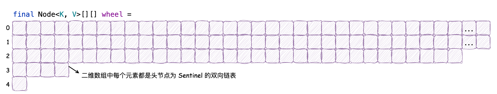

在前文 [缓存之美：万文详解 Caffeine 实现原理]() 中，我们详细介绍了 Caffeine 缓存添加元素和读取元素的流程，并详细解析了配置固定大小元素驱逐策略的实现原理。在本文中我们将主要介绍 **配置元素过期时间策略的实现原理**，补全 Caffeine 对元素管理的机制。在创建有过期时间策略的 Caffeine 缓存时，它提供了三种不同的方法，分别为 `expireAfterAccess`, `expireAfterWrite` 和 `expireAfter`，前两者的元素过期机制非常简单：通过当前时间减去元素的最后访问时间（或写入时间）和配置的时间作对比，如果超过配置的时间，则认为元素过期。而 `expireAfter` 为自定义过期策略，使用到了时间轮 `TimeWheel`。它的实现相对复杂，在源码中相关的方法都会包含 **Variable** 命名（变量；可变的），如 `expiresVariable`。本文以如下源码创建自定义过期策略的缓存来了解 Caffeine 中的 `TimeWheel` 机制，它创建的缓存类型为 `SSA`，表示 Key 和 Value 均为强引用且配置了自定义过期策略：

```java
public class TestReadSourceCode {
    @Test
    public void doReadTimeWheel() {
        Cache<String, String> cache2 = Caffeine.newBuilder()
//                .expireAfterAccess(5, TimeUnit.SECONDS)
//                .expireAfterWrite(5, TimeUnit.SECONDS)
                .expireAfter(new Expiry<>() {
                    @Override
                    public long expireAfterCreate(Object key, Object value, long currentTime) {
                        // 指定过期时间为 Long.MAX_VALUE 则不会过期
                        if ("key0".equals(key)) {
                            return Long.MAX_VALUE;
                        }
                        // 设置条目在创建后 5 秒过期
                        return TimeUnit.SECONDS.toNanos(5);
                    }

                    @Override
                    public long expireAfterUpdate(Object key, Object value, long currentTime, @NonNegative long currentDuration) {
                        // 默认过期策略
                        return currentDuration;
                    }

                    @Override
                    public long expireAfterRead(Object key, Object value, long currentTime, @NonNegative long currentDuration) {
                        // 默认过期策略
                        return currentDuration;
                    }
                })
                .build();

        cache2.put("key2", "value2");
        System.out.println(cache2.getIfPresent("key2"));
        try {
            Thread.sleep(6000);
        } catch (InterruptedException e) {
            e.printStackTrace();
        }
        System.out.println(cache2.getIfPresent("key2"));
    }
}
```

在前文中我们提到过，Caffeine 中 `maintenance` 负责维护缓存中的元素，我们便以这个方法作为起点去探究时间过期策略的执行：

```java
abstract class BoundedLocalCache<K, V> extends BLCHeader.DrainStatusRef
        implements LocalCache<K, V> {

    @GuardedBy("evictionLock")
    void maintenance(@Nullable Runnable task) {
        setDrainStatusRelease(PROCESSING_TO_IDLE);

        try {
            drainReadBuffer();

            drainWriteBuffer();
            if (task != null) {
                task.run();
            }

            drainKeyReferences();
            drainValueReferences();

            // 元素过期策略执行
            expireEntries();
            evictEntries();

            climb();
        } finally {
            if ((drainStatusOpaque() != PROCESSING_TO_IDLE)
                    || !casDrainStatus(PROCESSING_TO_IDLE, IDLE)) {
                setDrainStatusOpaque(REQUIRED);
            }
        }
    }
}
```

在其中我们能发现 `expireEntries` 元素过期策略的执行方法，该方法的源码如下所示：

```java
abstract class BoundedLocalCache<K, V> extends BLCHeader.DrainStatusRef
        implements LocalCache<K, V> {

    @GuardedBy("evictionLock")
    void expireEntries() {
        // 获取当前时间
        long now = expirationTicker().read();
        // 基于访问和写后的过期策略
        expireAfterAccessEntries(now);
        expireAfterWriteEntries(now);
        // *主要关注*：执行自定义过期策略
        expireVariableEntries(now);

        // Pacer 用于调度和执行定时任务，创建 Caffeine 缓存时可通过 scheduler 方法来配置
        // 默认为 null
        Pacer pacer = pacer();
        if (pacer != null) {
            long delay = getExpirationDelay(now);
            if (delay == Long.MAX_VALUE) {
                pacer.cancel();
            } else {
                pacer.schedule(executor, drainBuffersTask, now, delay);
            }
        }
    }
    
}
```

在自定义的过期策略中，我们便能够发现 `TimeWheel` 的身影：

```java
abstract class BoundedLocalCache<K, V> extends BLCHeader.DrainStatusRef
        implements LocalCache<K, V> {

    @GuardedBy("evictionLock")
    void expireVariableEntries(long now) {
        if (expiresVariable()) {
            timerWheel().advance(this, now);
        }
    }
}
```

`TimeWheel` 是 Caffeine 缓存中定义的类，并在注释中如下写道：

一个 **分层的** 时间轮，能够以O（1）的时间复杂度添加、删除和触发过期事件。过期事件的执行被推迟到 `maintenance` 维护方法中的 `TimeWheel#advance` 逻辑中。

> A hierarchical timer wheel to add, remove, and fire expiration events in amortized O(1) time. The expiration events are deferred until the timer is advanced, which is performed as part of the cache's maintenance cycle.

其中 **分层（hierarchical）**，它这样解释：

时间轮将计时器事件存储在循环缓冲区的桶中。**Bucket** 表示粗略的时间跨度，例如一分钟，并使用一个双向链表来记录事件。时间轮按层次结构（秒、分钟、小时、天）构建，这样当时间轮旋转时，在遥远的未来安排的事件会级联到较低的桶中。它允许在O（1）的时间复杂度下添加、删除和过期事件，在整个 **Bucket** 中的元素都会发生过期，同时有大部分元素过期的特殊情况由时间轮的轮换分摊。

> A timer wheel stores timer events in buckets on a circular buffer. A bucket represents a coarse time span, e.g. one minute, and holds a doubly-linked list of events. The wheels are structured in a hierarchy (seconds, minutes, hours, days) so that events scheduled in the distant future are cascaded to lower buckets when the wheels rotate. This allows for events to be added, removed, and expired in O(1) time, where expiration occurs for the entire bucket, and the penalty of cascading is amortized by the rotations.

接下来我们根据它的注释内容，详细探究一下 `TimeWheel` 是如何实现这种机制的。我们先来看它的构造方法：

```java
final class TimerWheel<K, V> implements Iterable<Node<K, V>> {
    // 定义了 5 个桶，每个桶的容量分别为 64、64、32、4、1
    static final int[] BUCKETS = {64, 64, 32, 4, 1};
    final Node<K, V>[][] wheel;

    TimerWheel() {
        wheel = new Node[BUCKETS.length][];
        for (int i = 0; i < wheel.length; i++) {
            wheel[i] = new Node[BUCKETS[i]];
            for (int j = 0; j < wheel[i].length; j++) {
                wheel[i][j] = new Sentinel<>();
            }
        }
    }

    // 双向链表头节点
    static final class Sentinel<K, V> extends Node<K, V> {
        Node<K, V> prev;
        Node<K, V> next;
        
        Sentinel() {
            prev = next = this;
        }
    }
}
```

它会创建如下所示的二维数组，每行都作为一个桶（Bucket），根据 `BUCKETS` 数组中定义的容量，每行桶的容量分别为 64、64、32、4、1，桶中元素为 `Sentinel` 为节点的双向链表，如下所示（其中...表示图中省略了31个桶）：



它为什么会创建一个内部类 `Sentinel` 并将其作为桶中的初始元素呢？在《算法导论》中讲解链表的章节提到过这个方法：双向链表中没有元素时也不为 null，而是创建一个哨兵节点（Sentinel），它不存储任何数据，只是为了方便链表的操作，减少代码中的判空逻辑，而在此处将其命名为 `Sentinel`，表示采用这个方法，又同时提高了代码的可读性。

### schedule

现在数据结构已经创建好了，那么究竟什么时候会向其中添加元素呢？在上文中我们提到过，向 Caffeine 缓存中 `put` 元素时会执行 `AddTask` 任务，其中有一段逻辑便会调用 `TimeWheel#schedule` 方法向其中添加元素：

```java
final class AddTask implements Runnable {
    @Override
    @GuardedBy("evictionLock")
    @SuppressWarnings("FutureReturnValueIgnored")
    public void run() {
        // ...
        if (isAlive) {
            // ...
            // 如果自定义时间策略，则执行 schedule 方法
            if (expiresVariable()) {
                // node 为添加的节点
                timerWheel().schedule(node);
            }
        }
        // ...
    }
    
}
```

我们来看看 `schedule` 方法：

```java
final class TimerWheel<K, V> implements Iterable<Node<K, V>> {

    static final long[] SPANS = {
            // 1073741824L 2^30 1.07s
            ceilingPowerOfTwo(TimeUnit.SECONDS.toNanos(1)),
            // 68719476736L 2^36 1.14m
            ceilingPowerOfTwo(TimeUnit.MINUTES.toNanos(1)),
            // 36028797018963968L 2^45 1.22h
            ceilingPowerOfTwo(TimeUnit.HOURS.toNanos(1)),
            // 864691128455135232L 2^50 1.63d
            ceilingPowerOfTwo(TimeUnit.DAYS.toNanos(1)),
            // 5629499534213120000L 2^52 6.5d
            BUCKETS[3] * ceilingPowerOfTwo(TimeUnit.DAYS.toNanos(1)),
            BUCKETS[3] * ceilingPowerOfTwo(TimeUnit.DAYS.toNanos(1)),
    };
    // Long.numberOfTrailingZeros 表示尾随 0 的数量
    static final long[] SHIFT = {
            // 30
            Long.numberOfTrailingZeros(SPANS[0]),
            // 36
            Long.numberOfTrailingZeros(SPANS[1]),
            // 45
            Long.numberOfTrailingZeros(SPANS[2]),
            // 50
            Long.numberOfTrailingZeros(SPANS[3]),
            // 52
            Long.numberOfTrailingZeros(SPANS[4]),
    };

    final Node<K, V>[][] wheel;

    long nanos;
    
    public void schedule(Node<K, V> node) {
        // 在 wheel 中找到对应的桶，node.getVariableTime() 获取的是元素的“过期时间”
        Node<K, V> sentinel = findBucket(node.getVariableTime());
        // 将该节点添加到桶中
        link(sentinel, node);
    }

    // 初次添加时，time 为元素的“过期时间”
    Node<K, V> findBucket(long time) {
        // 计算 duration 持续时间
        long duration = time - nanos;
        // length 为 4
        int length = wheel.length - 1;
        for (int i = 0; i < length; i++) {
            // 注意这里它是将持续时间和 SPANS[i + 1] 作比较，如果小于则认为该节点在这个“层级”中
            if (duration < SPANS[i + 1]) {
                // tick 指钟表的滴答声，用于表示它所在层级的偏移量
                // 如果 duration < SPANS[1] 表示秒级别的时间跨度，则右移 SHIFT[0] 30 位，SPANS[0] 为 2^30 对应 1.07s，右移 30 位则将 time 表示为秒级别的时间跨度
                long ticks = (time >>> SHIFT[i]);
                // 2进制数-1 的位与运算计算出节点在该层级的实际索引位置
                int index = (int) (ticks & (wheel[i].length - 1));
                return wheel[i][index];
            }
        }
        // 如果遍历完所有层级都没有合适的，那么将其放在最后一层
        return wheel[length][0];
    }

    // 双向链表的尾插法添加元素
    void link(Node<K, V> sentinel, Node<K, V> node) {
        node.setPreviousInVariableOrder(sentinel.getPreviousInVariableOrder());
        node.setNextInVariableOrder(sentinel);

        sentinel.getPreviousInVariableOrder().setNextInVariableOrder(node);
        sentinel.setPreviousInVariableOrder(node);
    }
}
```

其中 `node.getVariableTime()` 为元素的过期时间，那么这个过期时间是何时计算的呢？在 `put` 方法中有如下逻辑：

```java
abstract class BoundedLocalCache<K, V> extends BLCHeader.DrainStatusRef
        implements LocalCache<K, V> {
    @Nullable
    V put(K key, V value, Expiry<K, V> expiry, boolean onlyIfAbsent) {
        requireNonNull(key);
        requireNonNull(value);

        Node<K, V> node = null;
        long now = expirationTicker().read();
        int newWeight = weigher.weigh(key, value);
        Object lookupKey = nodeFactory.newLookupKey(key);
        for (int attempts = 1; ; attempts++) {
            Node<K, V> prior = data.get(lookupKey);
            if (prior == null) {
                if (node == null) {
                    node = nodeFactory.newNode(key, keyReferenceQueue(),
                            value, valueReferenceQueue(), newWeight, now);
                    // 计算过期时间并为 variableTime 赋值
                    setVariableTime(node, expireAfterCreate(key, value, expiry, now));
                }
            }
            // ...
        }
        // ...
    }

    long expireAfterCreate(@Nullable K key, @Nullable V value,
                           Expiry<? super K, ? super V> expiry, long now) {
        if (expiresVariable() && (key != null) && (value != null)) {
            // 此处的 expireAfterCreate 便为自定义的有效期
            long duration = expiry.expireAfterCreate(key, value, now);
            // 将定义的有效期在当前操作时间上进行累加得出过期时间
            return isAsync ? (now + duration) : (now + Math.min(duration, MAXIMUM_EXPIRY));
        }
        return 0L;
    }
}
```

接着回到 `findBucket` 方法，其中有逻辑 `duration < SPANS[i + 1]`，它是如何确定节点所在时间轮的层级的，为什么会有 `i + 1` 的操作呢？需要我们思考：`SPANS` 数组中存储的是层级的“时间跨度边界”，如注释中标记的，`SPANS[0]` 表示第一层级的时间为 1.07s，`SPANS[1]` 表示第二层级的时间为 1.14m，for 循环开始时便以 `SPANS[1]` 作为比较，如果 `duration` 小于 `SPANS[1]`，那么将该节点放在第一层级，这也就以为着第一层级的时间范围为 `t < 1.14 min`，认定它为秒级的时间跨度，第二层级的时间范围为 `1.14 min <= t < 1.22 h`，认定为分钟级的时间跨度，接下来的时间跨度以此类推。在这里明白了为什么 `final Node<K, V>[][] wheel` 为什么会将第一行第二行元素大小设定为 64，因为第一行为秒级别的时间跨度，60s 即为 1min，那么在这个秒级别的跨度下 64 的容量足以，同理，第二行为分钟级别的时间跨度，60min 即为 1h，那么在这个分钟级别的跨度下 64 的容量也足够了，以此类推。

现在我们已经了解了向 `TimeWheel` 中添加元素的逻辑，那么现在我们可以回到文章开头提到的 `maintenance` 方法中调用的 `TimeWheel#advance` 方法中了。

### advance

`advance` 有推进、前进的意思，我认为在 `TimeWheel` 中表示“某个层级的时间有没有流动”更合适，以下是它的源码： 

```java
final class TimerWheel<K, V> implements Iterable<Node<K, V>> {

    static final long[] SHIFT = {
            Long.numberOfTrailingZeros(SPANS[0]),
            Long.numberOfTrailingZeros(SPANS[1]),
            Long.numberOfTrailingZeros(SPANS[2]),
            Long.numberOfTrailingZeros(SPANS[3]),
            Long.numberOfTrailingZeros(SPANS[4]),
    };
    
    long nanos;
    
    public void advance(BoundedLocalCache<K, V> cache, long currentTimeNanos) {
        // nanos 总是记录 advance 方法被调用时的时间
        long previousTimeNanos = nanos;
        nanos = currentTimeNanos;

        // 校正时间戳的溢出
        if ((previousTimeNanos < 0) && (currentTimeNanos > 0)) {
            previousTimeNanos += Long.MAX_VALUE;
            currentTimeNanos += Long.MAX_VALUE;
        }

        try {
            // 遍历所有层级，如果当前层级的时间没有流动，则结束循环
            // 因为所有的层级是按照时间递增的顺序排列的，如果低层级的时间都没有流动，那么证明更高的层级时间更没有流动了，比如秒级别时间没变，那么分钟级别的时间更不可能变
            for (int i = 0; i < SHIFT.length; i++) {
                long previousTicks = (previousTimeNanos >>> SHIFT[i]);
                long currentTicks = (currentTimeNanos >>> SHIFT[i]);
                // 计算出某层级下时间的流动范围
                long delta = (currentTicks - previousTicks);
                if (delta <= 0L) {
                    break;
                }
                // 如果当前层级的时间有流动，则调用 expire 方法
                expire(cache, i, previousTicks, delta);
            }
        } catch (Throwable t) {
            nanos = previousTimeNanos;
            throw t;
        }
    }
}
```

我们接着看 `expire` 方法：

```java
final class TimerWheel<K, V> implements Iterable<Node<K, V>> {

    final Node<K, V>[][] wheel;

    long nanos;
    
    void expire(BoundedLocalCache<K, V> cache, int index, long previousTicks, long delta) {
        Node<K, V>[] timerWheel = wheel[index];
        int mask = timerWheel.length - 1;
        
        // 计算要遍历处理的槽位数量，假设 delta 不会出现负值（只有时间范围超过 2^61 nanoseconds (73 years) 才会溢出）
        int steps = Math.min(1 + (int) delta, timerWheel.length);
        // 上一次 advance 的操作时间即为起始索引
        int start = (int) (previousTicks & mask);
        // 计算结果索引
        int end = start + steps;

        for (int i = start; i < end; i++) {
            // 拿到桶中的哨兵节点，获取到尾节点和头节点
            Node<K, V> sentinel = timerWheel[i & mask];
            Node<K, V> prev = sentinel.getPreviousInVariableOrder();
            Node<K, V> node = sentinel.getNextInVariableOrder();
            // 重置哨兵节点，意味着这个桶中的元素都需要被处理
            sentinel.setPreviousInVariableOrder(sentinel);
            sentinel.setNextInVariableOrder(sentinel);

            // node != sentinel 表示 node 并不是哨兵节点，证明其中有元素需要被处理
            while (node != sentinel) {
                // 标记 next 节点的引用
                Node<K, V> next = node.getNextInVariableOrder();
                // 将当前节点从双向链表中断开
                node.setPreviousInVariableOrder(null);
                node.setNextInVariableOrder(null);

                try {
                    // 先拿元素的过期时间与当前操作时间比较，判断有没有过期，如果过期则会执行 evictEntry 方法，驱逐元素
                    if (((node.getVariableTime() - nanos) > 0)
                            || !cache.evictEntry(node, RemovalCause.EXPIRED, nanos)) {
                        // 如果没有过期则重新 schedule 节点，因为随着时间的流逝，该节点可能会被重新分配到更低的时间层级中，以便被更好的管理过期时间
                        schedule(node);
                    }
                    node = next;
                } catch (Throwable t) {
                    // 处理时发生异常，将节点重新加入到链表中
                    node.setPreviousInVariableOrder(sentinel.getPreviousInVariableOrder());
                    node.setNextInVariableOrder(next);
                    sentinel.getPreviousInVariableOrder().setNextInVariableOrder(node);
                    sentinel.setPreviousInVariableOrder(prev);
                    throw t;
                }
            }
        }
    }
}
```

`expire` 方法并不复杂，本质上是将未过期的节点重新执行 `TimeWheel#schedule` 方法，将其划分到更精准的时间分层；将过期的节点驱逐，`evictEntry` 方法在 [缓存之美：万文详解 Caffeine 实现原理]() 中已经介绍过了，这里就不再赘述了。

总结一下 `TimeWheel` 的流程：只有指定了 `expireAfter` 时间过期策略的缓存才会使用到时间轮。当元素被添加时，它的过期时间已经被计算好并赋值到 `variableTime` 字段中，根据当前元素的剩余有效期（`variableTime - nanos`）划分它在具体的时间轮层级（`wheel`），随着时间的流逝（`advance`），它所在的时间轮层级会不断变化，可能由小时级别被转移（`schedule`）到分钟级，当然它也可能过期被驱逐（`evictEntry`），这样将剩余有效期划分到更精准的时间层级中，可以更精准的控制元素的过期时间，比如秒级时间没有流逝的话，那么便无需检查分钟级或更高时间跨度级别的元素是否过期。完整的原理图如下：


