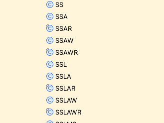
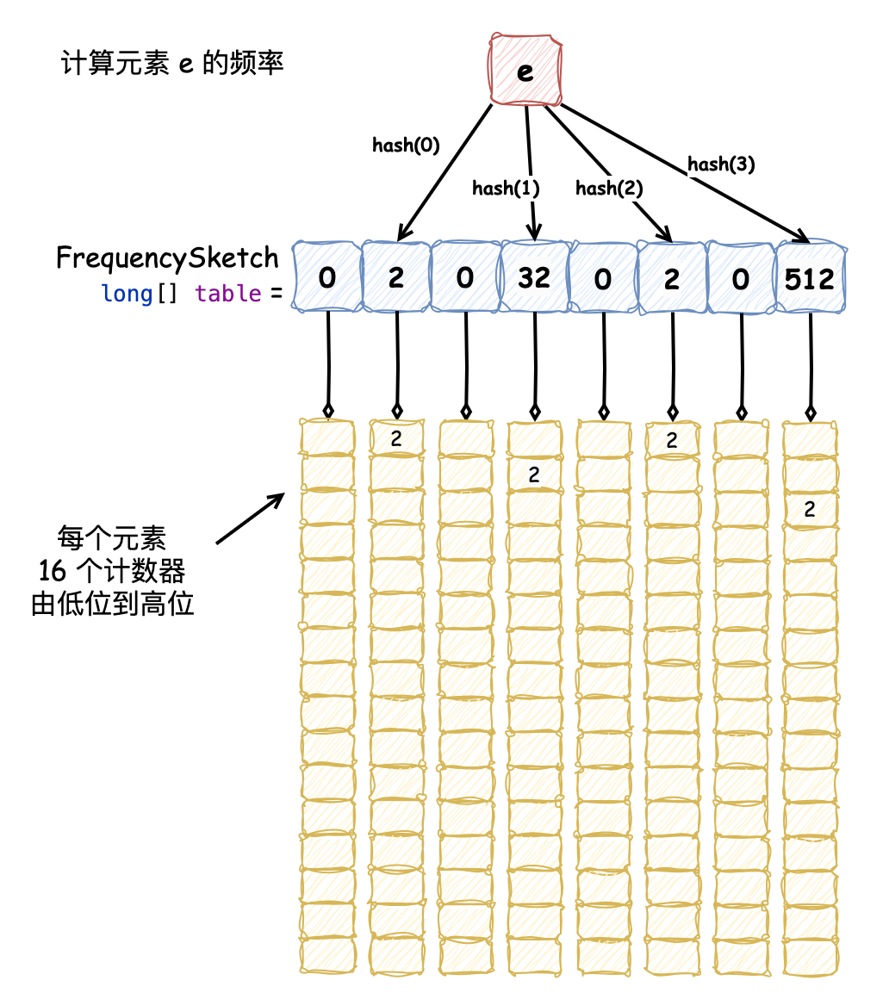

我们先以简单的创建一个固定大小的缓存为例

```java
public class TestReadSourceCode {

    @Test
    public void doRead() {
        // read constructor
        Cache<String, String> cache = Caffeine.newBuilder()
                .maximumSize(10_000)
                .build();

        // read put
        cache.put("key", "value");

        // read get
        cache.getIfPresent("key");
    }

}
```

### constructor

在 Caffeine 的构造方法中，区分了 `BoundedLocalManualCache` 和 `UnboundedLocalManualCache`
，见名知意它们分别为有“边界”的和无“边界”的缓存，`isBounded` 方法诠释了“边界”的含义：

```java
public final class Caffeine<K, V> {

    static final int UNSET_INT = -1;

    public <K1 extends K, V1 extends V> Cache<K1, V1> build() {
        // 校验参数
        requireWeightWithWeigher();
        requireNonLoadingCache();

        @SuppressWarnings("unchecked")
        Caffeine<K1, V1> self = (Caffeine<K1, V1>) this;
        return isBounded()
                ? new BoundedLocalCache.BoundedLocalManualCache<>(self)
                : new UnboundedLocalCache.UnboundedLocalManualCache<>(self);
    }

    boolean isBounded() {
        // 指定了最大大小；指定了最大权重
        return (maximumSize != UNSET_INT) || (maximumWeight != UNSET_INT)
                // 指定了访问后过期策略；指定了写后过期策略
                || (expireAfterAccessNanos != UNSET_INT) || (expireAfterWriteNanos != UNSET_INT)
                // 指定了自定义过期策略；指定了 key 或 value 的引用级别
                || (expiry != null) || (keyStrength != null) || (valueStrength != null);
    }
}
```

也就是说，当为缓存指定了上述的驱逐或过期策略会定义为有边界的 `BoundedLocalManualCache`
缓存，它会限制缓存的大小，防止内存溢出，否则为无边界的 `UnboundedLocalManualCache`
缓存，它没有大小限制，直到内存耗尽。

接下来我们主要关注 `BoundedLocalManualCache`，它在执行构造方法时，有以下逻辑：

```java
abstract class BoundedLocalCache<K, V> extends BLCHeader.DrainStatusRef
        implements LocalCache<K, V> {
    // ...

    static class BoundedLocalManualCache<K, V> implements LocalManualCache<K, V>, Serializable {
        private static final long serialVersionUID = 1;

        final BoundedLocalCache<K, V> cache;

        BoundedLocalManualCache(Caffeine<K, V> builder) {
            this(builder, null);
        }

        BoundedLocalManualCache(Caffeine<K, V> builder, @Nullable CacheLoader<? super K, V> loader) {
            cache = LocalCacheFactory.newBoundedLocalCache(builder, loader, /* async */ false);
        }
    }
}
```

我们可以发现 `BoundedLocalCache` 为抽象类，创建对象的实际类型应该是它的子类，而且它在创建时，使用了反射并遵循简单工厂的编码风格：

```java
interface LocalCacheFactory {
    static <K, V> BoundedLocalCache<K, V> newBoundedLocalCache(Caffeine<K, V> builder,
                                                               @Nullable AsyncCacheLoader<? super K, V> cacheLoader, boolean async) {
        var className = getClassName(builder);
        var factory = loadFactory(className);
        try {
            return factory.newInstance(builder, cacheLoader, async);
        } catch (RuntimeException | Error e) {
            throw e;
        } catch (Throwable t) {
            throw new IllegalStateException(className, t);
        }
    }
}
```

`getClassName` 非常有意思，它会根据为缓存设置的一些属性动态的拼接出列名：

```java
interface LocalCacheFactory {

    static String getClassName(Caffeine<?, ?> builder) {
        var className = new StringBuilder();
        // key 是强引用或弱引用
        if (builder.isStrongKeys()) {
            className.append('S');
        } else {
            className.append('W');
        }
        // value 是强引用或弱引用
        if (builder.isStrongValues()) {
            className.append('S');
        } else {
            className.append('I');
        }
        // 配置了移除监听器
        if (builder.removalListener != null) {
            className.append('L');
        }
        // 配置了统计功能
        if (builder.isRecordingStats()) {
            className.append('S');
        }
        // 不同的驱逐策略
        if (builder.evicts()) {
            // 基于最大值限制，可能是最大权重W，也可能是最大容量S
            className.append('M');
            // 基于权重或非权重
            if (builder.isWeighted()) {
                className.append('W');
            } else {
                className.append('S');
            }
        }
        // 配置了访问过期或可变过期策略
        if (builder.expiresAfterAccess() || builder.expiresVariable()) {
            className.append('A');
        }
        // 配置了写入过期策略
        if (builder.expiresAfterWrite()) {
            className.append('W');
        }
        // 配置了刷新策略
        if (builder.refreshAfterWrite()) {
            className.append('R');
        }
        return className.toString();
    }
}
```

这也就是为什么能在 `com.github.benmanes.caffeine.cache` 包路径下能发现很多类似 `SSMS` 只有简称命名的类（下图只截取部分，实际上有很多）：



根据代码，它的命名遵循如下格式 `S|W S|I [L] [S] [MW|MS] [A] [W] [R]` 其中 `[]` 表示选填 `|`
为某位置不同选择的分隔符，结合注释能清楚的了解各个位置字母表达的含义。如此定义使用了多级继承，尽可能多地复用代码，以我们测试用例中创建的 `SSMS`
为例，它表示 key 和 value 均为强引用并且配置了非权重的最大缓存大小，类图关系如下：


虽然在一些软件设计相关的书籍中强调“多用组合，少用继承”，但是这里使用多级继承我觉得并没有增加开发者的理解难度，反而了解了它的命名规则后，能更清晰的理解各个缓存所表示的含义，实现代码复用。

测试样例创建的缓存类型为 `SSMS`，它的构造方法会依次执行如下逻辑：

```java
// 1
abstract class BoundedLocalCache<K, V> extends BLCHeader.DrainStatusRef
        implements LocalCache<K, V> {

    static final int WRITE_BUFFER_MIN = 4;
    static final int WRITE_BUFFER_MAX = 128 * ceilingPowerOfTwo(NCPU);

    static final long MAXIMUM_CAPACITY = Long.MAX_VALUE - Integer.MAX_VALUE;

    static final double PERCENT_MAIN = 0.99d;
    static final double PERCENT_MAIN_PROTECTED = 0.80d;

    static final double HILL_CLIMBER_STEP_PERCENT = 0.0625d;

    final @Nullable RemovalListener<K, V> evictionListener;
    final @Nullable AsyncCacheLoader<K, V> cacheLoader;

    final MpscGrowableArrayQueue<Runnable> writeBuffer;
    final ConcurrentHashMap<Object, Node<K, V>> data;
    final PerformCleanupTask drainBuffersTask;
    final Consumer<Node<K, V>> accessPolicy;
    final Buffer<Node<K, V>> readBuffer;
    final NodeFactory<K, V> nodeFactory;
    final ReentrantLock evictionLock;
    final Weigher<K, V> weigher;
    final Executor executor;

    final boolean isAsync;
    final boolean isWeighted;

    protected BoundedLocalCache(Caffeine<K, V> builder,
                                @Nullable AsyncCacheLoader<K, V> cacheLoader, boolean isAsync) {
        // 标记同步或异步
        this.isAsync = isAsync;
        // 指定 cacheLoader 
        this.cacheLoader = cacheLoader;
        // 指定用于执行驱逐元素、刷新缓存等任务的线程池，不指定默认为 ForkJoinPool.commonPool()
        executor = builder.getExecutor();
        // 标记是否定义了节点计算权重的 Weigher 对象
        isWeighted = builder.isWeighted();
        // 同步锁，在接下来的内容中会看到很多标记了 @GuardedBy("evictionLock") 注解的方法，表示这行这些方法时都会获取这把同步锁
        // 根据该锁的命名，eviction 表示驱逐的意思，也就是说关注驱逐策略执行的方法都要获取该锁，这一点需要在后文中注意
        evictionLock = new ReentrantLock();
        // 计算元素权重的对象，不指定为 SingletonWeigher.INSTANCE
        weigher = builder.getWeigher(isAsync);
        // 执行缓存 maintenance 方法的任务，在后文中具体介绍
        drainBuffersTask = new PerformCleanupTask(this);
        // 创建节点的工厂
        nodeFactory = NodeFactory.newFactory(builder, isAsync);
        // 驱逐监听器，有元素被驱逐时会回调
        evictionListener = builder.getEvictionListener(isAsync);
        // 用于保存所有数据的 ConcurrentHashMap
        data = new ConcurrentHashMap<>(builder.getInitialCapacity());
        // 如果指定驱逐策略 或 key为弱引用 或 value为弱引用或软引用 或 访问后过期则创建 readBuffer，否则它为不可用状态
        // readBuffer 用于记录某些被访问过的节点
        readBuffer = evicts() || collectKeys() || collectValues() || expiresAfterAccess()
                ? new BoundedBuffer<>() : Buffer.disabled();
        // 如果指定了驱逐策略 或 访问后过期策略则会定义访问策略，执行 onAccess 方法，后文详细介绍
        accessPolicy = (evicts() || expiresAfterAccess()) ? this::onAccess : e -> {
        };
        // 初始化最大值和最小值的双端队列作为 writeBuffer，用于记录一些写后操作任务 
        writeBuffer = new MpscGrowableArrayQueue<>(WRITE_BUFFER_MIN, WRITE_BUFFER_MAX);

        // 执行了驱逐策略则更新最大容量限制
        if (evicts()) {
            setMaximumSize(builder.getMaximum());
        }
    }

    @GuardedBy("evictionLock")
    void setMaximumSize(long maximum) {
        requireArgument(maximum >= 0, "maximum must not be negative");
        if (maximum == maximum()) {
            return;
        }

        // 不能超过最大容量
        long max = Math.min(maximum, MAXIMUM_CAPACITY);
        // 计算窗口区大小
        long window = max - (long) (PERCENT_MAIN * max);
        // 计算保护区大小
        long mainProtected = (long) (PERCENT_MAIN_PROTECTED * (max - window));

        // 记录这些值
        setMaximum(max);
        setWindowMaximum(window);
        setMainProtectedMaximum(mainProtected);

        // 标记命中量、非命中量并初始化步长值，这三个值用于后续动态调整保护区和窗口区大小
        setHitsInSample(0);
        setMissesInSample(0);
        setStepSize(-HILL_CLIMBER_STEP_PERCENT * max);

        // 直到当前缓存的权重（大小）接近最大值时才初始化频率草图
        if ((frequencySketch() != null) && !isWeighted() && (weightedSize() >= (max >>> 1))) {
            frequencySketch().ensureCapacity(max);
        }
    }
}

// 2
class SS<K, V> extends BoundedLocalCache<K, V> {
    static final LocalCacheFactory FACTORY = SS::new;

    // key value 强引用无需特殊操作
    SS(Caffeine<K, V> var1, @Nullable AsyncCacheLoader<? super K, V> var2, boolean var3) {
        super(var1, var2, var3);
    }
}

// 3
class SSMS<K, V> extends SS<K, V> {

    // 频率草图，后文具体介绍
    final FrequencySketch<K> sketch = new FrequencySketch();

    final AccessOrderDeque<Node<K, V>> accessOrderWindowDeque;
    final AccessOrderDeque<Node<K, V>> accessOrderProbationDeque;
    final AccessOrderDeque<Node<K, V>> accessOrderProtectedDeque;

    SSMS(Caffeine<K, V> var1, @Nullable AsyncCacheLoader<? super K, V> var2, boolean var3) {
        super(var1, var2, var3);
        // 如果 caffeine 初始化了容量则确定频率草图的容量
        if (var1.hasInitialCapacity()) {
            long var4 = Math.min(var1.getMaximum(), (long) var1.getInitialCapacity());
            this.sketch.ensureCapacity(var4);
        }

        // 初始化窗口区、试用区和保护区，它们都是双端队列（链表实现）
        this.accessOrderWindowDeque = !var1.evicts() && !var1.expiresAfterAccess() ? null : new AccessOrderDeque();
        this.accessOrderProbationDeque = new AccessOrderDeque();
        this.accessOrderProtectedDeque = new AccessOrderDeque();
    }
}
```

在步骤 1 中我们需要解释一下 `weightedSize()` 方法，它用于访问 `long weightedSize`
变量。根据其命名有“权重大小”的含义，在默认不指定权重计算对象 `Weigher` 的情况下，`Weigher`
默认为 `SingletonWeigher.INSTANCE` 表示每个元素的权重大小为 1，如下：

```java
enum SingletonWeigher implements Weigher<Object, Object> {
    INSTANCE;

    @Override
    public int weigh(Object key, Object value) {
        return 1;
    }
}
```

这样 `weightedSize` 表示的便是当前缓存中元素数量，如果自定义了 `Weigher` 那么 `weightedSize`
表示的便是缓存中总权重大小，每个元素的权重则可能会不同。因为在示例中我们并没有指定 `Weigher`
，所以在此处可以将 `weightedSize` 理解为当前缓存大小。

还有一个点需要注意，上文中我们提到缓存的定义遵循大写字母缩写的命名规则，节点类的定义也是用了这种方式，在创建节点工厂 `NodeFactory.newFactory(builder, isAsync)`
的逻辑中，它会执行如下逻辑，根据缓存的类型来确定它的节点类型，命名遵循 `P|F S|W|D A|AW|W| [R] [MW|MS]` 的规则，同样使用了反射，如下：

```java
interface NodeFactory<K, V> {
    // ...

    static <K, V> NodeFactory<K, V> newFactory(Caffeine<K, V> builder, boolean isAsync) {
        if (builder.interner) {
            return (NodeFactory<K, V>) Interned.FACTORY;
        }
        var className = getClassName(builder, isAsync);
        return loadFactory(className);
    }

    static String getClassName(Caffeine<?, ?> builder, boolean isAsync) {
        var className = new StringBuilder();
        // key 强引用或弱引用
        if (builder.isStrongKeys()) {
            className.append('P');
        } else {
            className.append('F');
        }
        // value 强引用或弱引用或软引用
        if (builder.isStrongValues()) {
            className.append('S');
        } else if (builder.isWeakValues()) {
            className.append('W');
        } else {
            className.append('D');
        }
        // 过期策略
        if (builder.expiresVariable()) {
            if (builder.refreshAfterWrite()) {
                // 访问后过期
                className.append('A');
                if (builder.evicts()) {
                    // 写入后过期
                    className.append('W');
                }
            } else {
                className.append('W');
            }
        } else {
            // 访问后过期
            if (builder.expiresAfterAccess()) {
                className.append('A');
            }
            // 写入后过期
            if (builder.expiresAfterWrite()) {
                className.append('W');
            }
        }
        // 写入后刷新
        if (builder.refreshAfterWrite()) {
            className.append('R');
        }
        // 驱逐策略
        if (builder.evicts()) {
            // 默认最大大小限制
            className.append('M');
            // 加权
            if (isAsync || (builder.isWeighted() && (builder.weigher != Weigher.singletonWeigher()))) {
                className.append('W');
            } else {
                // 非加权
                className.append('S');
            }
        }
        return className.toString();
    }

}
```

`SSMS` 类型缓存对应的节点类型为 `PSMS`。除此之外我们还需要具体介绍下 `FrequencySketch`，它在上述方法的步骤 3 中被创建。这个类使用 **Count-Min Sketch**
算法计算某个元素的访问频率。它维护了一个 `long[] table` 一维数组，每个元素有 64 位，每 4 位作为一个计数器（这也就限定了最大频率为
15），那么数组中每个槽位便是 16 个计数器。通过哈希函数取 4 个独立的计数值，将其中的最小值作为元素的访问频率。`table`
的初始大小为缓存最大容量最接近的 2 的 n 次幂，并在计算哈希值时使用 `blockMask` 掩码来使哈希结果均匀分布，保证了获取元素访问频率的正确率为
93.75%，达到空间与时间的平衡。它的实现原理和布隆过滤器类似，牺牲了部分准确性，但减少了占用内存的大小。如下图所示为计算元素 e
的访问频率：



以下为 `FrequencySketch` 的源码，关注注释即可，并不复杂：

```java
final class FrequencySketch<E> {

    static final long RESET_MASK = 0x7777777777777777L;
    static final long ONE_MASK = 0x1111111111111111L;

    // 采样大小，用于控制 reset
    int sampleSize;
    // 掩码，用于均匀分散哈希结果
    int blockMask;
    long[] table;
    int size;

    public FrequencySketch() {
    }

    public void ensureCapacity(@NonNegative long maximumSize) {
        requireArgument(maximumSize >= 0);
        // 取缓存最大容量和 Integer.MAX_VALUE >>> 1 中的小值 
        int maximum = (int) Math.min(maximumSize, Integer.MAX_VALUE >>> 1);
        // 如果已经被初始化过并且 table 长度大于等于最大容量，那么不进行操作
        if ((table != null) && (table.length >= maximum)) {
            return;
        }

        // 初始化 table，长度为最接近 maximum 的 2的n次幂和 8 中的大值
        table = new long[Math.max(Caffeine.ceilingPowerOfTwo(maximum), 8)];
        // 计算采样大小
        sampleSize = (maximumSize == 0) ? 10 : (10 * maximum);
        // 计算掩码
        blockMask = (table.length >>> 3) - 1;
        // 特殊判断
        if (sampleSize <= 0) {
            sampleSize = Integer.MAX_VALUE;
        }
        // 计数器总数
        size = 0;
    }

    @NonNegative
    public int frequency(E e) {
        // 如果缓存没有被初始化则返回频率为 0
        if (isNotInitialized()) {
            return 0;
        }

        // 创建 4 个元素的数组 count 用于保存 4 次 hash 计算出的频率值
        int[] count = new int[4];
        // hash 扰动，使结果均匀分布
        int blockHash = spread(e.hashCode());
        // 重 hash，进一步分散结果
        int counterHash = rehash(blockHash);
        // 根据掩码计算对应的块索引
        int block = (blockHash & blockMask) << 3;
        // 循环 4 次计算 4 个计数器的结果
        for (int i = 0; i < 4; i++) {
            // 位运算变更 hash 值
            int h = counterHash >>> (i << 3);
            int index = (h >>> 1) & 15;
            // 计算计数器的偏移量
            int offset = h & 1;
            // 定位到 table 中某个槽位后右移并进行位与运算得到最低的 4 位的值（0xfL 为二进制的 1111）
            count[i] = (int) ((table[block + offset + (i << 1)] >>> (index << 2)) & 0xfL);
        }
        // 取其中的较小值
        return Math.min(Math.min(count[0], count[1]), Math.min(count[2], count[3]));
    }

    public void increment(E e) {
        if (isNotInitialized()) {
            return;
        }

        // 长度为 8 的数组记录该元素对应的位置，每个计数器需要两个值来定位
        int[] index = new int[8];
        int blockHash = spread(e.hashCode());
        int counterHash = rehash(blockHash);
        int block = (blockHash & blockMask) << 3;
        for (int i = 0; i < 4; i++) {
            int h = counterHash >>> (i << 3);
            // i 记录定位到 table 中某元素的位偏移量
            index[i] = (h >>> 1) & 15;
            int offset = h & 1;
            // i + 4 记录元素所在 table 中的索引
            index[i + 4] = block + offset + (i << 1);
        }
        // 四个对应的计数器都需要累加
        boolean added =
                incrementAt(index[4], index[0])
                        | incrementAt(index[5], index[1])
                        | incrementAt(index[6], index[2])
                        | incrementAt(index[7], index[3]);

        // 累加成功且达到采样大小需要进行重置
        if (added && (++size == sampleSize)) {
            reset();
        }
    }

    boolean incrementAt(int i, int j) {
        int offset = j << 2;
        long mask = (0xfL << offset);
        if ((table[i] & mask) != mask) {
            table[i] += (1L << offset);
            return true;
        }
        return false;
    }

    // 重置机制防止计数器溢出
    void reset() {
        int count = 0;
        for (int i = 0; i < table.length; i++) {
            // 累加 table 中每个元素的 2 进制表示的 1 的个数，结果为计数器个数的 4 倍
            count += Long.bitCount(table[i] & ONE_MASK);
            // 右移一位将计数值减半并将高位清零
            table[i] = (table[i] >>> 1) & RESET_MASK;
        }
        // count >>> 2 表示计数器个数，计算重置后的 size
        size = (size - (count >>> 2)) >>> 1;
    }

    static int spread(int x) {
        x ^= x >>> 17;
        x *= 0xed5ad4bb;
        x ^= x >>> 11;
        x *= 0xac4c1b51;
        x ^= x >>> 15;
        return x;
    }

    static int rehash(int x) {
        x *= 0x31848bab;
        x ^= x >>> 14;
        return x;
    }

}
```

到这里，`Caffeine` 缓存的基本数据结构全貌已经展现出来了，如下所示，在后文中我们再具体关注它们之间是如何协同的。


### put

接下来我们需要了解一下，向缓存中添加不存在的元素流程，如下为 Caffeine 的 `put` 方法：

```java
abstract class BoundedLocalCache<K, V> extends BLCHeader.DrainStatusRef implements LocalCache<K, V> {

    // 默认入参 onlyIfAbsent 为 false，表示向缓存中添加相同的 key 会对 value 进行替换 
    @Override
    public @Nullable V put(K key, V value) {
        return put(key, value, expiry(), /* onlyIfAbsent */ false);
    }
}
```

它会执行到如下具体逻辑中，关注注释信息：

```java
abstract class BoundedLocalCache<K, V> extends BLCHeader.DrainStatusRef implements LocalCache<K, V> {

    static final int WRITE_BUFFER_RETRIES = 100;

    final MpscGrowableArrayQueue<Runnable> writeBuffer;

    final ConcurrentHashMap<Object, Node<K, V>> data;

    final ReentrantLock evictionLock;

    final NodeFactory<K, V> nodeFactory;

    @Nullable
    V put(K key, V value, Expiry<K, V> expiry, boolean onlyIfAbsent) {
        // 不允许添加 null
        requireNonNull(key);
        requireNonNull(value);

        Node<K, V> node = null;
        // 获取当前时间戳
        long now = expirationTicker().read();
        // 计算缓存权重，如果没有指定 weigher 的话，默认权重为 1
        int newWeight = weigher.weigh(key, value);
        // 创建用于查找的键对象
        Object lookupKey = nodeFactory.newLookupKey(key);
        // 无限循环
        for (int attempts = 1; ; attempts++) {
            // 尝试获取节点；prior 译为先前的；较早的
            Node<K, V> prior = data.get(lookupKey);
            // 处理不存在的节点
            if (prior == null) {
                // 如果 node 在循环执行中还未被创建
                if (node == null) {
                    // NodeFactory 创建对应类型节点
                    node = nodeFactory.newNode(key, keyReferenceQueue(), value, valueReferenceQueue(), newWeight, now);
                    // 设置节点的过期时间
                    setVariableTime(node, expireAfterCreate(key, value, expiry, now));
                }
                // 尝试添加新节点到缓存中，如果键已存在则返回现有节点
                prior = data.putIfAbsent(node.getKeyReference(), node);
                // 返回 null 表示插入成功
                if (prior == null) {
                    // 写操作后添加 AddTask 并调度执行任务
                    afterWrite(new AddTask(node, newWeight));
                    return null;
                }
                // onlyIfAbsent 在默认的 put 方法中为 false，以下逻辑简单介绍
                // 如果此时有其他线程添加了相同 key 的元素
                else if (onlyIfAbsent) {
                    // 获取到当前值，尝试判断读后失效策略，更新访问时间，并执行写后方法 afterRead
                    V currentValue = prior.getValue();
                    if ((currentValue != null) && !hasExpired(prior, now)) {
                        if (!isComputingAsync(prior)) {
                            tryExpireAfterRead(prior, key, currentValue, expiry(), now);
                            setAccessTime(prior, now);
                        }
                        afterRead(prior, now, /* recordHit */ false);
                        return currentValue;
                    }
                }
            } else if (onlyIfAbsent) {
                // 同样的逻辑
                V currentValue = prior.getValue();
                if ((currentValue != null) && !hasExpired(prior, now)) {
                    if (!isComputingAsync(prior)) {
                        tryExpireAfterRead(prior, key, currentValue, expiry(), now);
                        setAccessTime(prior, now);
                    }
                    afterRead(prior, now, /* recordHit */ false);
                    return currentValue;
                }
            }
        }
        // ...
    }
}
```

注意添加节点成功的逻辑，添加成功会添加 `AddTask` 任务到 `writeBuffer` 中：

```java
abstract class BoundedLocalCache<K, V> extends BLCHeader.DrainStatusRef implements LocalCache<K, V> {

    // 写重试最多 100 次
    static final int WRITE_BUFFER_RETRIES = 100;

    static final int WRITE_BUFFER_MIN = 4;
    static final int WRITE_BUFFER_MAX = 128 * ceilingPowerOfTwo(NCPU);

    final MpscGrowableArrayQueue<Runnable> writeBuffer = new MpscGrowableArrayQueue<>(WRITE_BUFFER_MIN, WRITE_BUFFER_MAX);

    // 添加写后 Task 到 writeBuffer 中并在合适的时机调度执行任务
    void afterWrite(Runnable task) {
        // 最多重试添加 100 次
        for (int i = 0; i < WRITE_BUFFER_RETRIES; i++) {
            if (writeBuffer.offer(task)) {
                // 写后调度
                scheduleAfterWrite();
                return;
            }
            // 向 writeBuffer 中添加任务失败会调度任务执行
            scheduleDrainBuffers();
            // 自旋等待，让出 CPU 控制权
            Thread.onSpinWait();
        }
        // ...
    }
}
```

`writeBuffer` 的类型为 `MpscGrowableArrayQueue`，在这里我们详细的介绍下它。根据它的命名 **GrowableArrayQueue**
可知它是一个容量可以增长的双端队列，前缀 **MPSC** 表达的含义是“多生产者，单消费者”，也就是说可以有多个线程能向其中添加元素，但只有一个线程能从其中获取元素。那么它是如何实现 **MPSC** 的呢？接下来我们就根据源码详细了解一下。

#### MpscGrowableArrayQueue

首先我们先来看一下它的类继承关系图及简要说明：


图中灰色的表示抽象类，蓝色为实现类，`java.util.AbstractQueue` 就不再多解释了。首先我们先看看其中标记红框的内容：“避免内存伪共享问题”。以 `BaseMpscLinkedArrayQueuePad1` 为例：

```java
abstract class BaseMpscLinkedArrayQueuePad1<E> extends AbstractQueue<E> {
    byte p000, p001, p002, p003, p004, p005, p006, p007;
    byte p008, p009, p010, p011, p012, p013, p014, p015;
    byte p016, p017, p018, p019, p020, p021, p022, p023;
    byte p024, p025, p026, p027, p028, p029, p030, p031;
    byte p032, p033, p034, p035, p036, p037, p038, p039;
    byte p040, p041, p042, p043, p044, p045, p046, p047;
    byte p048, p049, p050, p051, p052, p053, p054, p055;
    byte p056, p057, p058, p059, p060, p061, p062, p063;
    byte p064, p065, p066, p067, p068, p069, p070, p071;
    byte p072, p073, p074, p075, p076, p077, p078, p079;
    byte p080, p081, p082, p083, p084, p085, p086, p087;
    byte p088, p089, p090, p091, p092, p093, p094, p095;
    byte p096, p097, p098, p099, p100, p101, p102, p103;
    byte p104, p105, p106, p107, p108, p109, p110, p111;
    byte p112, p113, p114, p115, p116, p117, p118, p119;
}
```

这个类除了定义了 120 字节的字段外，看上去没有做其他任何事情，实际上它为 **性能提升** 默默做出了贡献，**避免了内存伪共享问题**。CPU 中缓存行（Cache Line）的大小通常是 64 字节，在类中定义 120 字节来占位，这样便能将上下继承关系间的字段间隔开，保证被多个线程访问的关键字段距离至少跨越一个缓存行，分布在不同的缓存行中。这样在不同的线程访问 `BaseMpscLinkedArrayQueueProducerFields` 和 `BaseMpscLinkedArrayQueueConsumerFields` 中字段时互不影响，

补张图吧

详细了解原理可参考[博客园 - CPU Cache与缓存行](https://www.cnblogs.com/zhongqifeng/p/14765576.html)。

接下来我们看看其他抽象类的作用。`BaseMpscLinkedArrayQueueProducerFields` 定义生产者相关字段：

```java
abstract class BaseMpscLinkedArrayQueueProducerFields<E> extends BaseMpscLinkedArrayQueuePad1<E> {
    // 生产者操作索引（并不对应缓冲区 producerBuffer 中索引位置）
    protected long producerIndex;
}
```

`BaseMpscLinkedArrayQueueConsumerFields` 负责定义消费者相关字段：

```java
abstract class BaseMpscLinkedArrayQueueConsumerFields<E> extends BaseMpscLinkedArrayQueuePad2<E> {
    // 掩码值，用于计算消费者实际的索引位置
    protected long consumerMask;
    // 消费者访问这个缓冲区来获取元素消费
    protected E[] consumerBuffer;
    // 消费者操作索引（并不对应缓冲区 consumerBuffer 中索引位置）
    protected long consumerIndex;
}
```

`BaseMpscLinkedArrayQueueColdProducerFields` 中定义字段如下，该类的命名包含 **Cold**，表示其中字段被修改的次数会比较少：

```java
abstract class BaseMpscLinkedArrayQueueColdProducerFields<E> extends BaseMpscLinkedArrayQueuePad3<E> {
    // 生产者可以操作的最大索引上限
    protected volatile long producerLimit;
    // 掩码值，用于计算生产者在数组中实际的索引
    protected long producerMask;
    // 存储生产者生产的元素
    protected E[] producerBuffer;
}
```

现在关键字段我们已经介绍完了，接下来看一下创建 `MpscGrowableArrayQueue` 的逻辑，执行它的构造方法时会为我们刚刚提到的字段进行赋值：

```java
class MpscGrowableArrayQueue<E> extends MpscChunkedArrayQueue<E> {

    MpscGrowableArrayQueue(int initialCapacity, int maxCapacity) {
        // 调用父类的构造方法
        super(initialCapacity, maxCapacity);
    }
}

abstract class MpscChunkedArrayQueue<E> extends MpscChunkedArrayQueueColdProducerFields<E> {
    // 省略字节占位字段...
    byte p119;

    MpscChunkedArrayQueue(int initialCapacity, int maxCapacity) {
        // 调用父类的构造方法
        super(initialCapacity, maxCapacity);
    }

}

abstract class MpscChunkedArrayQueueColdProducerFields<E> extends BaseMpscLinkedArrayQueue<E> {
    protected final long maxQueueCapacity;

    MpscChunkedArrayQueueColdProducerFields(int initialCapacity, int maxCapacity) {
        // 调用父类的构造方法
        super(initialCapacity);
        if (maxCapacity < 4) {
            throw new IllegalArgumentException("Max capacity must be 4 or more");
        }
        // 保证了最大值最少比初始值大 2 倍
        if (ceilingPowerOfTwo(initialCapacity) >= ceilingPowerOfTwo(maxCapacity)) {
            throw new IllegalArgumentException(
                    "Initial capacity cannot exceed maximum capacity(both rounded up to a power of 2)");
        }
        // 最大容量也为 2的n次幂
        maxQueueCapacity = ((long) ceilingPowerOfTwo(maxCapacity)) << 1;
    }
}

abstract class BaseMpscLinkedArrayQueue<E> extends BaseMpscLinkedArrayQueueColdProducerFields<E> {

    BaseMpscLinkedArrayQueue(final int initialCapacity) {
        if (initialCapacity < 2) {
            throw new IllegalArgumentException("Initial capacity must be 2 or more");
        }

        // 初始化缓冲区大小为数值最接近的 2 的 n 次幂
        int p2capacity = ceilingPowerOfTwo(initialCapacity);
        // 掩码值，-1L 使其低位均为 1，左移 1 位则最低位为 0，eg: 00000110，注意该值会被生产者和消费者掩码值共同赋值
        long mask = (p2capacity - 1L) << 1;
        // 创建一个大小为 2的n次幂 +1 大小的缓冲区，注意这个 buffer 分别被 producerBuffer 和 consumerBuffer 共同引用
        E[] buffer = allocate(p2capacity + 1);
        // BaseMpscLinkedArrayQueueColdProducerFields 类中相关字段赋值
        producerBuffer = buffer;
        producerMask = mask;
        // 将 producerLimit 值赋为 掩码值
        soProducerLimit(this, mask);
        // BaseMpscLinkedArrayQueueConsumerFields 类中相关字段赋值
        consumerBuffer = buffer;
        consumerMask = mask;
    }
}
```

现在 `MpscGrowableArrayQueue` 的构建已经看完了，了解了其中关键字段的赋值，现在我们就需要看它是如何实现 **MPSC** 的。“多生产者”也就意味着会有多个线程向其中添加元素，添加操作对应了 `BaseMpscLinkedArrayQueue#offer` 方法，它的实现如下，在看源码的过程中，需要思考它是如何在多线程间完成协同的：

```java
abstract class BaseMpscLinkedArrayQueue<E> extends BaseMpscLinkedArrayQueueColdProducerFields<E> {

    private static final Object JUMP = new Object();

    @Override
    @SuppressWarnings("MissingDefault")
    public boolean offer(final E e) {
        if (e == null) {
            throw new NullPointerException();
        }

        long mask;
        E[] buffer;
        long pIndex;

        while (true) {
            // 生产者最大索引（生产者掩码值），获取 BaseMpscLinkedArrayQueueColdProducerFields 中定义的该字段
            long producerLimit = lvProducerLimit();
            // 生产者当前索引，初始值为 0，BaseMpscLinkedArrayQueueProducerFields 中字段 
            pIndex = lvProducerIndex(this);
            // producerIndex 最低位用来表示扩容（索引生产者索引 producerIndex 并不对应缓冲区中实际的索引）
            // 低位为 1 表示正在扩容，自旋等待直到扩容完成（表示只有一个线程操作扩容）
            if ((pIndex & 1) == 1) {
                continue;
            }

            // 掩码值和buffer可能在扩容中被改变，每次循环使用最新值
            mask = this.producerMask;
            buffer = this.producerBuffer;

            // 检查是否需要扩容
            if (producerLimit <= pIndex) {
                int result = offerSlowPath(mask, pIndex, producerLimit);
                switch (result) {
                    case 0:
                        break;
                    case 1:
                        continue;
                    case 2:
                        return false;
                    case 3:
                        resize(mask, buffer, pIndex, e);
                        return true;
                }
            }

            // CAS 操作更新生产者索引，注意这里是 +2，更新成功结束循环
            if (casProducerIndex(this, pIndex, pIndex + 2)) {
                break;
            }
        }
        // 计算该元素在 buffer 中的实际偏移量，并将其添加到缓冲区中
        final long offset = modifiedCalcElementOffset(pIndex, mask);
        soElement(buffer, offset, e);
        return true;
    }

    // 没有将 resize 逻辑封装在该方法中，而是由该方法判断是否需要扩容
    private int offerSlowPath(long mask, long pIndex, long producerLimit) {
        int result;
        // 获取消费者索引 BaseMpscLinkedArrayQueueConsumerFields 类中
        final long cIndex = lvConsumerIndex(this);
        // 通过掩码值计算当前缓冲区容量
        long bufferCapacity = getCurrentBufferCapacity(mask);
        result = 0;
        // 如果队列还有空间
        if (cIndex + bufferCapacity > pIndex) {
            // 尝试更新生产者最大限制，更新失败则返回 1 重试
            if (!casProducerLimit(this, producerLimit, cIndex + bufferCapacity)) {
                result = 1;
            }
        }
        // 如果队列已满且无法扩展
        else if (availableInQueue(pIndex, cIndex) <= 0) {
            result = 2;
        }
        // 更新 producerIndex 最低位为 1，成功则进行扩容，否则重试
        else if (casProducerIndex(this, pIndex, pIndex + 1)) {
            result = 3;
        } else {
            result = 1;
        }
        return result;
    }

    private void resize(long oldMask, E[] oldBuffer, long pIndex, final E e) {
        // 计算新缓冲区大小并创建，2 * (buffer.length - 1) + 1
        int newBufferLength = getNextBufferSize(oldBuffer);
        final E[] newBuffer = allocate(newBufferLength);

        // 更新缓冲区引用为新的缓冲区
        producerBuffer = newBuffer;
        // 更新新的掩码
        final int newMask = (newBufferLength - 2) << 1;
        producerMask = newMask;

        // 计算元素在新旧缓冲区中的偏移量
        final long offsetInOld = modifiedCalcElementOffset(pIndex, oldMask);
        final long offsetInNew = modifiedCalcElementOffset(pIndex, newMask);

        // 将元素放到新缓冲区中
        soElement(newBuffer, offsetInNew, e);
        // 将新缓冲区连接到旧缓冲区中
        soElement(oldBuffer, nextArrayOffset(oldMask), newBuffer);

        // 校验可用空间
        final long cIndex = lvConsumerIndex(this);
        final long availableInQueue = availableInQueue(pIndex, cIndex);
        if (availableInQueue <= 0) {
            throw new IllegalStateException();
        }

        // 更新生产者限制大小和生产者索引
        soProducerLimit(this, pIndex + Math.min(newMask, availableInQueue));
        soProducerIndex(this, pIndex + 2);

        // 将旧缓冲区中该位置的元素更新为 JUMP 标志位，这样在被消费时就知道去新的缓冲区获取了
        soElement(oldBuffer, offsetInOld, JUMP);
    }
    
    private long nextArrayOffset(final long mask) {
        return modifiedCalcElementOffset(mask + 2, Long.MAX_VALUE);
    }
    
    // 因为最低位用来表示是否在扩容，所以 producerIndex 和 consumerIndex 并不表示实际的索引
    // 注意生产者（消费者）操作索引值会随着元素的增加不断变大，因为有它们和掩码值的位与运算才保证了索引值一直在索引值的有效范围内
    static long modifiedCalcElementOffset(long index, long mask) {
        return (index & mask) >> 1;
    }
}
```

可见，在这个过程中它并没有限制操作线程数量，并通过保证 **可见性** 和使用 **CAS 操作** 允许多线程同时添加元素，可见性保证和CAS操作源码如下：

```java
abstract class BaseMpscLinkedArrayQueue<E> extends BaseMpscLinkedArrayQueueColdProducerFields<E> {

    static final VarHandle P_INDEX = pIndexLookup.findVarHandle(
            BaseMpscLinkedArrayQueueProducerFields.class, "producerIndex", long.class);
    
    // volatile 可见性保证
    static long lvProducerIndex(BaseMpscLinkedArrayQueue<?> self) {
        return (long) P_INDEX.getVolatile(self);
    }
    
    // CAS 操作
    static boolean casProducerIndex(BaseMpscLinkedArrayQueue<?> self, long expect, long newValue) {
        return P_INDEX.compareAndSet(self, expect, newValue);
    }
}
```

保证可见性（内存操作对其他线程可见）的原理是 **内存屏障**，除了保证可见性以外，内存屏障还能够 **防止重排序**（确保在内存屏障前后的内存操作不会被重排序，从而保证程序的正确性）。到这里，生产者添加元素的逻辑我们已经分析完了，接下来我们需要继续看一下消费者取出元素的逻辑，它对应了  `BaseMpscLinkedArrayQueue#poll` 方法，同样地，在这过程中需要关注“在这个方法中有没有限制单一线程执行”：

```java
abstract class BaseMpscLinkedArrayQueue<E> extends BaseMpscLinkedArrayQueueColdProducerFields<E> {
    
    private static final Object JUMP = new Object();
    
    public E poll() {
        // 读取消费者相关字段 BaseMpscLinkedArrayQueueConsumerFields 类
        final E[] buffer = consumerBuffer;
        final long index = consumerIndex;
        final long mask = consumerMask;

        // 根据消费索引，计算出元素在消费者缓冲区中实际的位置
        final long offset = modifiedCalcElementOffset(index, mask);
        // 读取该元素（volatile 可见性读取）
        Object e = lvElement(buffer, offset);
        
        // 如果为空
        if (e == null) {
            // 比较生产者索引，如果两个索引不相等，那么证明两索引间存在距离表示还有元素能够被消费
            if (index != lvProducerIndex(this)) {
                // 自旋读取元素，直到读到元素
                do {
                    e = lvElement(buffer, offset);
                } while (e == null);
            } else {
                // 索引相等证明确实是空队列
                return null;
            }
        }
        if (e == JUMP) {
            // 获取到新缓冲区
            final E[] nextBuffer = getNextBuffer(buffer, mask);
            // 在新缓冲区中获取到对应元素
            return newBufferPoll(nextBuffer, index);
        }
        // 清除当前索引的元素，表示该元素已经被消费
        soElement(buffer, offset, null);
        // 更新消费者索引，这里也是 +2，它并不表示实际的在缓冲区的索引
        soConsumerIndex(this, index + 2);
        return (E) e;
    }

    private E[] getNextBuffer(final E[] buffer, final long mask) {
        // 如果已经发生扩容，此时 consumerMask 仍然对应的是扩容前的 mask
        // 此处与生产者操作扩容时拼接新旧缓冲区调用的是一样的方法，这样便能够获取到新缓冲区的偏移量
        final long nextArrayOffset = nextArrayOffset(mask);
        // 获取到新缓冲区，因为在扩容操作时已经将新缓冲区链接到旧缓冲区上了
        final E[] nextBuffer = (E[]) lvElement(buffer, nextArrayOffset);
        // 将旧缓冲区中新缓冲区位置设置为 null 表示旧缓冲区中已经没有任何元素需要被消费了，也不再需要被引用了（能被垃圾回收了）
        soElement(buffer, nextArrayOffset, null);
        return nextBuffer;
    }

    private long nextArrayOffset(final long mask) {
        return modifiedCalcElementOffset(mask + 2, Long.MAX_VALUE);
    }

    private E newBufferPoll(E[] nextBuffer, final long index) {
        // 计算出消费者操作索引在新缓冲区中对应的实际位置
        final long offsetInNew = newBufferAndOffset(nextBuffer, index);
        // 在新缓冲区中获取到对应元素
        final E n = lvElement(nextBuffer, offsetInNew);
        if (n == null) {
            throw new IllegalStateException("new buffer must have at least one element");
        }
        // 清除当前索引的元素，表示该元素已经被消费
        soElement(nextBuffer, offsetInNew, null);
        // 更新消费者索引
        soConsumerIndex(this, index + 2);
        return n;
    }

    private long newBufferAndOffset(E[] nextBuffer, final long index) {
        // 将消费者缓冲区引用和掩码值更新
        consumerBuffer = nextBuffer;
        consumerMask = (nextBuffer.length - 2L) << 1;
        return modifiedCalcElementOffset(index, consumerMask);
    }
    
    static long modifiedCalcElementOffset(long index, long mask) {
        return (index & mask) >> 1;
    }
    
    static <E> E lvElement(E[] buffer, long offset) {
        return (E) REF_ARRAY.getVolatile(buffer, (int) offset);
    }
}
```

可以发现在该方法中并没有限制单一线程执行，所以理论上这个方法可能被多个线程调用，那么它又为什么被称为 **MPSC** 呢？在这个方法中的一段注释值得细心体会：

> This implementation is correct for single consumer thread use only.
> 此实现仅适用于单消费者线程使用

所以，猜想调用该方法的可能是一个线程数大小固定为1的线程池，保证单线程调用，至于是不是如此，需要等到在后续的源码中验证了。

到这里 `MpscGrowableArrayQueue` 中核心的逻辑已经讲解完了，现在我们回过头来再看一下队列扩容前后生产者和消费者是如何协同的？在扩容前，`consumerBuffer` 和 `producerBuffer` 引用的是同一个缓冲区对象。如果发生扩容，那么生产者会创建一个新的缓冲区，并将 `producerBuffer` 引用指向它，此时它做了一个 **非常巧妙** 的操作，将 **新缓冲区依然链接到旧缓冲区** 上，并将触发扩容的元素对应的旧缓冲区的索引处标记为 JUMP，表示这及之后的元素已经都在新缓冲区中。此时，消费者依然会在旧缓冲区中慢慢地消费，直到遇到 JUMP 标志位，消费者就知道需要到新缓冲区中取获取元素了。因为之前生产者在扩容时对新旧缓冲区进行链接，所以消费者能够通过旧缓冲区获取到新缓冲区的引用，并变更 `consumerBuffer` 的引用和 `consumerMask` 掩码值，接下来的消费过程便和扩容前没有差别了。

#### scheduleAfterWrite 方法

现在我们再回到 `put` 方法的逻辑中，如果向 `WriterBuffer` 中添加元素成功，则会调用 `scheduleAfterWrite` 方法，调度任务的执行：

```java
abstract class BoundedLocalCache<K, V> extends BLCHeader.DrainStatusRef implements LocalCache<K, V> {

    final ReentrantLock evictionLock = new ReentrantLock();
    // 默认为 ForkJoinPool.commonPool()
    final Executor executor;
    // 该任务在创建缓存时已经完成初始化
    final PerformCleanupTask drainBuffersTask;
    
    // 根据状态的变化来调度执行任务
    void scheduleAfterWrite() {
        // 获取当前 drainStatus，drain 译为排空，耗尽
        int drainStatus = drainStatusOpaque();
        for (; ; ) {
            // 这里的状态机变更需要关注下
            switch (drainStatus) {
                // IDLE 表示当前无任务可做
                case IDLE:
                    // CAS 更新状态为 REQUIRED
                    casDrainStatus(IDLE, REQUIRED);
                    // 调度任务执行
                    scheduleDrainBuffers();
                    return;
                // REQUIRED 表示当前有任务需要执行
                case REQUIRED:
                    // 调度任务执行
                    scheduleDrainBuffers();
                    return;
                // PROCESSING_TO_IDLE 表示当前任务处理完成后会变成 IDLE 状态
                case PROCESSING_TO_IDLE:
                    // 又来了新的任务，则 CAS 操作将它更新为 PROCESSING_TO_REQUIRED 状态
                    if (casDrainStatus(PROCESSING_TO_IDLE, PROCESSING_TO_REQUIRED)) {
                        return;
                    }
                    drainStatus = drainStatusAcquire();
                    continue;
                    // PROCESSING_TO_REQUIRED 表示正在处理任务，处理完任务后还有任务需要处理
                case PROCESSING_TO_REQUIRED:
                    return;
                default:
                    throw new IllegalStateException("Invalid drain status: " + drainStatus);
            }
        }
    }

    // 调度执行缓冲区中的任务
    void scheduleDrainBuffers() {
        // 如果状态表示正在有任务处理则返回
        if (drainStatusOpaque() >= PROCESSING_TO_IDLE) {
            return;
        }
        // 注意这里要获取同步锁 evictionLock
        if (evictionLock.tryLock()) {
            try {
                // 获取锁后再次校验当前处理状态
                int drainStatus = drainStatusOpaque();
                if (drainStatus >= PROCESSING_TO_IDLE) {
                    return;
                }
                // 更新状态为 PROCESSING_TO_IDLE
                setDrainStatusRelease(PROCESSING_TO_IDLE);
                // 同步机制保证任何时刻只能有一个线程能够提交任务
                executor.execute(drainBuffersTask);
            } catch (Throwable t) {
                logger.log(Level.WARNING, "Exception thrown when submitting maintenance task", t);
                maintenance(/* ignored */ null);
            } finally {
                evictionLock.unlock();
            }
        }
    }

}
```

写后调度处理任务（`scheduleAfterWrite`）会根据状态选择性执行 `scheduleDrainBuffers` 方法，执行该方法时通过同步锁 `evictionLock` 保证同时只有一个线程能提交 `PerformCleanupTask` 任务。这个任务在创建缓存时已经被初始化完成了，每次提交任务都会被复用，接下来我们看一下这个任务的具体实现：

```java
abstract class BoundedLocalCache<K, V> extends BLCHeader.DrainStatusRef implements LocalCache<K, V> {

    // 可重用的任务，用于执行 maintenance 方法，避免了使用 ForkJoinPool 来包装
    static final class PerformCleanupTask extends ForkJoinTask<Void> implements Runnable {
        private static final long serialVersionUID = 1L;

        final WeakReference<BoundedLocalCache<?, ?>> reference;

        PerformCleanupTask(BoundedLocalCache<?, ?> cache) {
            reference = new WeakReference<BoundedLocalCache<?, ?>>(cache);
        }

        @Override
        public boolean exec() {
            try {
                run();
            } catch (Throwable t) {
                logger.log(Level.ERROR, "Exception thrown when performing the maintenance task", t);
            }

            // Indicates that the task has not completed to allow subsequent submissions to execute
            return false;
        }

        @Override
        public void run() {
            // 获取到缓存对象
            BoundedLocalCache<?, ?> cache = reference.get();
            if (cache != null) {
                cache.performCleanUp(null);
            }
        }
        // ...
    }
}
```

它的实现非常简单，其中 `reference` 字段在调用构造方法时被赋值，引用的是缓存对象本身。当任务被执行时，调用的是 `BoundedLocalCache#performCleanUp` 方法：

```java
abstract class BoundedLocalCache<K, V> extends BLCHeader.DrainStatusRef implements LocalCache<K, V> {

    final ReentrantLock evictionLock = new ReentrantLock();
    
    // 执行该任务时，也要获取同步锁，表示任务只能由一个线程来执行
    void performCleanUp(@Nullable Runnable task) {
        evictionLock.lock();
        try {
            // 执行维护任务
            maintenance(task);
        } finally {
            evictionLock.unlock();
        }
        rescheduleCleanUpIfIncomplete();
    }

    @GuardedBy("evictionLock")
    void maintenance(@Nullable Runnable task) {
        // 更新状态为执行中
        setDrainStatusRelease(PROCESSING_TO_IDLE);

        try {
            // 处理读缓冲区中的任务
            drainReadBuffer();

            // 处理写缓冲区中的任务
            drainWriteBuffer();
            if (task != null) {
                task.run();
            }

            // 处理 key 和 value 的引用
            drainKeyReferences();
            drainValueReferences();

            // 过期和驱逐策略
            expireEntries();
            evictEntries();

            // “增值” 操作，后续重点讲
            climb();
        } finally {
            // 状态不是 PROCESSING_TO_IDLE 或者无法 CAS 更新为 IDLE 状态的话，需要更新状态为 REQUIRED，该状态会再次执行维护任务
            if ((drainStatusOpaque() != PROCESSING_TO_IDLE) || !casDrainStatus(PROCESSING_TO_IDLE, IDLE)) {
                setDrainStatusOpaque(REQUIRED);
            }
        }
    }
}
```

注意在执行 `performCleanUp` 方法时，也需要获取到同步锁 `evictionLock`，那么任务的提交和任务的执行也是互斥的。这个执行的核心逻辑在 `maintenance` “维护”方法中，注意这个方法被标记了注解 `@GuardedBy("evictionLock")`，源码中还有多个方法也标记了该注解，执行这些方法时都要获取同步锁，这也是在提醒我们这些方法同时只有由一条线程被执行。因为目前关注的是 `put` 方法，所以重点先看维护方法中 `drainWriteBuffer` 方法处理写缓冲区中的任务：

```java
abstract class BoundedLocalCache<K, V> extends BLCHeader.DrainStatusRef implements LocalCache<K, V> {

    static final int NCPU = Runtime.getRuntime().availableProcessors();

    static final int WRITE_BUFFER_MAX = 128 * ceilingPowerOfTwo(NCPU);

    final MpscGrowableArrayQueue<Runnable> writeBuffer;

    @GuardedBy("evictionLock")
    void drainWriteBuffer() {
        // 最大循环次数为 writeBuffer 最大容量，直至弹出元素为 null
        for (int i = 0; i <= WRITE_BUFFER_MAX; i++) {
            Runnable task = writeBuffer.poll();
            if (task == null) {
                return;
            }
            task.run();
        }
        // 更新状态为 PROCESSING_TO_REQUIRED
        setDrainStatusOpaque(PROCESSING_TO_REQUIRED);
    }
}
```

执行逻辑非常简单，在获取到同步锁之后，在 `WriteBuffer` 中获取要被执行的任务并执行。上文中我们猜想“单消费者”的实现是由固定大小为 1 的线程池来保证的，但实际上使用的是 **同步锁的机制保证同时只能有一个消费者消费缓冲区中的任务**。

在上文中我们已经知道，调用 `put` 方法时向缓冲区 `WriteBuffer` 中添加的任务为 `AddTask`，下面我们看一下该任务的实现：

```java
abstract class BoundedLocalCache<K, V> extends BLCHeader.DrainStatusRef implements LocalCache<K, V> {

    static final long MAXIMUM_CAPACITY = Long.MAX_VALUE - Integer.MAX_VALUE;

    final class AddTask implements Runnable {
        final Node<K, V> node;
        // 节点权重
        final int weight;

        AddTask(Node<K, V> node, int weight) {
            this.weight = weight;
            this.node = node;
        }

        @Override
        @GuardedBy("evictionLock")
        @SuppressWarnings("FutureReturnValueIgnored")
        public void run() {
            // 是否指定了驱逐策略
            if (evicts()) {
                // 更新缓存权重和窗口区权重
                setWeightedSize(weightedSize() + weight);
                setWindowWeightedSize(windowWeightedSize() + weight);
                // 更新节点的 policyWeight，该字段只有在自定了权重计算规则时才有效
                // 否则像只定义了固定容量的驱逐策略，使用默认元素权重为 1 是不需要关注该字段的
                node.setPolicyWeight(node.getPolicyWeight() + weight);

                // 检测当前总权重是否超过一半的最大容量
                long maximum = maximum();
                if (weightedSize() >= (maximum >>> 1)) {
                    // 如果超过最大容量
                    if (weightedSize() > MAXIMUM_CAPACITY) {
                        // 执行驱逐操作
                        evictEntries();
                    } else {
                        // 延迟加载频率草图 frequencySketch 数据结构，用于统计元素访问频率
                        long capacity = isWeighted() ? data.mappingCount() : maximum;
                        frequencySketch().ensureCapacity(capacity);
                    }
                }

                // 更新频率统计信息
                K key = node.getKey();
                if (key != null) {
                    // 因为频率草图数据结构具有延迟加载机制（权重超过半数）
                    // 所以实际上在元素权重还未过半未完成初始化时，调用 increment 是没有作用的
                    frequencySketch().increment(key);
                }

                // 增加未命中样本数
                setMissesInSample(missesInSample() + 1);
            }

            // 同步检测节点是否还有效
            boolean isAlive;
            synchronized (node) {
                isAlive = node.isAlive();
            }
            if (isAlive) {
                // 写后过期策略
                if (expiresAfterWrite()) {
                    writeOrderDeque().offerLast(node);
                }
                // 过期策略
                if (expiresVariable()) {
                    timerWheel().schedule(node);
                }
                // 驱逐策略
                if (evicts()) {
                    // 如果权重比配置的最大权重大
                    if (weight > maximum()) {
                        // 执行固定权重（RemovalCause.SIZE）的驱逐策略
                        evictEntry(node, RemovalCause.SIZE, expirationTicker().read());
                    }
                    // 如果权重超过窗口区最大权重，则将其放在窗口区头节点
                    else if (weight > windowMaximum()) {
                        accessOrderWindowDeque().offerFirst(node);
                    }
                    // 否则放在窗口区尾节点
                    else {
                        accessOrderWindowDeque().offerLast(node);
                    }
                }
                // 访问后过期策略
                else if (expiresAfterAccess()) {
                    accessOrderWindowDeque().offerLast(node);
                }
            }

            // 处理异步计算
            if (isComputingAsync(node)) {
                synchronized (node) {
                    if (!Async.isReady((CompletableFuture<?>) node.getValue())) {
                        long expirationTime = expirationTicker().read() + ASYNC_EXPIRY;
                        setVariableTime(node, expirationTime);
                        setAccessTime(node, expirationTime);
                        setWriteTime(node, expirationTime);
                    }
                }
            }
        }
    }
}
```

根据注释很容易理解该方法的作用，因为我们目前对缓存只定义了固定容量的驱逐策略，所以我们需要在看一下 `evictEntry` 方法：

```java
abstract class BoundedLocalCache<K, V> extends BLCHeader.DrainStatusRef implements LocalCache<K, V> {

    final ConcurrentHashMap<Object, Node<K, V>> data;
    
    @GuardedBy("evictionLock")
    @SuppressWarnings({"GuardedByChecker", "NullAway", "PMD.CollapsibleIfStatements"})
    boolean evictEntry(Node<K, V> node, RemovalCause cause, long now) {
        K key = node.getKey();
        @SuppressWarnings("unchecked")
        V[] value = (V[]) new Object[1];
        boolean[] removed = new boolean[1];
        boolean[] resurrect = new boolean[1];
        Object keyReference = node.getKeyReference();
        RemovalCause[] actualCause = new RemovalCause[1];

        data.computeIfPresent(keyReference, (k, n) -> {
            if (n != node) {
                return n;
            }
            synchronized (n) {
                value[0] = n.getValue();

                // key 或 value 为 null，这种情况下可能使用了 Caffeine.weakKeys, Caffeine.weakValues, or Caffeine.softValues
                // 导致被垃圾回收了
                if ((key == null) || (value[0] == null)) {
                    // 标记实际失效原因为垃圾回收 
                    actualCause[0] = RemovalCause.COLLECTED;
                }
                // 如果原因为垃圾回收，记录 resurrect 复活标记为 true
                else if (cause == RemovalCause.COLLECTED) {
                    resurrect[0] = true;
                    return n;
                }
                // 否则记录入参中的原因
                else {
                    actualCause[0] = cause;
                }

                // 过期驱逐策略判断
                if (actualCause[0] == RemovalCause.EXPIRED) {
                    boolean expired = false;
                    if (expiresAfterAccess()) {
                        expired |= ((now - n.getAccessTime()) >= expiresAfterAccessNanos());
                    }
                    if (expiresAfterWrite()) {
                        expired |= ((now - n.getWriteTime()) >= expiresAfterWriteNanos());
                    }
                    if (expiresVariable()) {
                        expired |= (n.getVariableTime() <= now);
                    }
                    if (!expired) {
                        resurrect[0] = true;
                        return n;
                    }
                }
                // 固定容量驱逐策略
                else if (actualCause[0] == RemovalCause.SIZE) {
                    int weight = node.getWeight();
                    if (weight == 0) {
                        resurrect[0] = true;
                        return n;
                    }
                }

                // 通知驱逐策略监听器，调用它的方法
                notifyEviction(key, value[0], actualCause[0]);
                // 将该 key 对应的刷新策略失效
                discardRefresh(keyReference);
                // 标记该节点被驱逐
                removed[0] = true;
                // 退休准备被垃圾回收
                node.retire();
            }
            return null;
        });

        // 如果复活标记为 true 那么不被移除
        if (resurrect[0]) {
            return false;
        }

        // 节点已经要被驱逐
        // 如果在窗口区，那么直接从窗口区移除
        if (node.inWindow() && (evicts() || expiresAfterAccess())) {
            accessOrderWindowDeque().remove(node);
        }
        // 如果没在窗口区
        else if (evicts()) {
            // 在试用区直接在试用区移除
            if (node.inMainProbation()) {
                accessOrderProbationDeque().remove(node);
            }
            // 在保护区则直接从保护区移除
            else {
                accessOrderProtectedDeque().remove(node);
            }
        }
        // 将写后失效和时间轮中关于该节点的元素移除
        if (expiresAfterWrite()) {
            writeOrderDeque().remove(node);
        } else if (expiresVariable()) {
            timerWheel().deschedule(node);
        }

        // 同步机制将 node 置为 dead
        synchronized (node) {
            logIfAlive(node);
            makeDead(node);
        }

        if (removed[0]) {
            // 节点被移除监控计数和节点移除通知回调
            statsCounter().recordEviction(node.getWeight(), actualCause[0]);
            notifyRemoval(key, value[0], actualCause[0]);
        }

        return true;
    }
}
```

该方法比较简单，是将节点进行驱逐的逻辑，对应 `AddTask` 任务的逻辑中，当被添加的元素权重超过最大权重限制时会被直接移除。这种特殊情况试用于指定了权重计算策略的缓存，如果只指定了固定容量，元素权重默认为 1，不会直接超过最大缓存数量限制。

现在我们已经将 `put` 方法中向缓存中添加元素的逻辑介绍完了，接下来需要关注 `put` 方法中对已存在的相同 key 值元素的处理逻辑：

```java
abstract class BoundedLocalCache<K, V> extends BLCHeader.DrainStatusRef implements LocalCache<K, V> {

    static final int MAX_PUT_SPIN_WAIT_ATTEMPTS = 1024 - 1;

    static final long EXPIRE_WRITE_TOLERANCE = TimeUnit.SECONDS.toNanos(1);
    
    final ConcurrentHashMap<Object, Node<K, V>> data;
    
    @Nullable
    V put(K key, V value, Expiry<K, V> expiry, boolean onlyIfAbsent) {
        requireNonNull(key);
        requireNonNull(value);

        Node<K, V> node = null;
        long now = expirationTicker().read();
        int newWeight = weigher.weigh(key, value);
        Object lookupKey = nodeFactory.newLookupKey(key);
        for (int attempts = 1; ; attempts++) {
            Node<K, V> prior = data.get(lookupKey);
            if (prior == null) {
                // ... 
            }

            // 元素被读到之后可能已经被驱逐了
            if (!prior.isAlive()) {
                // 自旋尝试重新从 ConcurrentHashMap 中获取，再获取时如果为 null 则执行新增逻辑
                if ((attempts & MAX_PUT_SPIN_WAIT_ATTEMPTS) != 0) {
                    Thread.onSpinWait();
                    continue;
                }
                // 如果自旋尝试后元素仍未被删除，校验元素是否处于存活状态
                // 如果处于非存活状态，那么可能这个元素已经被破坏，无法被移除，抛出异常
                data.computeIfPresent(lookupKey, (k, n) -> {
                    requireIsAlive(key, n);
                    return n;
                });
                continue;
            }

            V oldValue;
            // 新的过期时间
            long varTime;
            int oldWeight;
            boolean expired = false;
            boolean mayUpdate = true;
            boolean exceedsTolerance = false;
            // 为元素加同步锁
            synchronized (prior) {
                // 如果此时元素已经失效了，那么需要重新循环
                if (!prior.isAlive()) {
                    continue;
                }
                oldValue = prior.getValue();
                oldWeight = prior.getWeight();
                // oldValue 为 null 证明它被垃圾回收器回收了
                if (oldValue == null) {
                    // 记录元素创建后的过期时间
                    varTime = expireAfterCreate(key, value, expiry, now);
                    // 驱逐监听器回调
                    notifyEviction(key, null, RemovalCause.COLLECTED);
                }
                // 如果元素已经过期了
                else if (hasExpired(prior, now)) {
                    // 标记过期标志为 true
                    expired = true;
                    // 记录元素创建后的过期时间并回调驱逐监听器
                    varTime = expireAftexpireAfterCreateerCreate(key, value, expiry, now);
                    notifyEviction(key, oldValue, RemovalCause.EXPIRED);
                }
                // onlyInAbsent 为 true 时不会对已存在 key 的值进行修改
                else if (onlyIfAbsent) {
                    mayUpdate = false;
                    // 记录元素读后过期时间
                    varTime = expireAfterRead(prior, key, value, expiry, now);
                } else {
                    // 记录元素修改后过期时间
                    varTime = expireAfterUpdate(prior, key, value, expiry, now);
                }

                // 需要修改原有 key 的 value 值
                if (mayUpdate) {
                    exceedsTolerance =
                            // 配置了写后过期策略且已经超过写后时间的容忍范围
                            (expiresAfterWrite() && (now - prior.getWriteTime()) > EXPIRE_WRITE_TOLERANCE)
                                    // 或者配置了可变时间过期策略同样判断是否超过时间的容忍范围
                                    || (expiresVariable() && Math.abs(varTime - prior.getVariableTime()) > EXPIRE_WRITE_TOLERANCE);

                    // 更新值，更新权重，更新写时间
                    prior.setValue(value, valueReferenceQueue());
                    prior.setWeight(newWeight);
                    setWriteTime(prior, now);

                    // 写后刷新策略失效
                    discardRefresh(prior.getKeyReference());
                }

                // 更新过期时间
                setVariableTime(prior, varTime);
                // 更新访问时间
                setAccessTime(prior, now);
            }

            // 根据不同的情况回调不同的监听器
            if (expired) {
                notifyRemoval(key, oldValue, RemovalCause.EXPIRED);
            } else if (oldValue == null) {
                notifyRemoval(key, /* oldValue */ null, RemovalCause.COLLECTED);
            } else if (mayUpdate) {
                notifyOnReplace(key, oldValue, value);
            }

            // 计算写后权重变化
            int weightedDifference = mayUpdate ? (newWeight - oldWeight) : 0;
            // 如果 oldValue 已经被回收 或 权重修改前后发生变更 或 已经过期，添加更新任务
            if ((oldValue == null) || (weightedDifference != 0) || expired) {
                afterWrite(new UpdateTask(prior, weightedDifference));
            }
            // 如果超过了时间容忍范围，添加更新任务
            else if (!onlyIfAbsent && exceedsTolerance) {
                afterWrite(new UpdateTask(prior, weightedDifference));
            } else {
                // 没有超过时间容忍范围，更新写时间
                if (mayUpdate) {
                    setWriteTime(prior, now);
                }
                // 处理读后操作
                afterRead(prior, now, /* recordHit */ false);
            }

            return expired ? null : oldValue;
        }
    }
}
```

对于已有元素的变更，会对节点添加同步锁，更新它的权重等一系列变量，如果超过 1s 的时间容忍范围，则会添加 `UpdateTask` 更新任务，至于处理读后操作 `afterRead` 在读方法中再去介绍。接下来我们需要重新再看一下 `afterWrite` 方法，其中有部分我们在上文中没有介绍的逻辑：

```java
abstract class BoundedLocalCache<K, V> extends BLCHeader.DrainStatusRef implements LocalCache<K, V> {

    final ReentrantLock evictionLock;
    
    void afterWrite(Runnable task) {
        // 这段逻辑我们在看 AddTask 的逻辑时已经看过了，所以略过
        for (int i = 0; i < WRITE_BUFFER_RETRIES; i++) {
            if (writeBuffer.offer(task)) {
                scheduleAfterWrite();
                return;
            }
            scheduleDrainBuffers();
            Thread.onSpinWait();
        }

        // 以下逻辑用于解决在重试了 100 次后仍然写入失败的问题，它会尝试获取 evictionLock 同步锁
        // 直接执行“维护”方法并执行当前任务，但是它并无法解决某个写入操作执行时间很长的问题
        // 发生这种情况的原因可能是由于执行器的所有线程都很忙（可能是写入此缓存），写入速率大大超过了消耗速率，优先级反转，或者执行器默默地丢弃了维护任务
        lock();
        try {
            maintenance(task);
        } catch (RuntimeException e) {
            logger.log(Level.ERROR, "Exception thrown when performing the maintenance task", e);
        } finally {
            evictionLock.unlock();
        }
        // 重新调度异步维护任务，确保维护操作能及时执行
        rescheduleCleanUpIfIncomplete();
    }

    void lock() {
        long remainingNanos = WARN_AFTER_LOCK_WAIT_NANOS;
        long end = System.nanoTime() + remainingNanos;
        boolean interrupted = false;
        try {
            for (;;) {
                try {
                    if (evictionLock.tryLock(remainingNanos, TimeUnit.NANOSECONDS)) {
                        return;
                    }
                    logger.log(Level.WARNING, "The cache is experiencing excessive wait times for acquiring "
                            + "the eviction lock. This may indicate that a long-running computation has halted "
                            + "eviction when trying to remove the victim entry. Consider using AsyncCache to "
                            + "decouple the computation from the map operation.", new TimeoutException());
                    evictionLock.lock();
                    return;
                } catch (InterruptedException e) {
                    remainingNanos = end - System.nanoTime();
                    interrupted = true;
                }
            }
        } finally {
            if (interrupted) {
                Thread.currentThread().interrupt();
            }
        }
    }

    // 调用同步的维护方法时，可能发生获取锁超时，那么再重新开启一个异步维护调度
    void rescheduleCleanUpIfIncomplete() {
        // 校验是否有任务需要被执行
        if (drainStatusOpaque() != REQUIRED) {
            return;
        }
        
        // 默认线程池调度任务执行，这个方法我们在上文中已经详细介绍过
        if (executor == ForkJoinPool.commonPool()) {
            scheduleDrainBuffers();
            return;
        }
        
        // 如果自定义了线程池，那么会使用自定义的线程池进行处理
        var pacer = pacer();
        if ((pacer != null) && !pacer.isScheduled() && evictionLock.tryLock()) {
            try {
                if ((drainStatusOpaque() == REQUIRED) && !pacer.isScheduled()) {
                    pacer.schedule(executor, drainBuffersTask, expirationTicker().read(), Pacer.TOLERANCE);
                }
            } finally {
                evictionLock.unlock();
            }
        }
    }
}
```

写后操作除了在添加任务到缓冲区成功后会执行维护方法，添加失败（证明写入操作非常频繁）依然会尝试同步执行维护方法和发起异步维护，用于保证缓存中的任务能够被及时执行，使缓存中元素都处于“预期”状态中。接下来我们在看一下 `UpdateTask` 更新任务的逻辑：

```java
abstract class BoundedLocalCache<K, V> extends BLCHeader.DrainStatusRef implements LocalCache<K, V> {

    final class UpdateTask implements Runnable {
        final int weightDifference;
        final Node<K, V> node;

        public UpdateTask(Node<K, V> node, int weightDifference) {
            this.weightDifference = weightDifference;
            this.node = node;
        }

        @Override
        @GuardedBy("evictionLock")
        public void run() {
            // 写后过期和自定义过期逻辑
            if (expiresAfterWrite()) {
                reorder(writeOrderDeque(), node);
            } else if (expiresVariable()) {
                timerWheel().reschedule(node);
            }
            // 指定了驱逐策略
            if (evicts()) {
                // 变更节点权重
                int oldWeightedSize = node.getPolicyWeight();
                node.setPolicyWeight(oldWeightedSize + weightDifference);
                // 如果是窗口区节点
                if (node.inWindow()) {
                    // 更新窗口区权重
                    setWindowWeightedSize(windowWeightedSize() + weightDifference);
                    // 节点权重超过最大权重限制，直接驱逐
                    if (node.getPolicyWeight() > maximum()) {
                        evictEntry(node, RemovalCause.SIZE, expirationTicker().read());
                    }
                    // 节点权重比窗口区最大值小
                    else if (node.getPolicyWeight() <= windowMaximum()) {
                        onAccess(node);
                    }
                    // 窗口区包含该节点且该节点的权重大于窗口最大权重，则放到头节点
                    else if (accessOrderWindowDeque().contains(node)) {
                        accessOrderWindowDeque().moveToFront(node);
                    }
                }
                // 如果是试用区节点
                else if (node.inMainProbation()) {
                    // 节点权重比最大权重限制小
                    if (node.getPolicyWeight() <= maximum()) {
                        onAccess(node);
                    }
                    // 否则将该节点驱逐
                    else {
                        evictEntry(node, RemovalCause.SIZE, expirationTicker().read());
                    }
                }
                // 如果是保护区节点
                else if (node.inMainProtected()) {
                    // 更新保护区权重
                    setMainProtectedWeightedSize(mainProtectedWeightedSize() + weightDifference);
                    // 同样的逻辑
                    if (node.getPolicyWeight() <= maximum()) {
                        onAccess(node);
                    } else {
                        evictEntry(node, RemovalCause.SIZE, expirationTicker().read());
                    }
                }

                // 更新缓存权重大小
                setWeightedSize(weightedSize() + weightDifference);
                // 更新完成后超过最大权重限制执行驱逐操作
                if (weightedSize() > MAXIMUM_CAPACITY) {
                    evictEntries();
                }
            }
            // 配置了访问后过期
            else if (expiresAfterAccess()) {
                onAccess(node);
            }
        }
    }

    @GuardedBy("evictionLock")
    void onAccess(Node<K, V> node) {
        if (evicts()) {
            K key = node.getKey();
            if (key == null) {
                return;
            }
            // 更新访问频率
            frequencySketch().increment(key);
            // 如果节点在窗口区，则将其移动到尾节点
            if (node.inWindow()) {
                reorder(accessOrderWindowDeque(), node);
            }
            // 在试用区的节点执行 reorderProbation 方法，可能会将该节点从试用区晋升到保护区
            else if (node.inMainProbation()) {
                reorderProbation(node);
            }
            // 否则移动到保护区的尾结点
            else {
                reorder(accessOrderProtectedDeque(), node);
            }
            // 更新命中量
            setHitsInSample(hitsInSample() + 1);
        }
        // 配置了访问过期策略
        else if (expiresAfterAccess()) {
            reorder(accessOrderWindowDeque(), node);
        }
        // 配置了自定义时间过期策略
        if (expiresVariable()) {
            timerWheel().reschedule(node);
        }
    }

    static <K, V> void reorder(LinkedDeque<Node<K, V>> deque, Node<K, V> node) {
        // 如果节点存在，将其移动到尾结点
        if (deque.contains(node)) {
            deque.moveToBack(node);
        }
    }

    @GuardedBy("evictionLock")
    void reorderProbation(Node<K, V> node) {
        // 检查试用区是否包含该节点，不包含则证明已经被移除，则不处理
        if (!accessOrderProbationDeque().contains(node)) {
            return;
        }
        // 检查节点的权重是否超过保护区最大值
        else if (node.getPolicyWeight() > mainProtectedMaximum()) {
            // 如果超过，将该节点移动到 试用区 尾巴节点，保证超重的节点不会被移动到保护区
            reorder(accessOrderProbationDeque(), node);
            return;
        }

        // 更新保护区权重大小
        setMainProtectedWeightedSize(mainProtectedWeightedSize() + node.getPolicyWeight());
        // 在试用区中移除该节点
        accessOrderProbationDeque().remove(node);
        // 在保护区尾节点中添加
        accessOrderProtectedDeque().offerLast(node);
        // 将该节点标记为保护区节点
        node.makeMainProtected();
    }
}
```

`UpdateTask` 修改任务负责变更权重值，并更新节点所在队列的顺序和访问频率，这里我们也能发现，这三个区域的队列采用了 **LRU 算法**，一般情况下，**最新被访问的元素会被移动到尾节点**。到现在，向有固定容量限制的缓存中调用 `put` 方法添加元素的逻辑基本已经介绍完了，目前对 caffeine 缓存的了解程度如下所示：


`put` 添加元素时会先直接添加到 `ConcurrentHashMap` 中，并在 `WriteBuffer` 中添加 `AddTask/UpdateTask` 任务，`WriteBuffer` 是一个 **MPSC** 的缓冲区，添加成功后会有加锁的同步机制在默认的 `ForkJoinPool.commonPool()` 线程池中提交 `PerformCleanupTask` 任务，`PerformCleanupTask` 任务的主要作用是执行 `maintenance` 维护方法，该方法执行前需要先获取同步锁，单线程消费 `WriteBuffer` 中的任务。执行 `AddTask` 任务时会将元素先添加到窗口区，如果是 `UpdateTask`，它会修改三个不同区域的双端队列，这些队列采用LRU算法，最新被访问的元素会被放在尾节点处，并且试用区的元素被访问后会被晋升到保护区尾节点，元素对应的访问频率也会在频率草图中更新，如果被添加的节点权重超过缓存最大权重会直接被驱逐。（目前维护方法中除了 `drainWeiteBuffer` 方法外，其他步骤还未详细解释，之后会在后文中不断完善）

### getIfPresent

现在我们对 `put` 方法有了基本了解，现在我们继续深入 `getIfPresent` 方法：

```java
public class TestReadSourceCode {

    @Test
    public void doRead() {
        // read constructor
        Cache<String, String> cache = Caffeine.newBuilder()
                .maximumSize(10_000)
                .build();

        // read put
        cache.put("key", "value");

        // read get
        cache.getIfPresent("key");
    }

}
```

对应源码如下，关注注释信息：

```java
abstract class BoundedLocalCache<K, V> extends BLCHeader.DrainStatusRef implements LocalCache<K, V> {

    final ConcurrentHashMap<Object, Node<K, V>> data;

    final Buffer<Node<K, V>> readBuffer;

    @Override
    public @Nullable V getIfPresent(Object key, boolean recordStats) {
        // 直接由 ConcurrentHashMap 获取元素
        Node<K, V> node = data.get(nodeFactory.newLookupKey(key));
        if (node == null) {
            // 更新统计未命中
            if (recordStats) {
                statsCounter().recordMisses(1);
            }
            // 当前 drainStatus 为 REQUIRED 表示有任务需要处理则调度处理
            if (drainStatusOpaque() == REQUIRED) {
                // 这个方法在上文中介绍过，它会提交 PerformCleanupTask 执行维护方法 maintenance
                scheduleDrainBuffers();
            }
            return null;
        }

        V value = node.getValue();
        long now = expirationTicker().read();
        // 判断是否过期或者需要被回收且value对应的值为null
        if (hasExpired(node, now) || (collectValues() && (value == null))) {
            // 更新统计未命中
            if (recordStats) {
                statsCounter().recordMisses(1);
            }
            scheduleDrainBuffers();
            return null;
        }

        // 检查节点没有在进行异步计算
        if (!isComputingAsync(node)) {
            @SuppressWarnings("unchecked")
            K castedKey = (K) key;
            // 更新访问时间
            setAccessTime(node, now);
            // 更新读后过期时间
            tryExpireAfterRead(node, castedKey, value, expiry(), now);
        }
        // 处理读取后操作（主要关注）
        V refreshed = afterRead(node, now, recordStats);
        return (refreshed == null) ? value : refreshed;
    }
}
```

`getIfPresent` 方法中，部分内容我们已经在上文中介绍过，比如 `scheduleDrainBuffers` 方法。最后一步 `afterRead` 方法是我们本次关注的重点，从命名来看它表示“读后操作”接下来看看它的具体流程：

```java
abstract class BoundedLocalCache<K, V> extends BLCHeader.DrainStatusRef implements LocalCache<K, V> {

    final Buffer<Node<K, V>> readBuffer;
    
    @Nullable
    V afterRead(Node<K, V> node, long now, boolean recordHit) {
        // 更新统计命中
        if (recordHit) {
            statsCounter().recordHits(1);
        }

        // 注意这里如果 skipReadBuffer 为false，那么它会执行 readBuffer.offer(node) 逻辑，向 ReadBuffer 中添加待处理元素
        boolean delayable = skipReadBuffer() || (readBuffer.offer(node) != Buffer.FULL);
        // 判断是否需要延迟处理维护任务
        if (shouldDrainBuffers(delayable)) {
            scheduleDrainBuffers();
        }
        // 处理必要的刷新操作
        return refreshIfNeeded(node, now);
    }

    boolean skipReadBuffer() {
        // fastpath 方法访问元素是否可以跳过“通知”驱逐策略，true 表示跳过
        // 第二个判断条件判断频率草图是否初始化，如果“未初始化”则返回 true
        return fastpath() && frequencySketch().isNotInitialized();
    }

    // 状态流转，没有满 delayable 为 true 表示延迟执行维护任务
    boolean shouldDrainBuffers(boolean delayable) {
        switch (drainStatusOpaque()) {
            case IDLE:
                return !delayable;
            // 当前有任务需要处理则调度维护任务执行，否则均延迟执行    
            case REQUIRED:
                return true;
            case PROCESSING_TO_IDLE:
            case PROCESSING_TO_REQUIRED:
                return false;
            default:
                throw new IllegalStateException("Invalid drain status: " + drainStatus);
        }
    }
}
```

在深入具体源码前，我们还是先来介绍数据结构 `ReadBuffer`，它在 caffeine 的构造方法中完成初始化：

```java
abstract class BoundedLocalCache<K, V> extends BLCHeader.DrainStatusRef
        implements LocalCache<K, V> {

    final Buffer<Node<K, V>> readBuffer;
    
    protected BoundedLocalCache(Caffeine<K, V> builder,
                                @Nullable AsyncCacheLoader<K, V> cacheLoader, boolean isAsync) {
        // ...
        
        // 如果指定了过期策略或 key 定义了 week refenence value 定义了 week or soft reference 或定义了访问后过期策略 则 创建 BoundBuffer
        readBuffer = evicts() || collectKeys() || collectValues() || expiresAfterAccess()
                ? new BoundedBuffer<>()
                : Buffer.disabled();
    }
}
```

`Buffer.disabled()` 会创建如下枚举来表示 `DisabledBuffer`:

```java
enum DisabledBuffer implements Buffer<Object> {
    INSTANCE;

    @Override
    public int offer(Object e) {
        return Buffer.SUCCESS;
    }

    @Override
    public void drainTo(Consumer<Object> consumer) {
    }

    @Override
    public long size() {
        return 0;
    }

    @Override
    public long reads() {
        return 0;
    }

    @Override
    public long writes() {
        return 0;
    }
}
```

`readBuffer` 的实际类型为 `BoundedBuffer`，它的类关系图如下：


在 `Buffer` 接口的注释声明中，能获取很多有效信息：它同样也是 **多生产者单消费者（MPSC）** 缓冲区，上文我们在介绍`WriteBuffer` 时，它的单消费者实现方式是加同步锁，`ReadBuffer` 的实现方式一样，因为它们都是在维护方法 `maintenance` 中加同步锁对元素进行消费。此外，如果 `ReadBuffer` 缓冲区满了或者发生争抢则会拒绝添加新元素，它不像队列或栈，不保证 FIFO 或 LIFO。因为实现中不保证多消费者情况下正常，所以调用者需要保证消费者对该缓存的独占权。

> A multiple-producer / single-consumer buffer that rejects new elements if it is full or fails spuriously due to contention. Unlike a queue and stack, a buffer does not guarantee an ordering of elements in either FIFO or LIFO order.
Beware that it is the responsibility of the caller to ensure that a consumer has exclusive read access to the buffer. This implementation does not include fail-fast behavior to guard against incorrect consumer usage.

抽象类 `StripedBuffer` 采用分段设计（Striped）和CAS操作实现高效并发写入。分段是将缓冲区分成多个“段”，根据线程的探针值将它们哈希到不同的“段”，减少竞争，接下来我们看一下它具体的实现逻辑，首先是 `offer` 方法：

```java
abstract class StripedBuffer<E> implements Buffer<E> {

    volatile Buffer<E> @Nullable[] table;
    
    @Override
    public int offer(E e) {
        // 扰动函数计算 64位 线程探针值
        long z = mix64(Thread.currentThread().getId());
        // 取高 32 位值，位或 1 保证它为奇数
        int increment = ((int) (z >>> 32)) | 1;
        // 转换为 int 32 位
        int h = (int) z;

        // 掩码值为已分段的缓冲区数量-1
        int mask;
        int result;
        // 线程哈希到的具体缓冲区
        Buffer<E> buffer;
        // 未竞争标志位
        boolean uncontended = true;
        Buffer<E>[] buffers = table;
        if ((buffers == null)
                || ((mask = buffers.length - 1) < 0)
                // 位与运算获取缓冲区
                || ((buffer = buffers[h & mask]) == null)
                // 向缓冲区中添加元素
                || !(uncontended = ((result = buffer.offer(e)) != Buffer.FAILED))) {
            // 扩容或重试操作
            return expandOrRetry(e, h, increment, uncontended);
        }
        return result;
    }
}
```

在 `StripedBuffer` 中我们能发现定义了 `volatile Buffer<E> @Nullable[] table` 是数组的形式，这便对应了它“分段”的思想，将元素保存在多个缓冲区中。通过线程探针值哈希获取对应的缓冲区，逻辑并不复杂。`expandOrRetry` 方法我们稍后再介绍，我们先假设线程哈希到的具体缓冲区 `Buffer<E> buffer` 对象已经被创建，那么它会执行 `buffer.offer(e)`。`Buffer<E> buffer` 对应的实现类是定义在 `BoundedBuffer` 的静态内部类 `RingBuffer`，它实现了 `Buffer` 接口，源码如下：

```java
final class BoundedBuffer<E> extends StripedBuffer<E> {

    static final int BUFFER_SIZE = 16;
    static final int MASK = BUFFER_SIZE - 1;
    
    static final class RingBuffer<E> extends BBHeader.ReadAndWriteCounterRef implements Buffer<E> {
        static final VarHandle BUFFER = MethodHandles.arrayElementVarHandle(Object[].class);

        final Object[] buffer;

        public RingBuffer(E e) {
            buffer = new Object[BUFFER_SIZE];
            BUFFER.set(buffer, 0, e);
            WRITE.set(this, 1);
        }

        @Override
        public int offer(E e) {
            // ReadCounterRef#readCounter
            long head = readCounter;
            // ReadAndWriteCounterRef#writeCounter
            long tail = writeCounterOpaque();
            // 计算可操作容量 size
            long size = (tail - head);
            // 超过缓存大小则证明它已经满了
            if (size >= BUFFER_SIZE) {
                return Buffer.FULL;
            }
            // CAS 更新 writeCounter 为 writeCounter+1
            if (casWriteCounter(tail, tail + 1)) {
                // 位与掩码值获取缓冲区中的索引
                int index = (int) (tail & MASK);
                // 将元素 e 更新在指定索引处
                BUFFER.setRelease(buffer, index, e);
                return Buffer.SUCCESS;
            }
            return Buffer.FAILED;
        }

        @Override
        public void drainTo(Consumer<E> consumer) {
            // ReadCounterRef#readCounter
            long head = readCounter;
            // ReadAndWriteCounterRef#writeCounter
            long tail = writeCounterOpaque();
            // 计算可操作容量 size
            long size = (tail - head);
            // size 为 0 表示无元素可操作
            if (size == 0) {
                return;
            }
            // 循环获取待消费元素
            do {
                // 计算具体的索引
                int index = (int) (head & MASK);
                @SuppressWarnings("unchecked")
                E e = (E) BUFFER.getAcquire(buffer, index);
                // 索引处元素为空表示无元素可消费
                if (e == null) {
                    break;
                }
                // 获取到具体元素后将缓冲区该元素位置更新成 null
                BUFFER.setRelease(buffer, index, null);
                // 执行消费逻辑
                consumer.accept(e);
                // head累加
                head++;
            } while (head != tail);
            // 更新读索引的值
            setReadCounterOpaque(head);
        }
    }
}

final class BBHeader {

    @SuppressWarnings("PMD.AbstractClassWithoutAbstractMethod")
    abstract static class PadReadCounter {
        byte p000, /*省略118字节占位符...*/ p119;
    }
    
    abstract static class ReadCounterRef extends PadReadCounter {
        volatile long readCounter;
    }

    abstract static class PadWriteCounter extends ReadCounterRef {
        byte p120, /*省略118字节占位符...*/ p239;
    }
    
    abstract static class ReadAndWriteCounterRef extends PadWriteCounter {
        static final VarHandle READ, WRITE;

        volatile long writeCounter;

        // ...
    }
}
```

在 `BBHeader` 类中又看到了熟悉的 120 字节内存占位，在上文中我们详细介绍过，这样能够保证 `readCounter` 和 `writeCounter` 分布在不同内存行，**避免了内存伪共享问题**，保证不同线程读取这两个字段时互不影响。在添加元素的 `offer` 方法和消费元素的 `drainTo` 方法中，都能看见它使用了“读索引readCounter”和“写索引writeCounter”，这也对应了它命名中的 **Ring**。**Ring** 表示环形，读、写索引在操作过程中会不断累加，但是它会执行位与运算保证索引值一直落在缓冲区长度的有效范围内，也就是说这两个索引值会不断在有效索引范围内“转圈”，则形成一个“环形”缓冲区。

`RingBuffer` 通过 CAS 操作来确保并发添加元素操作的安全，如果 CAS 操作失败则返回 `Buffer.FAILED`，这时便会执行 `StripedBuffer#expandOrRetry` 方法，我们先来看一下它的方法注释内容，它说：

> Handles cases of updates involving initialization, resizing, creating new Buffers, and/ or contention. See above for explanation. This method suffers the usual non-modularity problems of optimistic retry code, relying on rechecked sets of reads.

```java
abstract class StripedBuffer<E> implements Buffer<E> {
    final int expandOrRetry(E e, int h, int increment, boolean wasUncontended) {
        int result = Buffer.FAILED;
        boolean collide = false; // True if last slot nonempty
        for (int attempt = 0; attempt < ATTEMPTS; attempt++) {
            Buffer<E>[] buffers;
            Buffer<E> buffer;
            int n;
            if (((buffers = table) != null) && ((n = buffers.length) > 0)) {
                if ((buffer = buffers[(n - 1) & h]) == null) {
                    if ((tableBusy == 0) && casTableBusy()) { // Try to attach new Buffer
                        boolean created = false;
                        try { // Recheck under lock
                            Buffer<E>[] rs;
                            int mask, j;
                            if (((rs = table) != null) && ((mask = rs.length) > 0)
                                    && (rs[j = (mask - 1) & h] == null)) {
                                rs[j] = create(e);
                                created = true;
                            }
                        } finally {
                            tableBusy = 0;
                        }
                        if (created) {
                            result = Buffer.SUCCESS;
                            break;
                        }
                        continue; // Slot is now non-empty
                    }
                    collide = false;
                } else if (!wasUncontended) { // CAS already known to fail
                    wasUncontended = true;      // Continue after rehash
                } else if ((result = buffer.offer(e)) != Buffer.FAILED) {
                    break;
                } else if ((n >= MAXIMUM_TABLE_SIZE) || (table != buffers)) {
                    collide = false; // At max size or stale
                } else if (!collide) {
                    collide = true;
                } else if ((tableBusy == 0) && casTableBusy()) {
                    try {
                        if (table == buffers) { // Expand table unless stale
                            table = Arrays.copyOf(buffers, n << 1);
                        }
                    } finally {
                        tableBusy = 0;
                    }
                    collide = false;
                    continue; // Retry with expanded table
                }
                h += increment;
            } else if ((tableBusy == 0) && (table == buffers) && casTableBusy()) {
                boolean init = false;
                try { // Initialize table
                    if (table == buffers) {
                        @SuppressWarnings({"rawtypes", "unchecked"})
                        Buffer<E>[] rs = new Buffer[1];
                        rs[0] = create(e);
                        table = rs;
                        init = true;
                    }
                } finally {
                    tableBusy = 0;
                }
                if (init) {
                    result = Buffer.SUCCESS;
                    break;
                }
            }
        }
        return result;
    }
}
```

### maintenance

```java
abstract class BoundedLocalCache<K, V> extends BLCHeader.DrainStatusRef implements LocalCache<K, V> {

    @GuardedBy("evictionLock")
    void maintenance(@Nullable Runnable task) {
        // 更新状态为执行中
        setDrainStatusRelease(PROCESSING_TO_IDLE);

        try {
            // 1. 处理读缓冲区中的任务
            drainReadBuffer();

            // 2. 处理写缓冲区中的任务
            drainWriteBuffer();
            if (task != null) {
                task.run();
            }

            // 3. 处理 key 和 value 的引用
            drainKeyReferences();
            drainValueReferences();

            // 4. 过期和驱逐策略
            expireEntries();
            evictEntries();

            // 5. “增值” 操作
            climb();
        } finally {
            // 状态不是 PROCESSING_TO_IDLE 或者无法 CAS 更新为 IDLE 状态的话，需要更新状态为 REQUIRED，该状态会再次执行维护任务
            if ((drainStatusOpaque() != PROCESSING_TO_IDLE) || !casDrainStatus(PROCESSING_TO_IDLE, IDLE)) {
                setDrainStatusOpaque(REQUIRED);
            }
        }
    }
}
```

首先我们来看步骤一处理读缓冲区：

```java
abstract class BoundedLocalCache<K, V> extends BLCHeader.DrainStatusRef implements LocalCache<K, V> {

    final Buffer<Node<K, V>> readBuffer;

    final Consumer<Node<K, V>> accessPolicy;

    @GuardedBy("evictionLock")
    void drainReadBuffer() {
        if (!skipReadBuffer()) {
            readBuffer.drainTo(accessPolicy);
        }
    }

}
```

它在这里会执行到 `BoundedBuffer#drainTo` 方法，并且入参了 `Consumer<Node<K, V>> accessPolicy`

```java
final class BoundedBuffer<E> extends StripedBuffer<E> {
    static final class RingBuffer<E> extends BBHeader.ReadAndWriteCounterRef implements Buffer<E> {
        static final VarHandle BUFFER = MethodHandles.arrayElementVarHandle(Object[].class);

        @Override
        public void drainTo(Consumer<E> consumer) {
            long head = readCounter;
            long tail = writeCounterOpaque();
            long size = (tail - head);
            if (size == 0) {
                return;
            }
            do {
                int index = (int) (head & MASK);
                @SuppressWarnings("unchecked")
                E e = (E) BUFFER.getAcquire(buffer, index);
                if (e == null) {
                    // not published yet
                    break;
                }
                BUFFER.setRelease(buffer, index, null);
                consumer.accept(e);
                head++;
            } while (head != tail);
            setReadCounterOpaque(head);
        }
    }
}
```

接下来我们看一下为 `accessPolicy` 赋值的逻辑

```java
abstract class BoundedLocalCache<K, V> extends BLCHeader.DrainStatusRef implements LocalCache<K, V> {

    final Buffer<Node<K, V>> readBuffer;

    final Consumer<Node<K, V>> accessPolicy;

    protected BoundedLocalCache(Caffeine<K, V> builder,
                                @Nullable AsyncCacheLoader<K, V> cacheLoader, boolean isAsync) {
        accessPolicy = (evicts() || expiresAfterAccess()) ? this::onAccess : e -> {
        };
    }
    
}
```

在这个方法中有一段注释非常重要，它说：

> If the protected space exceeds its maximum, the LRU items are demoted to the probation space.
> This is deferred to the adaption phase at the end of the maintenance cycle.

如果保护区空间超过它的最大值，它会将其中的元素降级到试用区。但是这个操作被推迟到 `maintenance` 方法的最后执行。

Main Probation: 试用区

Main Protected: 保护区

那么，我们在这里假设，执行 `maintenance` 方法时其他处理写缓冲区方法等均无需特别处理，直接跳转到最后的 `climb`
，看看它是如何为缓存“增值（climb）”的：

```java
abstract class BoundedLocalCache<K, V> extends BLCHeader.DrainStatusRef implements LocalCache<K, V> {

    static final double HILL_CLIMBER_RESTART_THRESHOLD = 0.05d;

    static final double HILL_CLIMBER_STEP_PERCENT = 0.0625d;

    // 步长值衰减比率
    static final double HILL_CLIMBER_STEP_DECAY_RATE = 0.98d;

    static final int QUEUE_TRANSFER_THRESHOLD = 1_000;

    @GuardedBy("evictionLock")
    void climb() {
        if (!evicts()) {
            return;
        }

        // 确定要调整的量
        determineAdjustment();
        // 将保护区中的元素降级到试用区
        demoteFromMainProtected();
        // 获取第一步计算完毕的调整大小
        long amount = adjustment();
        // 不调整则结束，否则根据正负增大或减小窗口大小
        if (amount == 0) {
            return;
        } else if (amount > 0) {
            increaseWindow();
        } else {
            decreaseWindow();
        }
    }

    @GuardedBy("evictionLock")
    void determineAdjustment() {
        // 检查频率草图是否被初始化
        if (frequencySketch().isNotInitialized()) {
            // 没有被初始化则重置命中率、命中和未命中样本数
            setPreviousSampleHitRate(0.0);
            setMissesInSample(0);
            setHitsInSample(0);
            return;
        }

        // 请求总数 = 命中样本数 + 未命中样本数
        int requestCount = hitsInSample() + missesInSample();
        if (requestCount < frequencySketch().sampleSize) {
            return;
        }

        // 计算命中率、命中率变化
        double hitRate = (double) hitsInSample() / requestCount;
        double hitRateChange = hitRate - previousSampleHitRate();
        // 计算调整量，如果命中率增加获取正的步长值，否则获取负的步长值
        double amount = (hitRateChange >= 0) ? stepSize() : -stepSize();
        // 计算下一个步长值，如果变化量超过阈值，那么重新计算步长，否则按照固定衰减率计算
        double nextStepSize = (Math.abs(hitRateChange) >= HILL_CLIMBER_RESTART_THRESHOLD)
                ? HILL_CLIMBER_STEP_PERCENT * maximum() * (amount >= 0 ? 1 : -1)
                : HILL_CLIMBER_STEP_DECAY_RATE * amount;
        // 记录本次命中率作为下一次计算的依据
        setPreviousSampleHitRate(hitRate);
        // 记录要调整的量
        setAdjustment((long) amount);
        // 记录步长值
        setStepSize(nextStepSize);
        // 重置未命中和命中数量
        setMissesInSample(0);
        setHitsInSample(0);
    }

    @GuardedBy("evictionLock")
    void demoteFromMainProtected() {
        // 获取保护区的最大值和当前值
        long mainProtectedMaximum = mainProtectedMaximum();
        long mainProtectedWeightedSize = mainProtectedWeightedSize();
        // 当前值没有超过最大值则不处理
        if (mainProtectedWeightedSize <= mainProtectedMaximum) {
            return;
        }

        // 每次从保护区转换到试用区有 1000 个最大限制
        for (int i = 0; i < QUEUE_TRANSFER_THRESHOLD; i++) {
            // 一旦不超过最大阈值则停止
            if (mainProtectedWeightedSize <= mainProtectedMaximum) {
                break;
            }

            // 在保护区取出头节点
            Node<K, V> demoted = accessOrderProtectedDeque().poll();
            if (demoted == null) {
                break;
            }
            // 标记为试用区
            demoted.makeMainProbation();
            // 加入到试用区中
            accessOrderProbationDeque().offerLast(demoted);
            // 计算保护区权重大小
            mainProtectedWeightedSize -= demoted.getPolicyWeight();
        }
        // 更新保护区权重
        setMainProtectedWeightedSize(mainProtectedWeightedSize);
    }

    @GuardedBy("evictionLock")
    void increaseWindow() {
        // 保护区最大容量为 0 则没有可调整的空间
        if (mainProtectedMaximum() == 0) {
            return;
        }

        // 窗口调整的变化量由保护区贡献，取能够变化额度 quota 为计算调整量和保护区最大值中的小值
        long quota = Math.min(adjustment(), mainProtectedMaximum());
        // 减小保护区大小增加窗口区大小
        setMainProtectedMaximum(mainProtectedMaximum() - quota);
        setWindowMaximum(windowMaximum() + quota);
        // 保护区大小变动后，需要操作元素由保护区降级到试用区
        demoteFromMainProtected();

        for (int i = 0; i < QUEUE_TRANSFER_THRESHOLD; i++) {
            // 获取试用区头节点为“候选节点”
            Node<K, V> candidate = accessOrderProbationDeque().peekFirst();
            boolean probation = true;
            // 如果在试用区获取失败或者窗口调整的变化量要比该节点所占的权重小，那么尝试从保护区获取节点
            if ((candidate == null) || (quota < candidate.getPolicyWeight())) {
                candidate = accessOrderProtectedDeque().peekFirst();
                probation = false;
            }
            // 试用区和保护区均无节点，则无需处理，结束循环
            if (candidate == null) {
                break;
            }

            // 获取该候选节点的权重，如果可变化额度比候选权重小，那么无需处理
            int weight = candidate.getPolicyWeight();
            if (quota < weight) {
                break;
            }

            // 每移除一个节点更新需要可变化额度
            quota -= weight;
            // 如果是试用区节点，则直接移除
            if (probation) {
                accessOrderProbationDeque().remove(candidate);
            }
            // 如果是保护区节点，需要更新保护区权重大小，再将其从保护区中移除
            else {
                setMainProtectedWeightedSize(mainProtectedWeightedSize() - weight);
                accessOrderProtectedDeque().remove(candidate);
            }
            // 增加窗口区大小
            setWindowWeightedSize(windowWeightedSize() + weight);
            // 将被移除的“候选节点”添加到窗口区中
            accessOrderWindowDeque().offerLast(candidate);
            // 标记为窗口区节点
            candidate.makeWindow();
        }

        // 可能存在 quota 小于 节点权重 的情况，那么这些量无法再调整，需要重新累加到保护区，并在窗口区中减掉
        setMainProtectedMaximum(mainProtectedMaximum() + quota);
        setWindowMaximum(windowMaximum() - quota);
        // 将未完成调整的 quota 记录在调整值中
        setAdjustment(quota);
    }

    @GuardedBy("evictionLock")
    void decreaseWindow() {
        // 如果窗口区大小小于等于 1 则无法再减少了
        if (windowMaximum() <= 1) {
            return;
        }

        // 获取变化量的额度（正整数），取调整值和窗口最大值减一中较小的值
        long quota = Math.min(-adjustment(), Math.max(0, windowMaximum() - 1));
        // 更新保护区和窗口区大小
        setMainProtectedMaximum(mainProtectedMaximum() + quota);
        setWindowMaximum(windowMaximum() - quota);

        for (int i = 0; i < QUEUE_TRANSFER_THRESHOLD; i++) {
            // 从窗口区获取“候选节点”
            Node<K, V> candidate = accessOrderWindowDeque().peekFirst();
            // 未获取到说明窗口区已经没有元素了，不能再减小了，结束循环操作
            if (candidate == null) {
                break;
            }

            // 获取候选节点的权重
            int weight = candidate.getPolicyWeight();
            // 可变化的额度小于权重，则不支持变化，结束循环
            if (quota < weight) {
                break;
            }

            // 随着节点的移动，变更可变化额度
            quota -= weight;
            // 更新窗口区大小并将元素从窗口区移除
            setWindowWeightedSize(windowWeightedSize() - weight);
            accessOrderWindowDeque().remove(candidate);
            // 将从窗口区中移除的元素添加到试用区
            accessOrderProbationDeque().offerLast(candidate);
            // 将节点标记为试用区元素
            candidate.makeMainProbation();
        }

        // 此时 quote 为剩余无法变更的额度，需要在保护区中减去在窗口区中加上
        setMainProtectedMaximum(mainProtectedMaximum() - quota);
        setWindowMaximum(windowMaximum() + quota);
        // 记录未变更完的额度在调整值中
        setAdjustment(-quota);
    }

}
```

- policy weight 的含义 与 policy 有关系吗？

### 巨人的肩膀

- [博客园 - CPU Cache与缓存行](https://www.cnblogs.com/zhongqifeng/p/14765576.html)