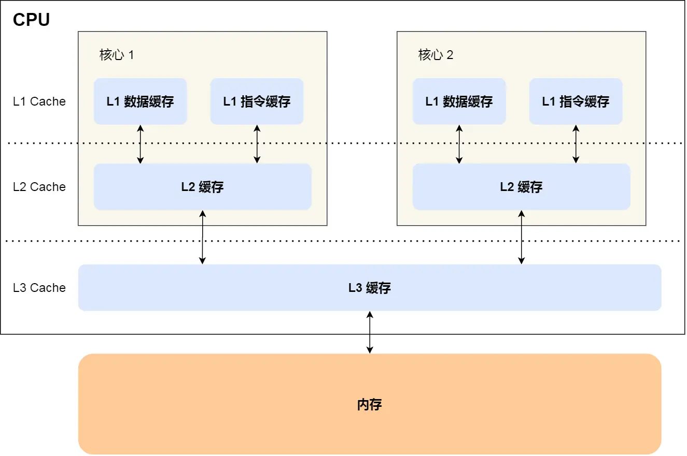

本文将介绍什么是缓存伪共享，会针对缓存伪共享举出相关例子，随后讨论 Caffeine 是如何解决缓存伪共享问题的 

**伪共享**（False sharing）是一种会导致性能下降的使用模式，最常见于现代多处理器CPU缓存中。

当参与者访问 **未** 被另一方更改的数据，该数据与正被更改的另一数据 **共享同一缓存行** 时，缓存协议可能会 **强制第一个参与者重新加载整个缓存行**（尽管在逻辑上这么做是不必要的）。缓存系统不知道此缓存行内的活动，所以强制第一个参与者承担资源的真共享访问（true shared access）所需的缓存系统开销。简单来说：有两份数据共享同一块缓存，当其中一份数据被修改时，另一份数据的访问者需要重新加载该块缓存中的数据以达到数据一致性。

接下来我们就来讨论下在 CPU 缓存中是如何发生伪共享问题的。

首先我们需要先介绍一下 CPU 的缓存结构，如下图所示：



CPU Cache 通常分为大小不等的三级缓存，分别为 L1 Cache、L2 Cache、L3 Cache，越靠近 CPU 的缓存，速度越快，容量也越小。CPU Cache 实际上由很多个缓存行 Cache Line 组成，通常它的大小为 64 字节，是 CPU 从内存中 **读取数据的基本单位**，如果访问一个 `long[]` 数组，当其中一个值被加载到缓存中时，它会额外加载另外 7 个元素到缓存中。那么我们考虑这样一种情况，CPU 的两个核心分别访问和修改统一缓存行中的数据，如下图所示：


核心 1 不断地访问和更新值 X，核心 2 则不断地访问和更新值 Y，事实上每当有核心对某一缓存行中的数据进行修改时，都会导致其他核心的缓存行失效，从而导致其他核心需要重新加载缓存行数据，进而导致性能下降，这也就是我们上文中所说的缓存伪共享问题。接下来我们用一段代码来验证下缓存伪共享问题会造成性能的损失，如下所示：

```java
public class TestFalseSharing {

    static class Pointer {
        // 两个 volatile 变量，保证可见性
        volatile long x;
        volatile long y;

        @Override
        public String toString() {
            return "x=" + x + ", y=" + y;
        }
    }

    @Test
    public void testFalseSharing() throws InterruptedException {
        Pointer pointer = new Pointer();

        // 启动两个线程，分别对 x 和 y 进行自增 1亿 次的操作
        long start = System.currentTimeMillis();
        Thread t1 = new Thread(() -> {
            for (int i = 0; i < 100_000_000; i++) {
                pointer.x++;
            }
        });
        Thread t2 = new Thread(() -> {
            for (int i = 0; i < 100_000_000; i++) {
                pointer.y++;
            }
        });

        t1.start();
        t2.start();
        t1.join();
        t2.join();

        System.out.println(System.currentTimeMillis() - start);
        System.out.println(pointer);
    }

}
```

这种情况下会发生缓存的伪共享，x 和 y 被加载到同一个缓存行中，当其中一个值被修改时，另一个值所在的缓存行需要重新加载，实际耗时为 3709ms。如果我们将 x 变量后再添加上 7 个 long 型的元素，使得变量 x 和变量 y 不分配到同一个缓存行，那么理论上性能将得到提升，我们实验一下：

```java
public class TestFalseSharing {

    static class Pointer {
        volatile long x;
        long p1, p2, p3, p4, p5, p6, p7;
        volatile long y;

        @Override
        public String toString() {
            return "x=" + x + ", y=" + y;
        }
    }

    @Test
    public void testFalseSharing() throws InterruptedException {
        // ...
    }

}
```

本次任务执行耗时为 473ms，性能得到了极大的提升。现在我们已经清楚的了解了缓存伪共享问题，那么在 Caffeine 中是如何解决缓存伪共享问题的呢？

### Caffeine 对缓存伪共享问题的解决方案


### 巨人的肩膀

- [维基百科 - 伪共享](https://zh.wikipedia.org/wiki/%E4%BC%AA%E5%85%B1%E4%BA%AB)
- [小林coding - 2.3 如何写出让 CPU 跑得更快的代码](https://www.xiaolincoding.com/os/1_hardware/how_to_make_cpu_run_faster.html)
