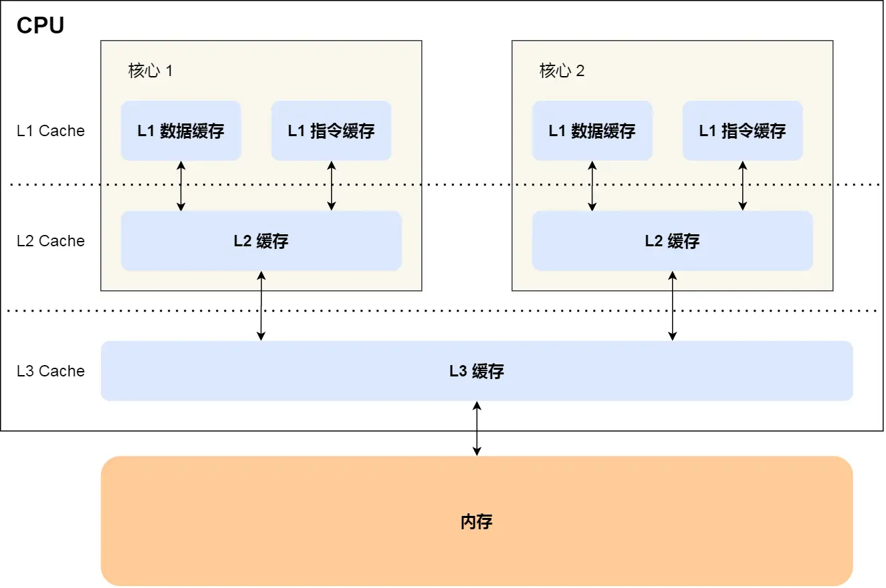
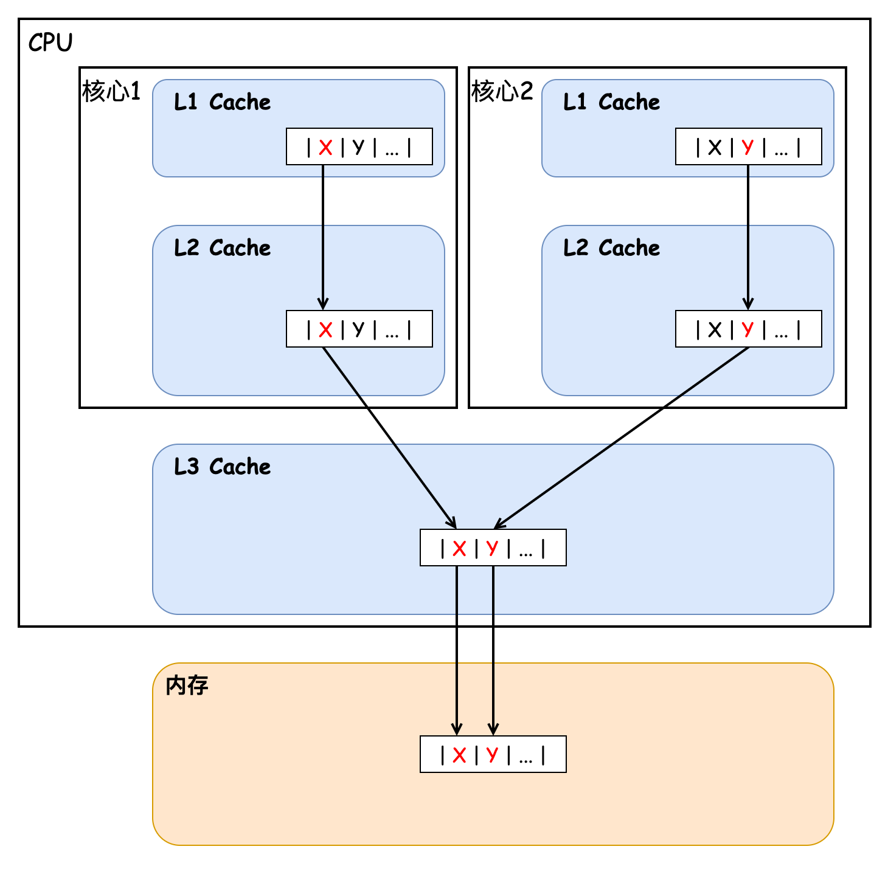

在多核高并发场景下，**缓存伪共享（False Sharing）** 是导致性能骤降的“隐形杀手”。当不同线程频繁修改同一缓存行（Cache Line）中的独立变量时，CPU缓存一致性协议会强制同步整个缓存行，引发无效化风暴，使看似无关的变量操作拖慢整体效率。本文从缓存结构原理出发，通过实验代码复现伪共享问题（耗时从3709ms优化至473ms），解析其底层机制；同时深入剖析高性能缓存库 Caffeine 如何通过 **内存填充技术**（120字节占位变量）隔离关键字段，以及 JDK 1.8 的 `@Contended` 注解如何以“空间换时间”策略高效解决伪共享问题，揭示缓存一致性优化的核心思想与实践价值，为开发者提供性能调优的关键思路。

### 伪共享

**伪共享**（False sharing）是一种会导致性能下降的使用模式，最常见于现代多处理器CPU缓存中。当不同线程频繁修改同一缓存行（Cache Line）中不同变量时，由于CPU缓存一致性协议（如MESI）会强制同步整个缓存行，导致线程间无实际数据竞争的逻辑变量被迫触发缓存行无效化（Invalidation），引发频繁的内存访问和性能下降。尽管这些变量在代码层面彼此独立，但因物理内存布局相邻，共享同一缓存行，造成“虚假竞争”，需通过内存填充或字段隔离使其独占缓存行解决。

接下来我们讨论并验证在 CPU 缓存中是如何发生伪共享问题的，首先我们需要先介绍一下 CPU 的缓存结构，如下图所示：



CPU Cache 通常分为大小不等的三级缓存，分别为 L1 Cache、L2 Cache、L3 Cache，越靠近 CPU 的缓存，速度越快，容量也越小。CPU Cache 实际上由很多个缓存行 Cache Line 组成，通常它的大小为 64 字节（或 128 字节），是 CPU 从内存中 **读取数据的基本单位**，如果访问一个 `long[]` 数组，当其中一个值被加载到缓存中时，它会额外加载另外 7 个元素到缓存中。那么我们考虑这样一种情况，CPU 的两个核心分别访问和修改统一缓存行中的数据，如下图所示：



核心 1 不断地访问和更新值 X，核心 2 则不断地访问和更新值 Y，事实上每当有核心对某一缓存行中的数据进行修改时，都会导致其他核心的缓存行失效，从而导致其他核心需要重新加载缓存行数据，进而导致性能下降，这也就是我们上文中所说的缓存伪共享问题。接下来我们用一段代码来验证下缓存伪共享问题造成的性能损失，如下所示：

```java
public class TestFalseSharing {

    static class Pointer {
        // 两个 volatile 变量，保证可见性
        volatile long x;
        volatile long y;

        @Override
        public String toString() {
            return "x=" + x + ", y=" + y;
        }
    }

    @Test
    public void testFalseSharing() throws InterruptedException {
        Pointer pointer = new Pointer();

        // 启动两个线程，分别对 x 和 y 进行自增 1亿 次的操作
        long start = System.currentTimeMillis();
        Thread t1 = new Thread(() -> {
            for (int i = 0; i < 100_000_000; i++) {
                pointer.x++;
            }
        });
        Thread t2 = new Thread(() -> {
            for (int i = 0; i < 100_000_000; i++) {
                pointer.y++;
            }
        });

        t1.start();
        t2.start();
        t1.join();
        t2.join();

        System.out.println(System.currentTimeMillis() - start);
        System.out.println(pointer);
    }

}
```

这种情况下会发生缓存的伪共享，x 和 y 被加载到同一缓存行中，当其中一个值被修改时，会使另一个核心中的该缓存行失效并重新加载，代码执行实际耗时为 3709ms。如果我们将 x 变量后再添加上 7 个 long 型的元素，使得变量 x 和变量 y 分配到不同的缓存行中，那么理论上性能将得到提升，我们实验一下：

```java
public class TestFalseSharing {

    static class Pointer {
        volatile long x;
        long p1, p2, p3, p4, p5, p6, p7;
        volatile long y;

        @Override
        public String toString() {
            return "x=" + x + ", y=" + y;
        }
    }

    @Test
    public void testFalseSharing() throws InterruptedException {
        // ...
    }

}
```

本次任务执行耗时为 473ms，性能得到了极大的提升。现在我们已经清楚的了解了缓存伪共享问题，接下来我们讨论下在 Caffeine 中是如何解决缓存伪共享问题的。

### Caffeine 对缓存伪共享问题的解决方案

在 [缓存之美：万文详解 Caffeine 实现原理]() 中我们提到过，负责记录写后任务的 `WriterBuffer` 数据结构的类继承关系如下所示：


如图中标红的类所示，它们都是用来解决伪共享问题的，我们以 `BaseMpscLinkedArrayQueuePad1` 为例来看下它的实现：

```java
abstract class BaseMpscLinkedArrayQueuePad1<E> extends AbstractQueue<E> {
    byte p000, p001, p002, p003, p004, p005, p006, p007;
    byte p008, p009, p010, p011, p012, p013, p014, p015;
    byte p016, p017, p018, p019, p020, p021, p022, p023;
    byte p024, p025, p026, p027, p028, p029, p030, p031;
    byte p032, p033, p034, p035, p036, p037, p038, p039;
    byte p040, p041, p042, p043, p044, p045, p046, p047;
    byte p048, p049, p050, p051, p052, p053, p054, p055;
    byte p056, p057, p058, p059, p060, p061, p062, p063;
    byte p064, p065, p066, p067, p068, p069, p070, p071;
    byte p072, p073, p074, p075, p076, p077, p078, p079;
    byte p080, p081, p082, p083, p084, p085, p086, p087;
    byte p088, p089, p090, p091, p092, p093, p094, p095;
    byte p096, p097, p098, p099, p100, p101, p102, p103;
    byte p104, p105, p106, p107, p108, p109, p110, p111;
    byte p112, p113, p114, p115, p116, p117, p118, p119;
}

abstract class BaseMpscLinkedArrayQueueProducerFields<E> extends BaseMpscLinkedArrayQueuePad1<E> {
    // 生产者操作索引（并不对应缓冲区 producerBuffer 中索引位置）
    protected long producerIndex;
}
```

可以发现在这个类中定义了 120 个字节变量，这样缓存行大小不论是 64 字节还是 128 字节，都能保证字段间的隔离。如图中所示 `AbstractQueue` 和 `BaseMpscLinkedArrayQueueProducerFields` 中的变量一定会 **被分配到不同的缓存行** 中。同理，借助 `BaseMpscLinkedArrayQueuePad2` 中的 120 个字节变量，`BaseMpscLinkedArrayQueueProducerFields` 和 `BaseMpscLinkedArrayQueueConsumerFields` 中的变量也会被分配到不同的缓存行中，这样就避免了缓存的伪共享问题。

其实除了 Caffeine 中有解决缓存伪共享问题的方案外，在 JDK 1.8 中引入了 `@Contended` 注解，它也可以解决缓存伪共享问题，如下所示为它在 `ConcurrentHashMap` 中的应用：

```java
public class ConcurrentHashMap<K,V> extends AbstractMap<K,V>
        implements ConcurrentMap<K,V>, Serializable {
    // ...
    
    @sun.misc.Contended
    static final class CounterCell {
        volatile long value;

        CounterCell(long x) {
            value = x;
        }
    }
}
```

其中的内部类 `CounterCell` 被标记了 `@sun.misc.Contended` 注解，表示该类中的字段会与其他类的字段相隔离，如果类中有多个字段，实际上该类中的变量间是不隔离的，这些字段可能被分配到同一缓存行中。因为 `CounterCell` 中只有一个字段，所以它会被被分配到一个缓存行中，剩余缓存行容量被空白内存填充，本质上也是一种以空间换时间的策略。这样其他变量的变更就不会影响到 `CounterCell` 中的变量了，从而避免了缓存伪共享问题。

这个注解不仅能标记在类上，还能标记在字段上，拿我们的的代码来举例：

```java
public class TestFalseSharing {

    static class Pointer {
        @Contended("cacheLine1")
        volatile long x;
        //        long p1, p2, p3, p4, p5, p6, p7;
        @Contended("cacheLine2")
        volatile long y;

        @Override
        public String toString() {
            return "x=" + x + ", y=" + y;
        }
    }
    
    @Test
    public void testFalseSharing() throws InterruptedException {
        // ...
    }

}
```

它可以指定内容来 **定义多个字段间的隔离关系**。我们使用注解将这两个字段定义在两个不同的缓存行中，执行结果耗时与显示声明字段占位耗时相差不大，为 520ms。另外需要注意的是，要想使注解 `Contended` 生效，需要添加 JVM 参数 `-XX:-RestrictContended`。

### 再谈伪共享

避免伪共享的主要方法是代码检查，而且伪共享可能不太容易被识别出来，因为只有在线程访问的是不同且碰巧在主存中相邻的全局变量时才会出现伪共享问题，线程的局部存储或者局部变量不会是伪共享的来源。此外，解决伪共享问题的本质是以空间换时间，所以并不适用于在大范围内解决该问题，否则会造成大量的内存浪费。

### 巨人的肩膀

- [维基百科 - 伪共享](https://zh.wikipedia.org/wiki/%E4%BC%AA%E5%85%B1%E4%BA%AB)
- [小林coding - 2.3 如何写出让 CPU 跑得更快的代码](https://www.xiaolincoding.com/os/1_hardware/how_to_make_cpu_run_faster.html)
- [知乎 - 杂谈 什么是伪共享（false sharing）](https://zhuanlan.zhihu.com/p/65394173)
- [博客园 - CPU Cache 与缓存行](https://www.cnblogs.com/zhongqifeng/p/14765576.html)
- [博客园 - 伪共享（false sharing），并发编程无声的性能杀手](https://www.cnblogs.com/cyfonly/p/5800758.html)
