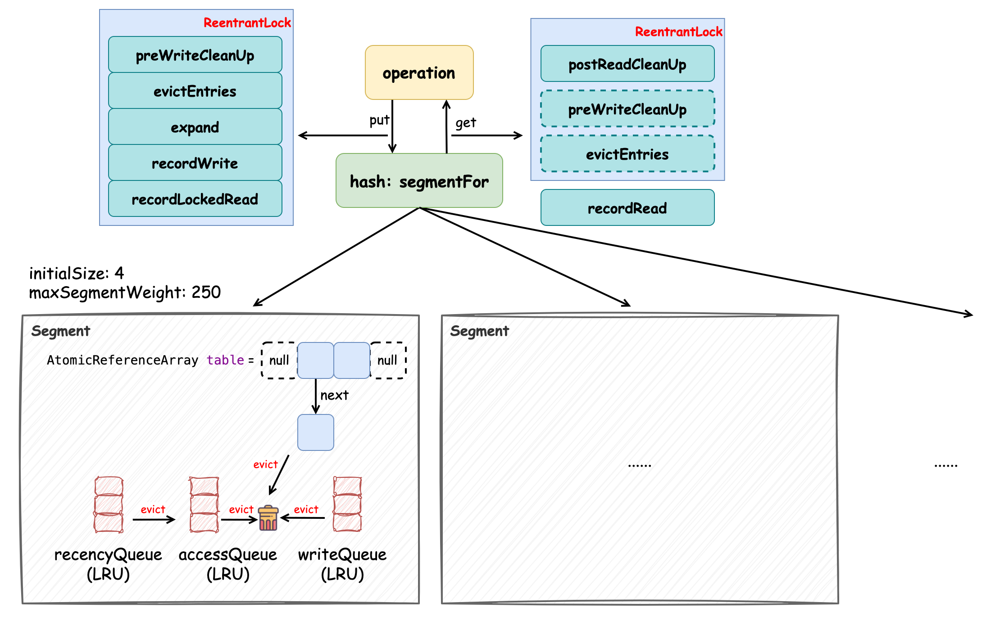
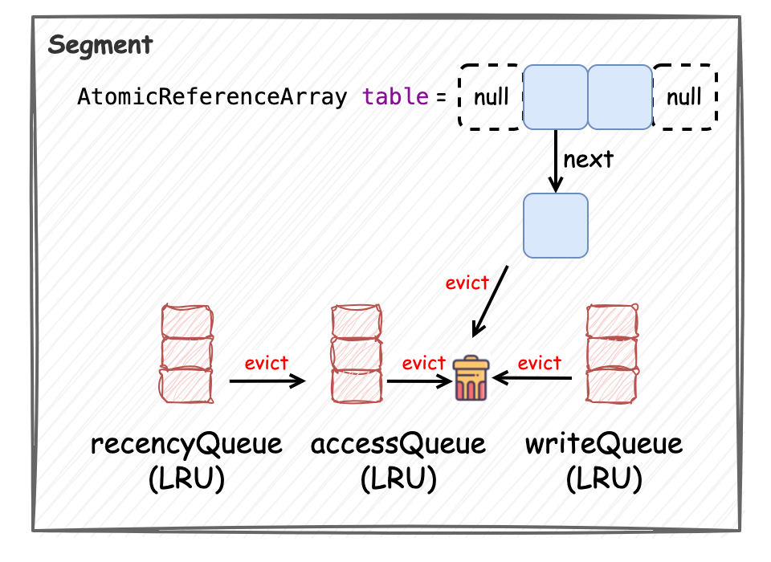

本文将结合 **Guava Cache** 的源码来分析它的实现原理，并阐述它相比与 Caffeine Cache 在性能上的劣势。为了让大家对 Guava Cache 理解起来更容易，我们还是在开篇介绍它的原理：



Guava Cache 通过分段（`Segment`）锁（`ReentrantLock`）机制、`volatile` 变量和多种缓存策略实现了性能相对 Caffeine 性能较差的缓存，它的数据结构如上图所示。它会将缓存分成多个段（`Segment`）去管理，如果要创建大小为 1000 的缓存，那么实际上会分配 4 个段，每个段的最大容量为 250。读写操作在执行时都会经 `segmentFor` 方法“路由”到某一个段。数据结构的实现都在 `Segment` 中，它对元素的管理采用的是 `AtomicReferenceArray` 数组，在初始化时是较小的容量，并随着元素的增多触发扩容机制。我们称数组中每个索引的位置为“桶”，每个桶中保存了元素的引用，这些元素是通过单向链表维护的，每当有新元素添加时，采用的是“头插法”。此外，在 `Segment` 中还维护了三个基于 **LRU 算法** 的队列，处于尾部的元素最“新”，分别是 `accessQueue`、`writeQueue` 和 `recencyQueue`，它们分别用于记录被访问的元素、被写入的元素和“最近”被访问的元素。`accessQueue` 的主要作用是在对超过最大容量（超过访问后过期时间）的元素进行驱逐时，优先将最近被访问的越少的元素驱逐（头节点开始遍历）；`writeQueue` 的主要作用是对写后过期的元素进行驱逐时，优先将最近最少被访问的元素驱逐，因为越早被添加的元素越早过期，当发现某元素未过期时，后续队列中的元素是不需要判断的；`recencyQueue` 的作用是记录被访问过的元素，它们最终都会被移动到 `accessQueue` 中，并根据访问顺序添加到其尾节点中。

对元素生命周期的管理主要是在 `put` 方法中完成的，`put` 相关的操作都需要加锁，如图中左上方所示，这些方法均与缓存元素的管理相关。Guava Cache 为了在不触发写操作而有大量读操作时也能正常触发对缓存元素的管理，添加了一个 `readCount` 变量，每次读请求都会使其累加，直到该变量超过规定阈值，也会触发缓存元素的驱逐（`postReadCleanUp`），保证数据的一致性，如图中右上方所示。

接下来我们通过创建最大大小为 1000，并配置有访问后和写后过期时间的 `LoadingCache` 来分析 Guava Cache 的实现原理，主要关注它的构造方法，`put` 方法和 `get` 方法：

```java
public class TestGuavaCache {

    @Test
    public void test() {
        LoadingCache<String, String> cache = CacheBuilder.newBuilder()
                .maximumSize(1000)
                .expireAfterWrite(10, TimeUnit.SECONDS)
                .expireAfterAccess(10, TimeUnit.SECONDS)
                .build(
                        new CacheLoader<>() {
                            @Override
                            public String load(String key) {
                                return String.valueOf(key.hashCode());
                            }
                        }
                );

        cache.put("key1", "value1");

        try {
            System.out.println(cache.get("key"));
        } catch (ExecutionException e) {
            throw new RuntimeException(e);
        }
    }
}
```

### constructor

首先我们来看一下它的构造方法，它会将创建缓存时指定的参数记录下来，比如访问后过期时间（`expireAfterAccessNanos`），写后过期时间（`expireAfterWriteNanos`）等等，除此之外还包括 `Segment` 分段对象的创建，定义分段的数量和每个分段的大小，并将这些 `Segment` 对象保存在一个数组中，以创建最大元素数量为 1000 的缓存为例，它会创建 4 个分段，每个分段分配 250 个元素。源码如下所示，均为赋值操作，可关注 `Segment` 相关逻辑：

```java
class LocalCache<K, V> extends AbstractMap<K, V> implements ConcurrentMap<K, V> {

    static final int MAX_SEGMENTS = 1 << 16;
    static final int MAXIMUM_CAPACITY = 1 << 30;
    
    final int concurrencyLevel;

    final Strength keyStrength;
    final Strength valueStrength;
    final Equivalence<Object> keyEquivalence;
    final Equivalence<Object> valueEquivalence;

    final long maxWeight;
    final Weigher<K, V> weigher;

    final long expireAfterAccessNanos;
    final long expireAfterWriteNanos;
    final long refreshNanos;

    final RemovalListener<K, V> removalListener;
    final Queue<RemovalNotification<K, V>> removalNotificationQueue;

    final Ticker ticker;
    final EntryFactory entryFactory;
    final StatsCounter globalStatsCounter;
    @CheckForNull final CacheLoader<? super K, V> defaultLoader;

    final int segmentMask;
    final int segmentShift;
    final Segment<K, V>[] segments;
    
    LocalCache(CacheBuilder<? super K, ? super V> builder, @CheckForNull CacheLoader<? super K, V> loader) {
        // 并发级别，不指定默认为 4
        concurrencyLevel = min(builder.getConcurrencyLevel(), MAX_SEGMENTS);

        // key 和 value 的引用强度，默认为强引用
        keyStrength = builder.getKeyStrength();
        valueStrength = builder.getValueStrength();

        // 键值比较器，默认为强引用比较器
        keyEquivalence = builder.getKeyEquivalence();
        valueEquivalence = builder.getValueEquivalence();

        // maxWeight 最大权重，指定了为 1000
        maxWeight = builder.getMaximumWeight();
        // weigher 没有指定，默认为 1，表示每个元素的权重为 1
        weigher = builder.getWeigher();
        // 访问后和写后过期时间，默认为 0，表示不设置过期时间
        expireAfterAccessNanos = builder.getExpireAfterAccessNanos();
        expireAfterWriteNanos = builder.getExpireAfterWriteNanos();
        // 刷新时间，默认为 0，表示不刷新
        refreshNanos = builder.getRefreshNanos();

        // 元素驱逐监听器
        removalListener = builder.getRemovalListener();
        removalNotificationQueue = 
                (removalListener == NullListener.INSTANCE) ? LocalCache.discardingQueue() : new ConcurrentLinkedQueue<>();

        // 定义 Ticker 可以模拟时间流动来验证逻辑
        ticker = builder.getTicker(recordsTime());
        entryFactory = EntryFactory.getFactory(keyStrength, usesAccessEntries(), usesWriteEntries());
        globalStatsCounter = builder.getStatsCounterSupplier().get();
        defaultLoader = loader;

        // 初始化大小，默认为 16
        int initialCapacity = min(builder.getInitialCapacity(), MAXIMUM_CAPACITY);
        if (evictsBySize() && !customWeigher()) {
            initialCapacity = (int) min(initialCapacity, maxWeight);
        }
        
        // 基于大小的驱逐策略是针对每个段而不是全局进行驱逐的，因此段数过多会导致随机的驱逐行为
        // 计算分段数量和分段位移（shift）的逻辑
        int segmentShift = 0;
        int segmentCount = 1;
        // 保证分段数量不低于并发级别 且 段数*20不超过最大权重，保证每个段的元素数量至少为 10
        while (segmentCount < concurrencyLevel && (!evictsBySize() || segmentCount * 20L <= maxWeight)) {
            // 分段位移+1
            ++segmentShift;
            // 分段数量为 2的n次幂
            segmentCount <<= 1;
        }
        this.segmentShift = 32 - segmentShift;
        // 分段掩码值为分段数量-1
        segmentMask = segmentCount - 1;

        // 创建分段数组
        this.segments = newSegmentArray(segmentCount);

        // 计算每个分段的大小
        int segmentCapacity = initialCapacity / segmentCount;
        if (segmentCapacity * segmentCount < initialCapacity) {
            ++segmentCapacity;
        }
        int segmentSize = 1;
        while (segmentSize < segmentCapacity) {
            segmentSize <<= 1;
        }
        // 如果指定了基于大小的驱逐策略，那么要保证所有分段的最大值之和（maxSegmentWeight）要超过指定的最大容量
        if (evictsBySize()) {
            long maxSegmentWeight = maxWeight / segmentCount + 1;
            long remainder = maxWeight % segmentCount;
            for (int i = 0; i < this.segments.length; ++i) {
                if (i == remainder) {
                    maxSegmentWeight--;
                }
                // 创建 Segment 对象，segmentSize为4，maxSegmentWeight为250
                this.segments[i] = createSegment(segmentSize, maxSegmentWeight, builder.getStatsCounterSupplier().get());
            }
        }
        // 如果未指定基于大小的驱逐策略，创建的 Segment 对象的 maxSegmentWeight 为 UNSET_INT
        else {
            for (int i = 0; i < this.segments.length; ++i) {
                this.segments[i] = createSegment(segmentSize, UNSET_INT, builder.getStatsCounterSupplier().get());
            }
        }
    }

    final Segment<K, V>[] newSegmentArray(int ssize) {
        return (Segment<K, V>[]) new Segment<?, ?>[ssize];
    }
}
```

我们接着看下创建 `Segment` 的方法 `LocalCache#createSegment`，它直接调用了 `Segment` 的构造方法：

```java
class LocalCache<K, V> extends AbstractMap<K, V> implements ConcurrentMap<K, V> {
    // ...
    
    Segment<K, V> createSegment(int initialCapacity, long maxSegmentWeight, StatsCounter statsCounter) {
        return new Segment<>(this, initialCapacity, maxSegmentWeight, statsCounter);
    }
}
```

`Segment` 是 `LocalCache` 内的静态内部类，它在缓存中起到了将数据分段管理的作用。它继承了 `ReentrantLock`，主要为了简化锁定的操作：

```java
static class Segment<K, V> extends ReentrantLock {
    // ...
}
```

在该类中有一段 JavaDoc 值得读一下：

**Segments** 内部维护了缓存本身（`final LocalCache<K, V> map`），所以它能一直保持数据一致性，也因此可以在不加锁的情况下进行读操作。被缓存的键值对对象（构成单向链表）中的 `next` 字段被 `final` 修饰，所有的添加操作都只能在每个桶的前面进行（头插法），这也就使得检查变更比较容易，并且遍历速度也比较快。当节点需要更改时，会创建新节点来替换它们（深拷贝）。这对于哈希表来说效果很好，因为桶列表往往很短（平均长度小于二）。

读操作可以在不加锁的情况下进行，但依赖于被 `volatile` 关键字修饰的变量，因为这个关键字能确保“可见性”。对大多数操作来说，可以将记录元素数量的字段 `count` 来作为确保可见性的变量。它带来了很多便利，在很多读操作中都需要参考这个字段：

- 未加锁的读操作必须首先读取 `count` 字段，如果它是 0，则不应读任何元素
- 加锁的写操作在任何桶发生结构性更改后都需要修改 `count` 字段值，这些写操作不能在任何情况下导致并发读操作发生读取数据不一致的情况，这样的保证使得 Map 中的读操作更容易。比如，没有操作可以揭示 Map 中添加了新的元素但是 `count` 字段没有被更新的情况，因此相对于读取没有原子性要求。

作为提示，所有被 `volatile` 修饰的字段都很关键，它们的读取和写入都会用注释标记。

>     /*
     * Segments maintain a table of entry lists that are ALWAYS kept in a consistent state, so can
     * be read without locking. Next fields of nodes are immutable (final). All list additions are
     * performed at the front of each bin. This makes it easy to check changes, and also fast to
     * traverse. When nodes would otherwise be changed, new nodes are created to replace them. This
     * works well for hash tables since the bin lists tend to be short. (The average length is less
     * than two.)
     *
     * Read operations can thus proceed without locking, but rely on selected uses of volatiles to
     * ensure that completed write operations performed by other threads are noticed. For most
     * purposes, the "count" field, tracking the number of elements, serves as that volatile
     * variable ensuring visibility. This is convenient because this field needs to be read in many
     * read operations anyway:
     *
     * - All (unsynchronized) read operations must first read the "count" field, and should not look
     * at table entries if it is 0.
     *
     * - All (synchronized) write operations should write to the "count" field after structurally
     * changing any bin. The operations must not take any action that could even momentarily cause a
     * concurrent read operation to see inconsistent data. This is made easier by the nature of the
     * read operations in Map. For example, no operation can reveal that the table has grown but the
     * threshold has not yet been updated, so there are no atomicity requirements for this with
     * respect to reads.
     *
     * As a guide, all critical volatile reads and writes to the count field are marked in code
     * comments.
     */

通过它的 JavaDoc 我们可以了解到它通过写操作对数据一致性的保证和被 `volatile` 修饰的字段来实现无锁的读操作，不过其中键值对中被 `final` 修饰的 `next` 字段究竟是怎么回事就需要在后文中去探究了。下面我们根据它的构造方法看一下该类中比较重要的字段信息：

```java
static class Segment<K, V> extends ReentrantLock {

    // 在某一段（Segment）中元素的数量
    volatile int count;

    // 总的权重值
    @GuardedBy("this")
    long totalWeight;

    // 修改次数
    int modCount;

    // 继上一次写操作后读操作的数量
    final AtomicInteger readCount = new AtomicInteger();
    
    @Weak final LocalCache<K, V> map;

    final long maxSegmentWeight;

    final StatsCounter statsCounter;

    int threshold;

    @CheckForNull volatile AtomicReferenceArray<ReferenceEntry<K, V>> table;

    final Queue<ReferenceEntry<K, V>> recencyQueue;

    @GuardedBy("this")
    final Queue<ReferenceEntry<K, V>> writeQueue;

    @GuardedBy("this")
    final Queue<ReferenceEntry<K, V>> accessQueue;
    
    Segment(LocalCache<K, V> map, int initialCapacity, long maxSegmentWeight, StatsCounter statsCounter) {
        // LocalCache 对象的引用
        this.map = map;
        // 最大分段权重，我们的例子中它的值是 250
        this.maxSegmentWeight = maxSegmentWeight;
        this.statsCounter = checkNotNull(statsCounter);
        // 根据初始化容量创建支持原子操作的 AtomicReferenceArray 对象
        initTable(newEntryArray(initialCapacity));

        // 管理弱引用和虚引用的 Key,Value 队列
        keyReferenceQueue = map.usesKeyReferences() ? new ReferenceQueue<>() : null;
        valueReferenceQueue = map.usesValueReferences() ? new ReferenceQueue<>() : null;

        // 用于记录“最近”元素被访问的顺序
        recencyQueue = map.usesAccessQueue() ? new ConcurrentLinkedQueue<>() : LocalCache.discardingQueue();

        // 用于记录元素的写入顺序，元素被写入时会被添加到尾部
        writeQueue = map.usesWriteQueue() ? new WriteQueue<>() : LocalCache.discardingQueue();

        // 记录元素的访问顺序，元素被访问后会被添加到尾部
        accessQueue = map.usesAccessQueue() ? new AccessQueue<>() : LocalCache.discardingQueue();
    }

    AtomicReferenceArray<ReferenceEntry<K, V>> newEntryArray(int size) {
        return new AtomicReferenceArray<>(size);
    }

    void initTable(AtomicReferenceArray<ReferenceEntry<K, V>> newTable) {
        // 默认负载因子为 0.75
        this.threshold = newTable.length() * 3 / 4;
        if (!map.customWeigher() && this.threshold == maxSegmentWeight) {
            // 在执行驱逐操作前防止不必要的扩张操作，将阈值+1
            this.threshold++;
        }
        this.table = newTable;
    }
    
    // ...
}
```

根据上述代码和注释信息，每个 `Segment` 的数据结构由 `AtomicReferenceArray`（本质上是 `Object[]` 数组）和三个基于LRU算法的队列组成，`AtomicReferenceArray` 初始化时为一个较小容量（4）的数组，在缓存的操作过程中会根据元素添加的情况触发扩容，在这里我们已经能看到 Guava Cache 数据结构的全貌了，如下所示：



在接下来的两个小节中，我们将深入讨论 `put` 和 `get` 方法的实现，分析这些数据结构是如何为这些操作提供支持的。

### put

在深入 `put` 方法前，我们需要先了解下创建键值对元素的逻辑。在调用 `LocalCache` 的构造方法时，其中 `entryFactory` 字段我们没具体讲解，在这里详细描述下，因为它与键值对元素的创建有关。`EntryFactory` 是一个枚举类，它其中定义了如 `STRONG_ACCESS_WRITE` 和 `WEAK_ACCESS_WRITE` 等一系列枚举，并根据创建缓存时指定的 `Key` 引用类型和元素管理策略来决定具体是哪个枚举，如其中的 `EntryFactory#getFactory` 方法所示：

```java
enum EntryFactory {
    STRONG {
        // ...
    },
    STRONG_ACCESS {
        // ...
    },
    STRONG_WRITE {
        // ...  
    },
    STRONG_ACCESS_WRITE {
        // ...
    },
    // ...
    WEAK_ACCESS_WRITE {
        // ...
    };

    static final int ACCESS_MASK = 1;
    static final int WRITE_MASK = 2;
    static final int WEAK_MASK = 4;
    
    static final EntryFactory[] factories = {
            STRONG,
            STRONG_ACCESS,
            STRONG_WRITE,
            STRONG_ACCESS_WRITE,
            WEAK,
            WEAK_ACCESS,
            WEAK_WRITE,
            WEAK_ACCESS_WRITE,
    };

    static EntryFactory getFactory(Strength keyStrength, boolean usesAccessQueue, boolean usesWriteQueue) {
        int flags = ((keyStrength == Strength.WEAK) ? WEAK_MASK : 0)
                        | (usesAccessQueue ? ACCESS_MASK : 0)
                        | (usesWriteQueue ? WRITE_MASK : 0);
        return factories[flags];
    }
}
```

当不指定 `Key` 的引用类型时为强引用，结合指定的访问后和写后过期策略，会匹配到 `STRONG_ACCESS_WRITE` 枚举，根据它的命名也能理解它表示 Key 为强引用且配置了访问后和写后过期策略。下面主要关注下它的逻辑：

```java
enum EntryFactory {
    STRONG_ACCESS_WRITE {
        @Override
        <K, V> ReferenceEntry<K, V> newEntry(
                Segment<K, V> segment, K key, int hash, @CheckForNull ReferenceEntry<K, V> next) {
            return new StrongAccessWriteEntry<>(key, hash, next);
        }

        // ...
    }
}
```

其中 `EntryFactory#newEntry` 为创建键值对元素的方法，创建的键值对类型为 `StrongAccessWriteEntry`，我们看下它的具体实现：

```java
class LocalCache<K, V> extends AbstractMap<K, V> implements ConcurrentMap<K, V> {
    
    static class StrongEntry<K, V> extends AbstractReferenceEntry<K, V> {
        
        final K key;
        final int hash;
        @CheckForNull final ReferenceEntry<K, V> next;
        volatile ValueReference<K, V> valueReference = unset();
        
        StrongEntry(K key, int hash, @CheckForNull ReferenceEntry<K, V> next) {
            this.key = key;
            this.hash = hash;
            this.next = next;
        }
        
        // ...
    }

    static final class StrongAccessWriteEntry<K, V> extends StrongEntry<K, V> {

        volatile long accessTime = Long.MAX_VALUE;
        volatile long writeTime = Long.MAX_VALUE;

        @Weak ReferenceEntry<K, V> nextAccess = nullEntry();
        @Weak ReferenceEntry<K, V> previousAccess = nullEntry();

        @Weak ReferenceEntry<K, V> nextWrite = nullEntry();
        @Weak ReferenceEntry<K, V> previousWrite = nullEntry();

        StrongAccessWriteEntry(K key, int hash, @CheckForNull ReferenceEntry<K, V> next) {
            super(key, hash, next);
        }
    }
}
```

`StrongAccessWriteEntry` 与它的父类 `StrongEntry` 均为定义在 `LocalCache` 内的静态内部类，构造方法需要指定 `Key, hash, next` 三个变量，这三个变量均定义在 `StrongEntry` 中，注意第三个变量 `ReferenceEntry<K, V> next`，它被父类中 `StrongEntry#next` 字段引用，并且该字段被 `final` 修饰，这与前文 JavaDoc 中所描述的内容相对应：

> 键值对对象中的 `next` 字段被 `final` 修饰，所有的添加操作都只能在每个桶的前面进行（头插法），这也就使得检查变更比较容易，并且遍历速度也比较快。

所以实际上在添加新的键值对元素时，针对每个桶中元素操作采用的是“头插法”，这些元素是通过 `next` 指针引用的 **单向链表**。现在了解了元素的类型和创建逻辑，我们再来看下 `put` 方法的实现。

Guava Cache 是不允许添加 null 键和 null 值的，如果添加了 null 键或 null 值，会抛出 `NullPointerException` 异常。注意其中的注解 `@GuardedBy` 表示某方法或字段被调用或访问时需要持有哪个同步锁，在 Caffeine 中也有类似的应用：

```java
class LocalCache<K, V> extends AbstractMap<K, V> implements ConcurrentMap<K, V> {
    
    // ...

    final Segment<K, V>[] segments;

    final int segmentShift;

    final int segmentMask;

    @GuardedBy("this")
    long totalWeight;
    
    @CheckForNull
    @CanIgnoreReturnValue
    @Override
    public V put(K key, V value) {
        checkNotNull(key);
        checkNotNull(value);
        // 计算 hash 值，过程中调用了 rehash 扰动函数使 hash 更均匀
        int hash = hash(key);
        // 根据 hash 值路由到具体的 Segment 段，再调用 Segment 的 put 方法
        return segmentFor(hash).put(key, hash, value, false);
    }

    Segment<K, V> segmentFor(int hash) {
        // 位移并位与运算，segmentMask 为段数组长度减一，保证计算结果在有效范围内
        return segments[(hash >>> segmentShift) & segmentMask];
    }
}
```

可以发现在执行 `put` 操作前，会根据键的哈希值来将其路由（`segmentFor`）到具体的 `Segment` 段，再调用 `Segment` 的 `put` 方法，而具体的 `put` 方法逻辑是在 `Segment` 中实现的。我们接着看 `Segment#put` 方法的实现（为了保证可读性，其中标注了数字的方法会在接下来小节中具体分析）：

```java
static class Segment<K, V> extends ReentrantLock {

    final AtomicInteger readCount = new AtomicInteger();

    @GuardedBy("this")
    final Queue<ReferenceEntry<K, V>> accessQueue;
    final Queue<ReferenceEntry<K, V>> recencyQueue;
    @GuardedBy("this")
    final Queue<ReferenceEntry<K, V>> writeQueue;

    // guava cache 本身
    @Weak
    final LocalCache<K, V> map;

    // Segment 中保存元素的数组
    @CheckForNull
    volatile AtomicReferenceArray<ReferenceEntry<K, V>> table;

    // 计数器
    final StatsCounter statsCounter;

    // 该段中的元素数量
    volatile int count;

    // 总的权重，不配置也表示元素数量，每个元素的权重为 1
    @GuardedBy("this")
    long totalWeight;

    // capacity * 0.75
    int threshold;

    // 更新次数，用于确保在批量读取的情况下，保证数据一致性，如果多次读取时 modCount 不一致则需要重试
    int modCount;
    
    @CanIgnoreReturnValue
    @CheckForNull
    V put(K key, int hash, V value, boolean onlyIfAbsent) {
        // 先加锁 ReentrantLock#lock 实现
        lock();
        try {
            long now = map.ticker.read();
            // 1. 写前置的清理操作，包括处理过期元素等
            preWriteCleanup(now);

            int newCount = this.count + 1;
            // 如果超过阈值，则扩容
            if (newCount > this.threshold) {
                // 2. 扩容操作
                expand();
                newCount = this.count + 1;
            }

            // 根据元素的 hash 值找到对应的桶索引 index，并拿到头节点 first
            AtomicReferenceArray<ReferenceEntry<K, V>> table = this.table;
            int index = hash & (table.length() - 1);
            ReferenceEntry<K, V> first = table.get(index);

            // 尝试遍历链表寻找被新添加的元素是否已经存在
            for (ReferenceEntry<K, V> e = first; e != null; e = e.getNext()) {
                K entryKey = e.getKey();
                // 如果新 put 的元素在缓存中已经存在
                if (e.getHash() == hash && entryKey != null && map.keyEquivalence.equivalent(key, entryKey)) {
                    ValueReference<K, V> valueReference = e.getValueReference();
                    V entryValue = valueReference.get();

                    // 通过元素的 value 是否为 null 的情况来判断
                    if (entryValue == null) {
                        ++modCount;
                        // StrongValueReference 类型默认 active 为 true 表示 value 值是有效的
                        if (valueReference.isActive()) {
                            // 但是此时元素的 value 值为空，说明该 value 值已经被垃圾回收了，所以需要将该元素 value 被垃圾回收的通知加入到通知队列中
                            // 并在总权重中将该元素的权重减去
                            enqueueNotification(key, hash, entryValue, valueReference.getWeight(), RemovalCause.COLLECTED);
                            // 更新为新的 value
                            setValue(e, key, value, now);
                            // 元素总数不变更
                            newCount = this.count;
                        } else {
                            // 赋值新的 Value 并需要将元素数 +1
                            setValue(e, key, value, now);
                            newCount = this.count + 1;
                        }
                        // 变更 count 值（可见性）
                        this.count = newCount;
                        // 3. 驱逐元素
                        evictEntries(e);
                        return null;
                    } else if (onlyIfAbsent) {
                        // 如果 onlyIfAbsent 为 true，那么已存在元素的 value 是不会被覆盖的，只需要记录读操作即可
                        recordLockedRead(e, now);
                        return entryValue;
                    } else {
                        // 这种情况是 value 不为空，需要将旧值替换成新值
                        // 变更修改次数
                        ++modCount;
                        // 同样是先将该元素的权重减去，并将元素 value 被替换的通知加入到通知队列中
                        enqueueNotification(key, hash, entryValue, valueReference.getWeight(), RemovalCause.REPLACED);
                        setValue(e, key, value, now);
                        // 3. 驱逐元素
                        evictEntries(e);
                        return entryValue;
                    }
                }
            }

            // put 的元素是一个新元素
            ++modCount;
            // 创建一个新元素，并指定 next 节点为 first 头节点
            ReferenceEntry<K, V> newEntry = newEntry(key, hash, first);
            setValue(newEntry, key, value, now);
            // 将该元素封装到数组中
            table.set(index, newEntry);
            // 更新 count 值
            newCount = this.count + 1;
            this.count = newCount;
            // 3. 驱逐元素
            evictEntries(newEntry);
            return null;
        } finally {
            // 执行完操作，解锁
            unlock();
            // 4. 写后操作，主要是处理通知，在后文中介绍
            postWriteCleanup();
        }
    }

    @GuardedBy("this")
    void setValue(ReferenceEntry<K, V> entry, K key, V value, long now) {
        ValueReference<K, V> previous = entry.getValueReference();
        // 计算元素权重，如果没有执行权重计算函数默认为 1
        int weight = map.weigher.weigh(key, value);
        checkState(weight >= 0, "Weights must be non-negative");

        // 更新元素的 value 值
        ValueReference<K, V> valueReference = map.valueStrength.referenceValue(this, entry, value, weight);
        entry.setValueReference(valueReference);
        // 处理写操作
        recordWrite(entry, weight, now);
        // StrongValueReference 该方法为空实现
        previous.notifyNewValue(value);
    }

    @GuardedBy("this")
    void recordWrite(ReferenceEntry<K, V> entry, int weight, long now) {
        // 将元素的最近被访问队列 recencyQueue 清空，并使用尾插法将它们都放到访问队列 accessQueue 的尾节点
        drainRecencyQueue();
        // 变更总权重
        totalWeight += weight;

        // 如果配置了访问后或写后过期则更新元素的访问后或写后时间
        if (map.recordsAccess()) {
            entry.setAccessTime(now);
        }
        if (map.recordsWrite()) {
            entry.setWriteTime(now);
        }
        // 添加到访问队列和写队列中
        accessQueue.add(entry);
        writeQueue.add(entry);
    }

    @GuardedBy("this")
    void recordLockedRead(ReferenceEntry<K, V> entry, long now) {
        // 配置了访问后过期时间则更新该元素的访问时间
        if (map.recordsAccess()) {
            entry.setAccessTime(now);
        }
        // 将该元素添加到访问队列中
        accessQueue.add(entry);
    }
}
```

上述源码中，我们能够发现 Guava Cache 是在 **Segment 的级别加锁** 的，通过这样的方式来减少竞争，其中 `preWriteCleanup` 方法负责处理元素的过期；`evictEntries` 方法负责驱逐保证缓存不超过最大的容量，根据 LRU 算法将最近最少访问的元素移除；`expand` 方法负责 `Segment` 的扩容；`setValue`, `recordWrite` 和 `recordLockedRead` 方法负责处理元素的更新并记录访问情况（更新 `accessQueue` 和 `writeQueue` 队列）。它对元素的管理相对简单也比较容易理解，接下来我们分步骤看下其中方法的实现。

#### preWriteCleanup

首先我们重点看下 `preWriteCleanup` 方法，该方法负责处理元素的过期，而元素过期的判断也非常简单，它会在每个元素中记录它们最新的访问或写入时间，将当前时间与这些时间作差后与配置的访问或写入过期时间作比较，如果超过了配置的时间则表示元素过期，并将它们进行驱逐。除此之外还有两个小细节需要留意，队列中维护元素的变动采用的是 LRU 算法，并规定元素越靠近尾部表示它越“新”，另一点是 `readCount` 会在写后标记为 0，这个变量的作用是保证在没发生写操作的情况下，而读次数超过一定阈值也会执行 `cleanUp` 的方法，这个在后文的 `get` 方法逻辑中还会提到。源码如下所示：

```java
static class Segment<K, V> extends ReentrantLock {

    final AtomicInteger readCount = new AtomicInteger();

    @GuardedBy("this")
    final Queue<ReferenceEntry<K, V>> accessQueue;
    final Queue<ReferenceEntry<K, V>> recencyQueue;
    @GuardedBy("this")
    final Queue<ReferenceEntry<K, V>> writeQueue;

    // guava cache 本身
    @Weak final LocalCache<K, V> map;

    // Segment 中保存元素的数组
    @CheckForNull volatile AtomicReferenceArray<ReferenceEntry<K, V>> table;

    // 计数器
    final StatsCounter statsCounter;

    // 该段中的元素数量
    volatile int count;

    // 总的权重，不配置也表示元素数量，每个元素的权重为 1
    @GuardedBy("this")
    long totalWeight;
    
    @GuardedBy("this")
    void preWriteCleanup(long now) {
        // 执行加锁的清理操作，包括处理引用队列和过期元素
        runLockedCleanup(now);
    }

    void runLockedCleanup(long now) {
        // 仍然是 ReentrantLock#tryLock 实现
        if (tryLock()) {
            try {
                // 处理引用队列（本文不对指定 Key 或 Value 为 weekReference 的情况进行分析）
                drainReferenceQueues();
                // 处理元素过期
                expireEntries(now);
                // 写后读次数清零
                readCount.set(0);
            } finally {
                unlock();
            }
        }
    }

    @GuardedBy("this")
    void expireEntries(long now) {
        // 处理最近访问队列 recencyQueue 和访问队列 accessQueue
        drainRecencyQueue();

        ReferenceEntry<K, V> e;
        // 从头节点开始遍历写队列 writeQueue，将过期的元素移除
        while ((e = writeQueue.peek()) != null && map.isExpired(e, now)) {
            if (!removeEntry(e, e.getHash(), RemovalCause.EXPIRED)) {
                throw new AssertionError();
            }
        }
        while ((e = accessQueue.peek()) != null && map.isExpired(e, now)) {
            if (!removeEntry(e, e.getHash(), RemovalCause.EXPIRED)) {
                throw new AssertionError();
            }
        }
    }

    // 将元素的最近被访问队列 recencyQueue 清空，并使用尾插法将它们都放到访问队列 accessQueue 的尾节点
    @GuardedBy("this")
    void drainRecencyQueue() {
        ReferenceEntry<K, V> e;
        // 遍历元素最近被访问队列 recencyQueue
        while ((e = recencyQueue.poll()) != null) {
            // 如果该元素在访问队列 accessQueue 中
            if (accessQueue.contains(e)) {
                // 则将其放到尾节点
                accessQueue.add(e);
            }
            // 源码中对这里的 IF 判断，标注了如下内容来解释如此判断的原因：
            // 尽管元素已经在缓存中删除，但它仍可能在 recencyQueue 队列中。
            // 这种情况可能出现在开发者操作元素删除或清空段中所有元素的同时执行读操作
        }
    }

    @VisibleForTesting
    @GuardedBy("this")
    @CanIgnoreReturnValue
    boolean removeEntry(ReferenceEntry<K, V> entry, int hash, RemovalCause cause) {
        int newCount = this.count - 1;
        AtomicReferenceArray<ReferenceEntry<K, V>> table = this.table;
        // 位与运算找到对应的桶，获取头节点
        int index = hash & (table.length() - 1);
        ReferenceEntry<K, V> first = table.get(index);

        for (ReferenceEntry<K, V> e = first; e != null; e = e.getNext()) {
            // 找到了对应的元素则操作移除
            if (e == entry) {
                ++modCount;
                // 在链表chain中移除元素，注意 e 表示待移除的元素
                ReferenceEntry<K, V> newFirst = removeValueFromChain(first, e, e.getKey(), hash, 
                        e.getValueReference().get(), e.getValueReference(), cause);
                // 注意这里又重新计算了 newCount，防止在方法执行前的 newCount 快照值发生变更
                newCount = this.count - 1;
                // 桶的位置更新为新的链表头节点
                table.set(index, newFirst);
                // count 被 volatile 修饰，可见性写操作
                this.count = newCount;
                return true;
            }
        }

        return false;
    }


    /**
     * 将元素从队列中移除
     * 
     * @param first 队列的头节点
     * @param entry 待移除元素
     * @param key   待移除元素的 key
     * @param hash  待移除元素的 hash 值
     * @param value 待移除元素的 value 值
     * @param valueReference 带移除元素的 value 引用对象
     * @param cause 被移除的原因
     * @return 返回链表头节点
     */
    @GuardedBy("this")
    @CheckForNull
    ReferenceEntry<K, V> removeValueFromChain(ReferenceEntry<K, V> first, ReferenceEntry<K, V> entry, 
                                              @CheckForNull K key, int hash, V value, ValueReference<K, V> valueReference, 
                                              RemovalCause cause) {
        // 入队元素被移除的通知等操作
        enqueueNotification(key, hash, value, valueReference.getWeight(), cause);
        // 在写队列和访问队列中移除元素
        writeQueue.remove(entry);
        accessQueue.remove(entry);

        if (valueReference.isLoading()) {
            valueReference.notifyNewValue(null);
            return first;
        } else {
            // 将元素在链表中移除
            return removeEntryFromChain(first, entry);
        }
    }
    
    @GuardedBy("this")
    @CheckForNull
    ReferenceEntry<K, V> removeEntryFromChain(ReferenceEntry<K, V> first, ReferenceEntry<K, V> entry) {
        // 初始化计数跟踪数量变化
        int newCount = count;
        // 被移除元素的 next 元素，作为新的头节点
        ReferenceEntry<K, V> newFirst = entry.getNext();
        // 遍历从 原头节点 first 到 被移除元素 entry 之间的所有元素
        for (ReferenceEntry<K, V> e = first; e != entry; e = e.getNext()) {
            // 创建一个新的节点，该节点是节点 e 的副本，并把新节点的 next 指针指向 newFirst 节点
            ReferenceEntry<K, V> next = copyEntry(e, newFirst);
            // 如果 next 不为空，变更 newFirst 的引用，指向刚刚创建的节点
            // 如果原链表为 a -> b -> c -> d 移除 c 后链表为 b -> a -> d
            if (next != null) {
                newFirst = next;
            } else {
                // 如果 next 为空，表示发生了垃圾回收，将该被回收的元素的移除
                removeCollectedEntry(e);
                // 计数减一
                newCount--;
            }
        }
        // 更新计数
        this.count = newCount;
        // 返回新的头节点
        return newFirst;
    }

    @GuardedBy("this")
    void removeCollectedEntry(ReferenceEntry<K, V> entry) {
        // 入队元素被移除的通知等操作
        enqueueNotification(entry.getKey(), entry.getHash(), entry.getValueReference().get(),
                entry.getValueReference().getWeight(), RemovalCause.COLLECTED);
        writeQueue.remove(entry);
        accessQueue.remove(entry);
    }

    @GuardedBy("this")
    void enqueueNotification(@CheckForNull K key, int hash, @CheckForNull V value, int weight, RemovalCause cause) {
        // 将当前元素的权重在总权重中减去
        totalWeight -= weight;
        // 如果元素被驱逐，则在计数器中记录
        if (cause.wasEvicted()) {
            statsCounter.recordEviction();
        }
        // 如果配置了驱逐通知，则将该元素被驱逐的原因等信息放入队列
        if (map.removalNotificationQueue != DISCARDING_QUEUE) {
            RemovalNotification<K, V> notification = RemovalNotification.create(key, value, cause);
            map.removalNotificationQueue.offer(notification);
        }
    }
}

class LocalCache<K, V> extends AbstractMap<K, V> implements ConcurrentMap<K, V> {
    // 判断元素是否过期，它的逻辑非常简单，如果配置了对应的过期模式，如访问后过期或写后过期
    // 会根据当前时间与元素的访问时间或写入时间进行比较，如果超过配置的过期时间，则返回 true，否则返回 false
    boolean isExpired(ReferenceEntry<K, V> entry, long now) {
        checkNotNull(entry);
        if (expiresAfterAccess() && (now - entry.getAccessTime() >= expireAfterAccessNanos)) {
            return true;
        }
        if (expiresAfterWrite() && (now - entry.getWriteTime() >= expireAfterWriteNanos)) {
            return true;
        }
        return false;
    }
}
```

#### expand

接下来是扩容方法，因为在初始化时，`Segment` 对象的 `table` 数组并没有被创建为最大的分段的大小，而是采取了较小的值 4 作为初始大小，所以随着元素的增加，会触发数组的扩容以满足元素的存储，它的负载因子默认为 0.75，每次扩容的大小为原有长度的 2 倍。其中对原有数组中元素的迁移蛮有意思，它会将能够哈希到同一个桶的元素直接赋值到新的数组，而不能被哈希到同一个桶的元素则创建它们的深拷贝，一个个放入新的数组中，如下：

```java
static class Segment<K, V> extends ReentrantLock {

    static final int MAXIMUM_CAPACITY = 1 << 30;

    // Segment 中保存元素的数组
    @CheckForNull
    volatile AtomicReferenceArray<ReferenceEntry<K, V>> table;

    // 该段中的元素数量
    volatile int count;

    // 总的权重，不配置也表示元素数量，每个元素的权重为 1
    @GuardedBy("this")
    long totalWeight;

    // capacity * 0.75
    int threshold;

    @GuardedBy("this")
    void expand() {
        AtomicReferenceArray<ReferenceEntry<K, V>> oldTable = table;
        int oldCapacity = oldTable.length();
        // 如果容量已经达到最大值，则直接返回
        if (oldCapacity >= MAXIMUM_CAPACITY) {
            return;
        }

        int newCount = count;
        // 创建一个原来两倍容量的 AtomicReferenceArray
        AtomicReferenceArray<ReferenceEntry<K, V>> newTable = newEntryArray(oldCapacity << 1);
        // 阈值计算，负载因子为固定的 0.75
        threshold = newTable.length() * 3 / 4;
        // 掩码值为容量大小 -1，因为容量是 2 的幂次方，所以掩码值的二进制表示中，从最低位开始，所有位都是 1，位与运算能计算出元素对应的索引
        int newMask = newTable.length() - 1;
        // 遍历扩容前的 AtomicReferenceArray table
        for (int oldIndex = 0; oldIndex < oldCapacity; ++oldIndex) {
            ReferenceEntry<K, V> head = oldTable.get(oldIndex);

            if (head != null) {
                // 获取头节点的 next 节点
                ReferenceEntry<K, V> next = head.getNext();
                // 计算头节点在新数组中的索引
                int headIndex = head.getHash() & newMask;

                // 头节点的 next 节点为空，那么证明该桶位置只有一个元素，直接将头节点放在新数组的索引处 
                if (next == null) {
                    newTable.set(headIndex, head);
                } else {
                    // 遍历从 next 开始的节点，找到所有能 hash 到同一个桶的一批节点，然后将这些节点封装在新数组的对应索引处
                    ReferenceEntry<K, V> tail = head;
                    int tailIndex = headIndex;
                    for (ReferenceEntry<K, V> e = next; e != null; e = e.getNext()) {
                        int newIndex = e.getHash() & newMask;
                        if (newIndex != tailIndex) {
                            tailIndex = newIndex;
                            tail = e;
                        }
                    }
                    newTable.set(tailIndex, tail);

                    // 将这些剩余的不能 hash 到同一个桶的节点，依次遍历，将它们放入新数组中
                    for (ReferenceEntry<K, V> e = head; e != tail; e = e.getNext()) {
                        int newIndex = e.getHash() & newMask;
                        ReferenceEntry<K, V> newNext = newTable.get(newIndex);
                        // 注意这里创建节点是深拷贝，并且采用的是头插法
                        ReferenceEntry<K, V> newFirst = copyEntry(e, newNext);
                        if (newFirst != null) {
                            newTable.set(newIndex, newFirst);
                        } else {
                            // 如果 next 为空，表示发生了垃圾回收，将该被回收的元素的移除
                            removeCollectedEntry(e);
                            newCount--;
                        }
                    }
                }
            }
        }
        
        // 操作完成后更新 table 和 count
        table = newTable;
        this.count = newCount;
    }
    
}
```

#### evictEntries

元素的驱逐方法 `evictEntries` 主要负责维护缓存不超过最大容量限制，实现原理也非常简单，它会根据 `accessQueue` 队列，将最近最少访问的元素优先移除：

```java
static class Segment<K, V> extends ReentrantLock {

    @Weak final LocalCache<K, V> map;

    final long maxSegmentWeight;

    @GuardedBy("this")
    long totalWeight;

    @GuardedBy("this")
    final Queue<ReferenceEntry<K, V>> accessQueue;
    
    @GuardedBy("this")
    void evictEntries(ReferenceEntry<K, V> newest) {
        if (!map.evictsBySize()) {
            return;
        }

        // 这个方法我们在前文中介绍过
        // 将元素的最近被访问队列 recencyQueue 清空，并使用尾插法将它们都放到访问队列 accessQueue 的尾节点
        drainRecencyQueue();
        
        // 如果新加入的元素权重超过了最大权重，那么直接将该元素驱逐
        if (newest.getValueReference().getWeight() > maxSegmentWeight) {
            if (!removeEntry(newest, newest.getHash(), RemovalCause.SIZE)) {
                throw new AssertionError();
            }
        }

        // 如果当前权重超过最大权重，那么不断地驱逐元素直到满足条件
        while (totalWeight > maxSegmentWeight) {
            // 在 accessQueue 中从头节点遍历元素，依次移除最近没有被访问的元素
            ReferenceEntry<K, V> e = getNextEvictable();
            if (!removeEntry(e, e.getHash(), RemovalCause.SIZE)) {
                throw new AssertionError();
            }
        }
    }

    @GuardedBy("this")
    ReferenceEntry<K, V> getNextEvictable() {
        for (ReferenceEntry<K, V> e : accessQueue) {
            int weight = e.getValueReference().getWeight();
            if (weight > 0) {
                return e;
            }
        }
        throw new AssertionError();
    }
}
```

#### postWriteCleanup

写后清理操作需要关注的内容并不多，它主要处理监听器相关的逻辑，因为在我们的例子中并没有创建监听器所以就不在详细分析了。

```java
static class Segment<K, V> extends ReentrantLock {

    @Weak final LocalCache<K, V> map;
    
    void postWriteCleanup() {
        runUnlockedCleanup();
    }

    void runUnlockedCleanup() {
        // locked cleanup may generate notifications we can send unlocked
        if (!isHeldByCurrentThread()) {
            map.processPendingNotifications();
        }
    }
}

class LocalCache<K, V> extends AbstractMap<K, V> implements ConcurrentMap<K, V> {

    final Queue<RemovalNotification<K, V>> removalNotificationQueue;

    final RemovalListener<K, V> removalListener;
    
    void processPendingNotifications() {
        RemovalNotification<K, V> notification;
        while ((notification = removalNotificationQueue.poll()) != null) {
            try {
                removalListener.onRemoval(notification);
            } catch (Throwable e) {
                logger.log(Level.WARNING, "Exception thrown by removal listener", e);
            }
        }
    }
}
```

### get

接下来我们要深入 `get` 方法的分析了，同样地它也会被路由（`segmentFor`）到具体的 `Segment`：

```java
static class LocalManualCache<K, V> implements Cache<K, V>, Serializable {
    final LocalCache<K, V> localCache;
    
    // ...
}

static class LocalLoadingCache<K, V> extends LocalManualCache<K, V>
        implements LoadingCache<K, V> {

    @Override
    public V get(K key) throws ExecutionException {
        return localCache.getOrLoad(key);
    }
}
class LocalCache<K, V> extends AbstractMap<K, V> implements ConcurrentMap<K, V> {

    @CheckForNull final CacheLoader<? super K, V> defaultLoader;
    
    V getOrLoad(K key) throws ExecutionException {
        return get(key, defaultLoader);
    }

    @CanIgnoreReturnValue
    V get(K key, CacheLoader<? super K, V> loader) throws ExecutionException {
        int hash = hash(checkNotNull(key));
        return segmentFor(hash).get(key, hash, loader);
    }
}
```

它的核心逻辑也在 `Segment` 中，注意读操作是不加锁的，它相比与 `put` 方法要简单，其中要注意的是 `recordRead` 方法，它会将被访问的元素添加到 `recencyQueue` 最近访问队列中，用于记录最近被访问元素的顺序，后续执行维护（cleanUp）相关的逻辑时，会将该队列中的元素全部移动到 `accessQueue` 队列中，用于根据元素的访问顺序来判断元素是否被驱逐。除此之外，因为元素的驱逐大多都是在 `put` 方法中完成的，为了在不发生写操作的情况下也能正常管理元素的生命中期，在 `get` 方法中也有相关的实现，比如 `postReadCleanup` 方法，它通过 `readCount` 的计数和 `DRAIN_THRESHOLD` 的阈值来判断是否需要驱逐元素，当计数超过阈值时则调用 `cleanUp` 方法进行驱逐，当然这并不会强制执行（因为它执行的是 `ReentrantLock#tryLock` 方法），尝试获取锁来执行，即使没有获取到锁，那么证明有写操作在执行，元素的驱逐操作也不需要再多关心了。源码如下所示：

```java
static class Segment<K, V> extends ReentrantLock {

    static final int DRAIN_THRESHOLD = 0x3F;
    
    volatile int count;

    @Weak final LocalCache<K, V> map;

    final Queue<ReferenceEntry<K, V>> recencyQueue;

    final StatsCounter statsCounter;

    final AtomicInteger readCount = new AtomicInteger();
    
    @CanIgnoreReturnValue
    V get(K key, int hash, CacheLoader<? super K, V> loader) throws ExecutionException {
        checkNotNull(key);
        checkNotNull(loader);
        try {
            if (count != 0) {
                ReferenceEntry<K, V> e = getEntry(key, hash);
                // 获取到对应元素
                if (e != null) {
                    long now = map.ticker.read();
                    // 获取到对应的 value
                    V value = getLiveValue(e, now);
                    // value 不为空
                    if (value != null) {
                        // 记录读操作，会将元素添加到最近访问队列 recencyQueue 的尾节点
                        recordRead(e, now);
                        // 命中计数 +1
                        statsCounter.recordHits(1);
                        // 如果配置了元素刷新则执行相关刷新逻辑
                        return scheduleRefresh(e, key, hash, value, now, loader);
                    }
                    // value 为空
                    ValueReference<K, V> valueReference = e.getValueReference();
                    // 如果 value 正在 loading 则等待
                    if (valueReference.isLoading()) {
                        return waitForLoadingValue(e, key, valueReference);
                    }
                }
            }

            // 如果元素数量为 0，则执行该方法
            return lockedGetOrLoad(key, hash, loader);
        } catch (ExecutionException ee) {
            Throwable cause = ee.getCause();
            if (cause instanceof Error) {
                throw new ExecutionError((Error) cause);
            } else if (cause instanceof RuntimeException) {
                throw new UncheckedExecutionException(cause);
            }
            throw ee;
        } finally {
            postReadCleanup();
        }
    }
    
    @CheckForNull
    ReferenceEntry<K, V> getEntry(Object key, int hash) {
        // 获取到 table 数组中对应桶的头节点
        for (ReferenceEntry<K, V> e = getFirst(hash); e != null; e = e.getNext()) {
            // 元素 hash 值不相等继续遍历寻找
            if (e.getHash() != hash) {
                continue;
            }

            // 找到对应的元素后，如果 key 为空，则处理引用队列
            K entryKey = e.getKey();
            if (entryKey == null) {
                tryDrainReferenceQueues();
                continue;
            }

            // 如果 key 值相等，则返回该元素
            if (map.keyEquivalence.equivalent(key, entryKey)) {
                return e;
            }
        }

        // 否则返回 null
        return null;
    }

    V getLiveValue(ReferenceEntry<K, V> entry, long now) {
        // key 和 value 为空的情况，处理引用队列
        if (entry.getKey() == null) {
            tryDrainReferenceQueues();
            return null;
        }
        V value = entry.getValueReference().get();
        if (value == null) {
            tryDrainReferenceQueues();
            return null;
        }

        // 如果元素过期了
        if (map.isExpired(entry, now)) {
            // 尝试加锁执行元素过期驱逐操作
            tryExpireEntries(now);
            return null;
        }
        return value;
    }

    void recordRead(ReferenceEntry<K, V> entry, long now) {
        // 如果配置了访问后过期，则更新元素访问时间
        if (map.recordsAccess()) {
            entry.setAccessTime(now);
        }
        // 将元素添加到最近访问队列中
        recencyQueue.add(entry);
    }

    V waitForLoadingValue(ReferenceEntry<K, V> e, K key, ValueReference<K, V> valueReference) throws ExecutionException {
        if (!valueReference.isLoading()) {
            throw new AssertionError();
        }

        checkState(!Thread.holdsLock(e), "Recursive load of: %s", key);
        try {
            // 等待元素加载完成
            V value = valueReference.waitForValue();
            if (value == null) {
                throw new InvalidCacheLoadException("CacheLoader returned null for key " + key + ".");
            }
            // 执行记录读操作
            long now = map.ticker.read();
            recordRead(e, now);
            return value;
        } finally {
            // 未命中统计数+1
            statsCounter.recordMisses(1);
        }
    }

    // 通常在写入过程中进行清理。如果在足够数量的读取后没有观察到清理，请尝试从读取线程进行清理。
    void postReadCleanup() {
        // readCount 自增，如果达到阈值则执行清理操作，清理操作与写入操作中的逻辑一致
        if ((readCount.incrementAndGet() & DRAIN_THRESHOLD) == 0) {
            cleanUp();
        }
    }

    void cleanUp() {
        long now = map.ticker.read();
        runLockedCleanup(now);
        runUnlockedCleanup();
    }
}
```

#### lockedGetOrLoad

`lockedGetOrLoad` 是 `LoadingCache` 的核心逻辑，在某个 key 在缓存中不存在且配置了 loader 函数时会被执行，本质上这也是触发了一次写操作，将不存在的元素通过 loader 方法获取到具体值并加载到缓存中，所以在这里也会触发到元素生命周期管理的方法，如 `preWriteCleanup`，不过该方法总体上的实现与 `put` 方法类似，并没有特别复杂的地方。

```java
static class Segment<K, V> extends ReentrantLock {

    volatile int count;
    
    @Weak final LocalCache<K, V> map;

    @CheckForNull volatile AtomicReferenceArray<ReferenceEntry<K, V>> table;

    @GuardedBy("this")
    final Queue<ReferenceEntry<K, V>> writeQueue;
    @GuardedBy("this")
    final Queue<ReferenceEntry<K, V>> accessQueue;

    final StatsCounter statsCounter;

    int modCount;
    
    // 加锁读或加载元素值
    V lockedGetOrLoad(K key, int hash, CacheLoader<? super K, V> loader) throws ExecutionException {
        ReferenceEntry<K, V> e;
        ValueReference<K, V> valueReference = null;
        LoadingValueReference<K, V> loadingValueReference = null;
        boolean createNewEntry = true;

        // 加锁
        lock();
        try {
            long now = map.ticker.read();
            // 写前整理操作，已经在上文中介绍过
            preWriteCleanup(now);

            int newCount = this.count - 1;
            // 找到该元素对应桶的头节点
            AtomicReferenceArray<ReferenceEntry<K, V>> table = this.table;
            int index = hash & (table.length() - 1);
            ReferenceEntry<K, V> first = table.get(index);

            // 遍历寻找该元素
            for (e = first; e != null; e = e.getNext()) {
                K entryKey = e.getKey();
                // 如果找到了与该元素 key 值相等的元素
                if (e.getHash() == hash && entryKey != null && map.keyEquivalence.equivalent(key, entryKey)) {
                    valueReference = e.getValueReference();
                    
                    // 判断元素是否在加载中
                    if (valueReference.isLoading()) {
                        // 如果在加载中则不创建新的元素
                        createNewEntry = false;
                    } else {
                        // 否则执行元素的加载
                        V value = valueReference.get();
                        if (value == null) {
                            // 如果获取到的值为空，说明元素已经被回收了，则将该事件通知放到队列中
                            enqueueNotification(entryKey, hash, value, valueReference.getWeight(), RemovalCause.COLLECTED);
                        } else if (map.isExpired(e, now)) {
                            // 如果元素过期了，则将该事件通知放到队列中
                            enqueueNotification(entryKey, hash, value, valueReference.getWeight(), RemovalCause.EXPIRED);
                        } else {
                            // 否则，获取到了 value 值，执行记录读操作
                            recordLockedRead(e, now);
                            // 命中统计数+1
                            statsCounter.recordHits(1);
                            return value;
                        }

                        // value 无效的情况都需要将元素在写队列和访问队列中移除
                        writeQueue.remove(e);
                        accessQueue.remove(e);
                        // 可见性写操作
                        this.count = newCount;
                    }
                    break;
                }
            }

            // 没有找到该元素，则需要创建新元素
            if (createNewEntry) {
                // value 的类型为 LoadingValueReference
                loadingValueReference = new LoadingValueReference<>();

                if (e == null) {
                    e = newEntry(key, hash, first);
                    e.setValueReference(loadingValueReference);
                    table.set(index, e);
                } else {
                    e.setValueReference(loadingValueReference);
                }
            }
        } finally {
            // 解锁和写后通知操作
            unlock();
            postWriteCleanup();
        }

        if (createNewEntry) {
            try {
                // 同步执行元素的加载
                synchronized (e) {
                    return loadSync(key, hash, loadingValueReference, loader);
                }
            } finally {
                // 元素未命中统计数+1
                statsCounter.recordMisses(1);
            }
        } else {
            // 元素已经存在，等在加载
            return waitForLoadingValue(e, key, valueReference);
        }
    }

    V loadSync(K key, int hash, LoadingValueReference<K, V> loadingValueReference, CacheLoader<? super K, V> loader) throws ExecutionException {
        ListenableFuture<V> loadingFuture = loadingValueReference.loadFuture(key, loader);
        return getAndRecordStats(key, hash, loadingValueReference, loadingFuture);
    }

    @CanIgnoreReturnValue
    V getAndRecordStats(K key, int hash, LoadingValueReference<K, V> loadingValueReference, ListenableFuture<V> newValue) throws ExecutionException {
        V value = null;
        try {
            // 阻塞执行 loader 函数（不允许中断）
            value = getUninterruptibly(newValue);
            if (value == null) {
                throw new InvalidCacheLoadException("CacheLoader returned null for key " + key + ".");
            }
            // 标记元素加载完成
            statsCounter.recordLoadSuccess(loadingValueReference.elapsedNanos());
            // 保存加载的元素
            storeLoadedValue(key, hash, loadingValueReference, value);
            return value;
        } finally {
            if (value == null) {
                statsCounter.recordLoadException(loadingValueReference.elapsedNanos());
                removeLoadingValue(key, hash, loadingValueReference);
            }
        }
    }
    
    // 逻辑与 put 方法类似
    @CanIgnoreReturnValue
    boolean storeLoadedValue(K key, int hash, LoadingValueReference<K, V> oldValueReference, V newValue) {
        // 加锁
        lock();
        try {
            long now = map.ticker.read();
            preWriteCleanup(now);

            int newCount = this.count + 1;
            if (newCount > this.threshold) {
                expand();
                newCount = this.count + 1;
            }

            // 找到该元素对应的桶的头节点
            AtomicReferenceArray<ReferenceEntry<K, V>> table = this.table;
            int index = hash & (table.length() - 1);
            ReferenceEntry<K, V> first = table.get(index);

            for (ReferenceEntry<K, V> e = first; e != null; e = e.getNext()) {
                K entryKey = e.getKey();
                if (e.getHash() == hash && entryKey != null && map.keyEquivalence.equivalent(key, entryKey)) {
                    ValueReference<K, V> valueReference = e.getValueReference();
                    V entryValue = valueReference.get();
 
                    // 如果元素已经存在，则替换旧的 LoadingValueReference
                    if (oldValueReference == valueReference || (entryValue == null && valueReference != UNSET)) {
                        ++modCount;
                        if (oldValueReference.isActive()) {
                            RemovalCause cause = (entryValue == null) ? RemovalCause.COLLECTED : RemovalCause.REPLACED;
                            enqueueNotification(key, hash, entryValue, oldValueReference.getWeight(), cause);
                            newCount--;
                        }
                        setValue(e, key, newValue, now);
                        this.count = newCount;
                        evictEntries(e);
                        return true;
                    }
                    
                    enqueueNotification(key, hash, newValue, 0, RemovalCause.REPLACED);
                    return false;
                }
            }

            ++modCount;
            // 没有找到该 key 对应的元素则创建新的元素，此处逻辑与 put 元素的操作一致
            ReferenceEntry<K, V> newEntry = newEntry(key, hash, first);
            setValue(newEntry, key, newValue, now);
            table.set(index, newEntry);
            this.count = newCount;
            evictEntries(newEntry);
            return true;
        } finally {
            unlock();
            postWriteCleanup();
        }
    }
}
```

### 与 Caffeine 的对比

Guava Cache 的源码要比 Caffeine 简单得多，但是 Caffeine 的实现更加优雅，可读性也更高（详细参阅[万文详解 Caffeine 实现原理]()）。

Guava Cache 采用的是分段锁的思想，这种思想在 JDK 1.7 的 `ConcurrentHashMap` 也有实现，但由于性能相对较差，在 JDK 1.8 及之后被弃用，取而代之的是使用 **CAS 操作**、少量 `synchronized` 关键字同步操作、及合适的 **自旋重试** 和 `volatile` 关键字的方案，而在 Caffeine 中，底层实现采用的便是 `ConcurrentHashMap`，它是在 `ConcurrentHashMap` 之上添加了缓存相关的管理功能，如缓存过期、缓存淘汰等（相比于 Guava Cache 功能也更丰富），在这一点上 Caffeine 就已经占尽了优势，能够高效支持更大规模的并发访问，而且还能随着 JDK 升级过程中对 `ConcurrentHashMap` 的优化而持续享受优化后带来的并发效率的提升。

在 Guava Cache 中针对缓存的驱逐采用了 **LRU 算法**，实际上这种驱逐策略并不精准，在 Caffeine 中提供了基于 **TinyLFU 算法** 的驱逐策略，这种算法在对缓存驱逐的准确性上更高，能更好的提供缓存命中率和保证缓存的性能。

除此之外，Caffeine 提供了更复杂的缓存过期管理机制：**TimeWheel**，这一点在 Guava Cache 中是没有的（[本地缓存 Caffeine 中的时间轮（TimeWheel）是什么？]()）。另外，在对内存性能的优化上，Caffeine 针对常访问的字段避免了缓存伪共享问题（[高性能缓存设计：如何解决缓存伪共享问题]()），这些在 Guava Cache 中也是没有任何体现的。

总而言之，Caffeine 是更加现代化的本地缓存，可以说它全面优于 Guava Cache，在技术选型上，可以优先考虑。不过，Guava Cache 也并不是一无是处，在对性能要求不高的场景下且不想引入额外的依赖（Caffeine），Guava Cache 也是一个不错的选择，因为 Guava 作为常用的 Java 库，通常都会在依赖中存在。

---

### 巨人的肩膀

- [Github - Guava](https://github.com/google/guava)
